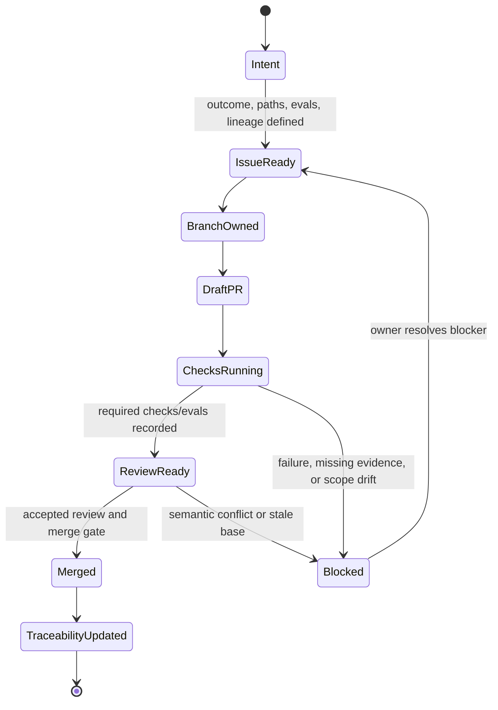

# GitHub Project Metadata

## Purpose

This directory owns contribution forms and project-operated automation. It converts eval-first intent into
reviewable issue/PR/check/release metadata. It is not XT-Aegis runtime authority and does not prove a
product claim.

## Contribution State Machine



Unchecked boxes and a green generic workflow are not sufficient evidence. PR results use `passed`,
`failed`, `not_run`, or `not_applicable`, with procedure and artifact/limitation references.

## Inputs and outputs

```text
user/design intent
  -> eval-first issue form
  -> branch/PR lineage and path ownership
  -> GitHub checks and review
  -> project-operated artifacts / merge status
  -> traceability and implementation-stack update
```

| Inputs | Outputs | Consumer |
|---|---|---|
| root/local Agent rules, issue acceptance criteria, branch protection, workflow policy | issue/PR metadata, check runs, review/merge state | maintainers, Worker Agents, traceability index |
| source/config/docs diff | CI, CodeQL, verifier-image, live-profile artifacts when explicitly configured | PR eval table and claim review |
| release policy and trusted publishing configuration | package/container/registry release action | release owner; never an untrusted PR |

## Source of truth

- Root [`AGENTS.md`](../AGENTS.md)
- [`docs/EVALS.md`](../docs/EVALS.md)
- [`docs/ISSUE_PR_CONTRACT.md`](../docs/ISSUE_PR_CONTRACT.md)
- [`docs/REPOSITORY_STATE_MACHINES.md`](../docs/REPOSITORY_STATE_MACHINES.md)
- [`docs/IMPLEMENTATION_STACKS.md`](../docs/IMPLEMENTATION_STACKS.md)
- [`docs/TRACEABILITY.md`](../docs/TRACEABILITY.md)
- [`SECURITY.md`](../SECURITY.md)
- Local [`AGENTS.md`](AGENTS.md)

## Directory ownership

| Path | Responsibility |
|---|---|
| `ISSUE_TEMPLATE/` | require observable outcome, scope, paths, dependencies, evals, evidence, lineage, and stop conditions |
| `pull_request_template.md` | require parent/base/children/order, State Machine/data-flow delta, actual eval evidence, gaps, and conflict owner |
| `workflows/` | project-operated checks or release actions with least required permissions |
| `dependabot.yml` | dependency update proposals; it does not authorize automatic semantic acceptance |

## Local evals

- Validate issue-form and workflow syntax.
- Inspect workflow permissions, secret use, event triggers, checkout provenance, and immutable references where
  required.
- Confirm changed paths match the owning issue and open PR graph in
  [`IMPLEMENTATION_STACKS.md`](../docs/IMPLEMENTATION_STACKS.md).
- Keep project-operated CI distinct from independent or live-profile reproduction.
- Preserve failed, cancelled, skipped, and timed-out checks as evidence.

## Stop and escalate

Stop when a change adds write permissions, secrets, external network destinations, release authority,
untrusted checkout execution, default-branch mutation, automatic semantic conflict acceptance, or claim
promotion without a dedicated issue and threat/evidence review. Also stop when PR base/parent, path
ownership, or current-head checks differ from the implementation-stack index.
