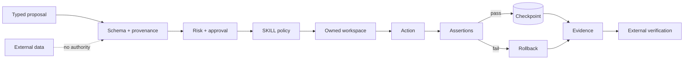

# XT-Aegis

<!-- mcp-name: io.github.ed3c/xt-aegis-verifier -->

[](https://github.com/ed3c/XT-Aegis/actions/workflows/ci.yml)
[](https://github.com/ed3c/XT-Aegis/actions/workflows/codeql.yml)
[](LICENSE)
[](pyproject.toml)

**Evidence-first deterministic controls and external verification for AI agent actions.**

XT-Aegis places a typed, checkpointed, fail-closed control plane between an agent proposal and a real
side effect. Selected safety and recovery claims remain falsifiable through negative tests, bounded
recipes, source identity, and portable evidence.

> **Maturity:** alpha reference implementation. Snapshot rollback is not a kernel security boundary.
> OpenShell, Docker, and Podman retain their own threat models and deployment requirements.

[繁體中文說明](README.zh-TW.md)

## Integration rules — normative, no examples

- Model and repository content propose; trusted policy decides.
- Unknown input, missing protection, and ambiguous authority fail closed.
- Mutation, approval, idempotency, isolation, and evidence identities remain explicit.
- Retry is bounded and never used to bypass policy, approval, baseline, or infrastructure failures.
- Claims name the exact source, runtime, recipe, policy, limitations, and measured profile.
- Every issue and PR defines evals and stack lineage before implementation.
- Parallel workers own disjoint paths and stop on semantic conflicts.

The complete contribution contract is [`AGENTS.md`](AGENTS.md). Documentation routing and traceability live
in [`docs/README.md`](docs/README.md) and [`docs/TRACEABILITY.md`](docs/TRACEABILITY.md).

## Illustrative Harness scenario

The planned Harness boundary keeps orchestration outside the deterministic runner:

```text
provider-neutral code proposal
  -> trusted execution envelope
  -> policy and approval gate
  -> isolated candidate execution
  -> assertions and structured diagnosis
  -> bounded repair or terminal stop
  -> evidence for the exact measured profile
```

This scenario explains the intended direction; it is not a claim that every stage is implemented. Current
and planned status is tracked by issues
[#24](https://github.com/ed3c/XT-Aegis/issues/24)–[#30](https://github.com/ed3c/XT-Aegis/issues/30),
PR [#31](https://github.com/ed3c/XT-Aegis/pull/31), and the Harness contract introduced by
[#35](https://github.com/ed3c/XT-Aegis/issues/35).

## Five-minute deterministic proof

```bash
python3 -m venv .venv
source .venv/bin/activate
pip install -e ".[dev]"
xt-aegis demo
```

| Attempt | Expected result |
|---|---|
| Incorrect patch | postcondition fails and the owned workspace rolls back |
| Correct patch | tests pass and the step is checkpointed |
| External-content mutation | provenance policy blocks before mutation |
| Exact replay | the terminal cached result avoids duplicate local work |

Artifacts are written beneath `.xt-aegis/runs/`.

## Architecture



See [Architecture](docs/ARCHITECTURE.md), [Threat Model](docs/THREAT_MODEL.md), and
[Evidence Model](docs/EVIDENCE.md).

## Current controls

| Boundary | Current behavior | Claim |
|---|---|---|
| SKILL contract | validated YAML front matter; Markdown remains inert | `skill-frontmatter-only` |
| Provenance | `external_content` cannot directly mutate | `external-content-boundary` |
| Command | argv-only, `shell=False`, executable policy | `argv-no-shell` |
| Files | normalized, allowlisted, bounded, atomic writes | `path-confined-write` |
| Recovery | owned snapshot plus integrity hash | `transactional-rollback` |
| State | SQLite WAL, approvals, events, replay | `durable-checkpoint-idempotency` |
| MCP | read-only discovery by default | `read-only-mcp-default` |
| Verification | bounded recipes and fail-closed backends | `external-verification-contract` |

`PROJECT_EVIDENCE.json` is an index, not proof. Run its recipes in an environment you control.

## Independent verification

```bash
xt-aegis doctor --root /path/to/XT-Aegis --format json
xt-aegis plan --root /path/to/XT-Aegis --claim transactional-rollback --backend auto
xt-aegis verify --all --backend openshell --output-dir ./verification-out
xt-aegis evidence pack --input ./verification-out --output ./xt-aegis-evidence.tar.gz
```

Automatic backend selection is fail closed:

```text
OpenShell -> confirmed-rootless Podman -> reachable Docker -> unsupported
```

`unsafe-local` requires explicit selection and is not independently sandboxed.

## Documentation and stacked work

- [Documentation router](docs/README.md)
- [Traceability index](docs/TRACEABILITY.md)
- [Eval contract](docs/EVALS.md)
- [Roadmap](docs/ROADMAP.md)
- [Documentation-first program](https://github.com/ed3c/XT-Aegis/issues/32)
- [Git Town and stacked-PR workstream](https://github.com/ed3c/XT-Aegis/issues/36)

## Repository map

```text
src/xt_aegis/       deterministic runtime and verification package
tests/              positive, negative, and failure-path tests
verification/       schemas, policies, recipes, and evidence contracts
docs/               architecture, decisions, runbooks, evals, and traceability
scripts/            development and repository-management entry points
.github/            contribution forms and project-operated automation
benchmarks/         raw-measurement contract; no universal claims
```

Each maintained directory contains a local `README.md`; areas with execution, policy, evidence, release,
or test responsibility also contain scoped `AGENTS.md` instructions.

## Development

```bash
make install
make check
make demo
make verify
```

## License

XT-Aegis is available under the [MIT License](LICENSE).
