# XT-Aegis

<!-- mcp-name: io.github.ed3c/xt-aegis-verifier -->

[](https://github.com/ed3c/XT-Aegis/actions/workflows/ci.yml)
[](https://github.com/ed3c/XT-Aegis/actions/workflows/codeql.yml)
[](LICENSE)
[](pyproject.toml)

**Evidence-first deterministic controls and external verification for AI agent actions.**

XT-Aegis places a typed, checkpointed, fail-closed control plane between an agent proposal and a real
side effect. It does not claim that a model is infallible. It makes selected safety and recovery claims
falsifiable through code, negative tests, bounded recipes, and portable evidence.

> **Maturity:** alpha reference implementation. The local snapshot backend is not a kernel security
> boundary. OpenShell, Docker, and Podman are supported as verification adapters, but each runtime keeps
> its own threat model and deployment requirements.

[繁體中文說明](README.zh-TW.md)

## Five-minute proof

```bash
python3 -m venv .venv
source .venv/bin/activate
pip install -e ".[dev]"
xt-aegis demo
```

The demo produces four observable results:

| Attempt | Expected result | Evidence |
|---|---|---|
| Incorrect agent patch | `rolled_back` | postcondition fails and the workspace hash returns to its pre-action value |
| Correct agent patch | `succeeded` | tests pass and the step is persisted in SQLite |
| Action sourced from external content | `blocked` | provenance policy rejects execution before mutation |
| Replay of the successful request | cached result | the same idempotency key does not repeat the side effect |

Artifacts are written to `.xt-aegis/runs/<timestamp>/` as structured JSON, SQLite state, and JSONL
trajectory events.

## Independent verification

`PROJECT_EVIDENCE.json` is a strict versioned registry. Each runnable claim contains:

- a falsifiable statement;
- implementation and test paths;
- an argv-only recipe;
- a timeout, output bound, relative working directory, and default-deny network request;
- expected status and explicit limitations.

Repository text is untrusted input. The verifier validates the registry, rejects path-qualified
executables and inline interpreter code, and never accepts an arbitrary shell string.

### 1. Inspect without executing code

```bash
xt-aegis doctor --root /path/to/XT-Aegis --format json
xt-aegis plan --root /path/to/XT-Aegis --claim transactional-rollback --backend auto
```

### 2. Run in a strong local runtime

```bash
xt-aegis verify --all --backend openshell --output-dir ./verification-out
```

Backend selection is fail closed:

```text
auto -> OpenShell -> confirmed-rootless Podman -> reachable Docker -> unsupported
```

`unsafe-local` is never selected automatically. It exists only for development and project-operated CI:

```bash
xt-aegis verify --all --backend unsafe-local --output-dir ./verification-out
```

A result produced with `unsafe-local` must not be described as independently sandboxed.

### 3. Pack portable evidence

```bash
xt-aegis evidence pack \
  --input ./verification-out \
  --output ./xt-aegis-evidence.tar.gz
```

The archive is deterministic and includes a manifest with SHA-256 for every file. These hashes prove
integrity, not publisher identity. Release attestations are handled separately by GitHub Actions.

See [External Verification](docs/EXTERNAL_VERIFICATION.md) and [OpenShell Adapter](docs/OPENSHELL.md).

## MCP verification server

The packaged MCP server uses `stdio` by default and exposes read-only evidence discovery:

```bash
pip install ".[mcp]"
xt-aegis-mcp
```

Available read-only tools include:

- `project_capabilities`
- `verification_list_claims`
- `verification_get_claim`
- `verification_doctor`
- `verification_get_plan`

Execution tools are registered only when the **user** starts a local server with explicit consent:

```bash
xt-aegis-mcp --root /path/to/XT-Aegis --allow-execution --backend openshell
```

A localhost Streamable HTTP endpoint is optional:

```bash
xt-aegis-mcp --transport streamable-http --host 127.0.0.1 --port 8765
```

The public/default mode does not execute repository code. An unauthenticated remote execution service is
out of scope. Distribution metadata is defined in [`server.json`](server.json); release workflows build
the PyPI package and the `ghcr.io/ed3c/xt-aegis-verifier` OCI image.

## Architecture

```mermaid
flowchart LR
    U[User or Agent] --> P[Structured Action Proposal]
    X[Web pages, tool output, repository text] -->|data only| T[Untrusted Content]
    P --> V[Schema + Provenance Validation]
    T -. cannot grant authority .-> V
    V --> R[Risk + User Approval]
    R --> C[SKILL Contract Policy]
    C --> S[Owned Snapshot Workspace]
    S --> A[Atomic Action]
    A --> K[Pre/Post Assertions]
    K -->|pass| D[(SQLite WAL Checkpoint)]
    K -->|fail| B[Transactional Rollback]
    D --> E[Outcome + Trajectory Evidence]
    B --> E
    E --> VR[Verification Registry]
    VR --> SB[OpenShell / Podman / Docker]
    SB --> EB[Portable Evidence Bundle]
```



The project uses **Neural-Core / SOP-Core separation**:

- the Neural-Core may propose a typed action;
- the SOP-Core decides whether the action is allowed, needs user approval, executes, or rolls back;
- retrieved text stays in the data plane and cannot become control-plane authority by instruction alone;
- the Verification Plane independently checks bounded claims without expanding runtime authority.

See [Architecture](docs/ARCHITECTURE.md) and [Threat Model](docs/THREAT_MODEL.md).

## Implemented controls

| Control | Current implementation | Verification claim |
|---|---|---|
| SKILL contract compiler | validates YAML front matter; Markdown remains inert | `skill-frontmatter-only` |
| Prompt-injection boundary | blocks `external_content` provenance before mutation | `external-content-boundary` |
| Command safety | argv-only execution, `shell=False`, executable policy | `argv-no-shell` |
| File safety | normalized relative paths, allowlisted targets, atomic writes | `path-confined-write` |
| Transactional rollback | owned snapshot plus full-tree integrity hash | `transactional-rollback` |
| Durable state | SQLite WAL, replay, resume position, approvals | `durable-checkpoint-idempotency` |
| User approval | durable suspend/approve/deny transition | `human-approval` |
| Evaluation | deterministic outcome, rollback, safety, and efficiency scores | `trajectory-evaluation` |
| Verification contract | strict schemas and bounded recipes | `external-verification-contract` |
| MCP execution gate | read-only default; execution requires local user opt-in | `read-only-mcp-default` |
| Sandbox adapters | OpenShell, Podman, and Docker command/policy adapters | `openshell-backend-adapter`, `oci-verifier-adapter` |
| Evidence bundle | deterministic archive with SHA-256 manifest | `deterministic-evidence-bundle` |
| MCP distribution | PyPI and OCI stdio metadata with ownership markers | `mcp-registry-distribution` |

A claim registry is an index, not proof. The user or verification client must execute the recipe in an
environment it controls and retain its own policy.

## Security defaults

- unknown fields and unknown actions fail closed;
- Markdown prose and code fences never become executable commands;
- external content remains data, not authority;
- commands use argument arrays and `shell=False`;
- mutating actions are path-confined and idempotent;
- high-risk actions suspend for user approval;
- public MCP mode is read-only;
- automatic verification requires a strong runtime;
- unmeasured numbers remain `unverified`.

Current limits remain explicit: a local process allowlist is not OS isolation; a container does not defend
against every host-kernel or runtime flaw; OpenShell availability and guarantees depend on the installed
runtime; SQLite is single-node; and no numeric latency or token-saving result is claimed.

## Repository map

```text
src/xt_aegis/
  skill.py                  strict SKILL front-matter compiler
  policy.py                 provenance, path, command, and network-intent checks
  workspace.py              owned workspace and snapshot transaction
  runner.py                 assertions, action, rollback, and user approval
  checkpoint.py             SQLite WAL state, idempotency, approvals, events
  evaluator.py              deterministic outcome and trajectory scores
  verification_models.py    registry, result, and bundle contracts
  verification.py           backend selection, execution, and evidence packing
  mcp_server.py             read-only MCP discovery plus opt-in local verification

verification/               JSON Schemas, recipes, and OpenShell policy
tests/                      failure-path and verification regression tests
docs/                       architecture, threat model, runbooks, ADRs
PROJECT_EVIDENCE.json       machine-readable claim-to-recipe registry
server.json                 MCP Registry distribution metadata
Dockerfile.verifier         non-root verifier image
```

## Development

```bash
make install
make check
make demo
make verify
```

Changes must keep claims falsifiable, add failure-path tests for enforcement logic, preserve the user’s
policy, and avoid hidden instructions that attempt to control an external system. See
[CONTRIBUTING.md](CONTRIBUTING.md).

## Roadmap

The next risk-reduction work is tracked in [docs/ROADMAP.md](docs/ROADMAP.md): runtime conformance on
supported OpenShell and rootless OCI hosts, crash fault injection, OpenTelemetry, distributed state,
authenticated mutating MCP adapters, and reproducible benchmark artifacts.

## License

XT-Aegis is available under the [MIT License](LICENSE).
