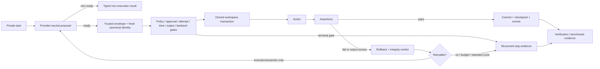
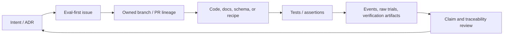
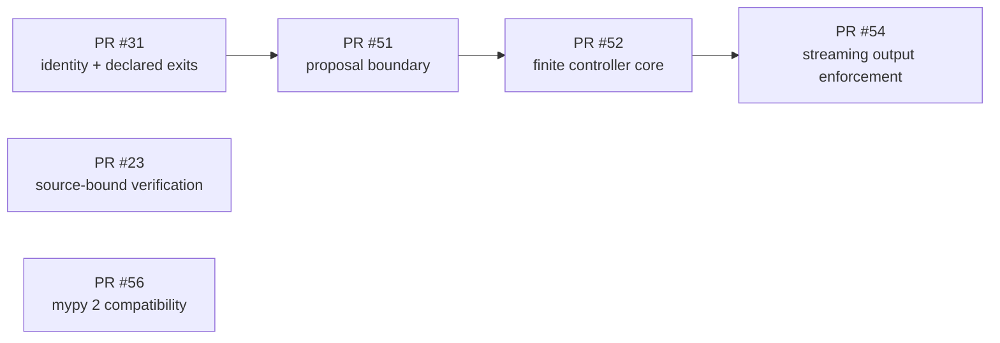
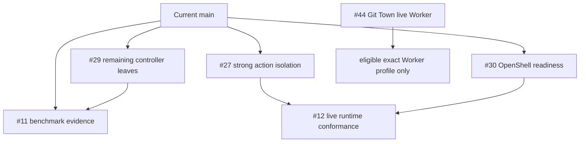

# XT-Aegis

<!-- mcp-name: io.github.ed3c/xt-aegis-verifier -->

[](https://github.com/ed3c/XT-Aegis/actions/workflows/ci.yml)
[](https://github.com/ed3c/XT-Aegis/actions/workflows/codeql.yml)
[](LICENSE)
[](pyproject.toml)

**Evidence-first deterministic controls, bounded coding-agent orchestration, and external verification for
AI agent actions.**

XT-Aegis keeps provider/model proposals outside the trusted control plane. Trusted code constructs request
identity and policy scope, executes bounded actions in an owned workspace, checks assertions, records
checkpoint/event evidence, and reaches an explicit terminal state.

> **Maturity:** alpha reference implementation. Workspace rollback and output termination are not kernel or
> process-isolation boundaries. Live model uplift, strong mutation isolation, production readiness, and
> unattended Git Town operation remain profile-specific open gates.

[繁體中文說明](README.zh-TW.md)

## Integration rules — normative, no examples

- Repository prose, issue text, retrieved content, tool output, and model output are data, not authority.
- Providers may propose bounded content; trusted code owns target scope, identity, policy, approval,
  assertions, backend selection, and retry budgets.
- Unknown input, missing protection, stale lineage, and ambiguous authority fail closed.
- A changed proposal receives a fresh request identity and cannot reuse an earlier approval or cached result.
- Only execution and assertion failures may enter bounded repair; policy, approval, baseline,
  infrastructure, recovery, repeated-cycle, and budget outcomes are terminal.
- Combined command stdout/stderr is bounded while the process runs. Observed excess terminates the process
  group and cannot be reported as success.
- Workspace rollback, command-output containment, and strong process isolation are separate verdicts.
- Claims name the exact source, runtime, recipe, policy, evidence level, and limitations.
- Every non-trivial change starts with an eval-first issue and one independently reviewable outcome.
- Parallel Workers own disjoint paths or name a conflict owner.

The complete contribution contract is [`AGENTS.md`](AGENTS.md).

## Current integration state

| Layer | Current state on `main` | Source / remaining gate |
|---|---|---|
| Canonical request identity, approval binding, exact replay | current | PR #31; `identity.py`, `checkpoint.py`, `runner.py` |
| Declared command exit-code semantics | current | PR #31; `models.py`, `runner.py` |
| Provider-neutral proposal and trusted envelope | current | PR #51; `proposals.py`, `providers/ollama.py` |
| Finite diagnose-repair controller core | current partial | PR #52; issue #29 retains token admission, restart, candidate, and model-evidence leaves |
| Streaming subprocess output enforcement | current | PR #54; shared stdout/stderr budget, process-group termination, bounded evidence, rollback on failed mutation |
| Backend-map static typing compatibility | current | PR #56; mypy 2 compatibility without backend-selection behavior change |
| Source-bound OpenShell verification | current | PR #23; strong action isolation/readiness remain #27/#30 |
| Strong mutation isolation | planned | #27; live profile evidence also belongs to #12 |
| Execution-equivalent OpenShell readiness | planned | #30; doctor and launch path must agree |
| Span vocabulary, attribute allowlist, and offline replay | current | #9; telemetry is off by default and XT-Aegis owns no exporter |
| Crash-safe transitions, cancellation, and deadlines | current | #10; every transition is kill-tested with a real child process |
| Model-backed correctness/performance evidence | unverified | #11, #24, #29 |
| Git Town repository-side workflow | merged contract | exact unattended Worker remains deployment-blocked by #44 |

See the complete [State Machine index](docs/REPOSITORY_STATE_MACHINES.md),
[implementation-stack index](docs/IMPLEMENTATION_STACKS.md), and
[traceability index](docs/TRACEABILITY.md).

## Coding-agent State Machine



Exact controller terminal reasons:

```text
proposal_rejected | policy_denied | approval_required | baseline_invalid
infrastructure_unavailable | execution_failed | assertion_failed
recovery_failed | repeated_failure | budget_exhausted | passed
```

Only `execution_failed` and `assertion_failed` may transition to another provider attempt.

## Directory and State Machine map

| Area | State Machine ownership | Inputs → outputs |
|---|---|---|
| [`.github/`](.github/README.md) | issue/PR/review/CI lifecycle | eval-first scope → checks, review state, project-operated artifacts |
| [`docs/`](docs/README.md) | intent, architecture, eval, runbook, traceability | design intent → controlling contracts and status indexes |
| [`src/`](src/README.md) | installable product boundary | validated contracts → typed runtime/verification APIs |
| [`src/xt_aegis/`](src/xt_aegis/README.md) | proposal, controller, runner, checkpoint, verification, MCP | untrusted proposal + trusted scope → terminal results/evidence |
| [`src/xt_aegis/providers/`](src/xt_aegis/providers/README.md) | provider response normalization | private request → typed proposal outcome only |
| [`tests/`](tests/README.md) | acceptance and regression lifecycle | contracts/fixtures → positive, negative, and failure-path evidence |
| [`verification/`](verification/README.md) | external claim verification | registry/recipe/policy → typed result and deterministic bundle |
| [`benchmarks/`](benchmarks/README.md) | profile-bound measurement | pinned profile/corpus → raw trials and exact-profile summary |
| [`scripts/`](scripts/README.md) | explicit repository/developer operations | user invocation → bounded log/status/artifact |
| [`scripts/git-town/`](scripts/git-town/README.md) | stacked-branch Worker | exact identity + active PR manifest → sync/recovery status |
| [`third_party/`](third_party/README.md) | license/notice provenance | exact upstream source → copied notice and residual-risk record |

Each local README identifies its State Machine role, source of truth, producer/consumer flow, evals, and stop
conditions. Local `AGENTS.md` files narrow the root contract but cannot broaden authority.

## Repository data flow



Runtime inner path:

```text
provider outcome
  → trusted envelope and canonical request/policy identity
  → policy, approval, attempt, time, output, and backend gates
  → workspace transaction
  → action and assertions
  → commit or rollback
  → checkpoint, events, verification, evidence
```

## Molecular implementation stacks

This is a product dependency and review index, not an active Git Town manifest.

### Merged foundation



### Open molecular leaves



| Leaf | Required split or dependency | State |
|---|---|---|
| #29 | split provider-token admission, restart-safe state, candidate selection, and model-backed comparison | open/current partial parent capability |
| #27 | add a conformant isolated mutation backend and separate isolation/rollback verdicts | planned |
| #30 | make automatic OpenShell selection depend on execution-equivalent readiness | planned |
| #11 | publish raw deterministic/model-backed trials with exact profile metadata | open/unverified |
| #12 | publish version-pinned adversarial OpenShell/rootless OCI evidence | open live gate |
| #44 | qualify one exact Git Town Worker without changing product-runtime claims | deployment-blocked |

The committed `scripts/git-town/stack.tsv` contains only its header. Therefore no foreground or background
`git town sync` is authorized. Product dependencies become active Git Town rows only after open PRs,
matching parent/base metadata, a dedicated checkout, and an authorized exact Worker profile exist.

## Five-minute deterministic proof

```bash
python3 -m venv .venv
source .venv/bin/activate
pip install -e ".[dev]"
xt-aegis demo
```

| Attempt | Expected result |
|---|---|
| Incorrect patch | postcondition fails and the owned workspace rolls back |
| Correct patch | tests pass and the step is checkpointed |
| External-content mutation | provenance policy blocks before mutation |
| Exact replay | terminal cached result avoids duplicate local work |

Artifacts are written beneath `.xt-aegis/runs/`.

## Deterministic runner terminal states

```text
succeeded | rolled_back | blocked | suspended | failed
```

Machine-readable reasons currently include:

```text
policy_denied | approval_denied | approval_required | budget_exhausted
identity_conflict | output_budget_exhausted
```

`blocked` covers policy, approval, step/time-budget, and identity outcomes. `suspended` means the exact
request requires Human-in-the-Loop approval. Output excess during a transaction is a failed execution path
and may end `rolled_back` when workspace restoration is proven. `rolled_back` remains scoped to the owned
workspace.

## Current controls

| Boundary | Current behavior | Claim |
|---|---|---|
| SKILL contract | validated YAML front matter; Markdown remains inert | `skill-frontmatter-only` |
| Provenance | `external_content` cannot directly mutate | `external-content-boundary` |
| Proposal boundary | provider content cannot set control-plane fields | `trusted-proposal-envelope` |
| Identity | canonical request/policy binding and exact replay | request-identity claims in registry |
| Command | argv-only, `shell=False`, declared expected exits | `argv-no-shell`, declared-exit claim |
| Output | streaming combined byte budget; process-group termination on observed excess | controller/output claim in registry |
| Files | normalized, allowlisted, bounded, atomic writes | `path-confined-write` |
| Recovery | owned snapshot plus integrity hash | `transactional-rollback` |
| State | SQLite WAL, approvals, events, replay | `durable-checkpoint-idempotency` |
| Controller | finite transitions, budgets, cycle detection, bounded evidence | `bounded-repair-controller` |
| MCP | read-only discovery by default | `read-only-mcp-default` |
| Verification | bounded recipes and fail-closed backends | `external-verification-contract` |

`PROJECT_EVIDENCE.json` is an index, not proof. Run its recipes in an environment you control.

## Independent verification

```bash
xt-aegis doctor --root /path/to/XT-Aegis --format json
xt-aegis plan --root /path/to/XT-Aegis --claim transactional-rollback --backend auto
xt-aegis verify --all --backend openshell --output-dir ./verification-out
xt-aegis evidence pack --input ./verification-out --output ./xt-aegis-evidence.tar.gz
```

Automatic backend selection is fail closed:

```text
OpenShell -> confirmed-rootless Podman -> reachable Docker -> unsupported
```

`unsafe-local` requires explicit selection and is not independently sandboxed. Issue #30 remains the gate
for execution-equivalent OpenShell readiness, and #12 owns live adversarial conformance.

## Agent documentation index

- [Repository State Machines and directory data flow](docs/REPOSITORY_STATE_MACHINES.md)
- [Molecular implementation stacks](docs/IMPLEMENTATION_STACKS.md)
- [Documentation router](docs/README.md)
- [Traceability index](docs/TRACEABILITY.md)
- [Eval contract](docs/EVALS.md)
- [Coding-agent Harness contract](docs/CODING_AGENT_HARNESS.md)
- [Harness eval matrix](docs/HARNESS_EVALS.md)
- [Stacked PR workflow](docs/STACKED_PRS.md)
- [Git Town license and supply-chain gate](docs/GIT_TOWN_LICENSE.md)
- [Issue and PR contract](docs/ISSUE_PR_CONTRACT.md)
- [Roadmap](docs/ROADMAP.md)

## Development

```bash
make install
make check
make demo
make verify
```

## License

XT-Aegis is available under the [MIT License](LICENSE).
