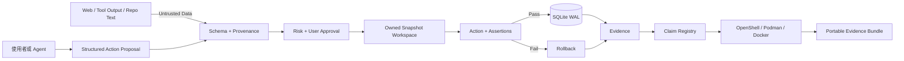

# XT-Aegis

**以可驗證證據為核心的 AI Agent 確定性控制層與外部驗證工具。**

XT-Aegis 不是聊天機器人 API 套殼，也不宣稱模型不會犯錯。它把 typed contract、policy
gate、checkpoint、user approval、transactional rollback 放在 Agent proposal 與真實 side
effect 之間，再用版本化 claim registry、沙盒 backend 與可攜式 evidence bundle 讓使用者獨立驗證。

> **目前成熟度：** Alpha reference implementation。本地 snapshot backend 不是 kernel security
> boundary。OpenShell、Podman、Docker adapter 已實作，但每個外部 runtime 仍有自己的成熟度、部署條件與威脅模型。

## 五分鐘證明

```bash
python3 -m venv .venv
source .venv/bin/activate
pip install -e ".[dev]"
xt-aegis demo
```

Demo 會產生四個可觀察結果：

| 場景 | 預期結果 |
|---|---|
| Agent 寫入錯誤 refactor | Postcondition 失敗，Workspace rollback，前後 hash 相同 |
| Agent 寫入正確 refactor | Unit tests 通過，結果寫入 SQLite checkpoint |
| 外部文字直接產生 mutation | Provenance policy 在副作用前阻擋 |
| 重送相同成功請求 | Idempotency key 回傳 cached result，不重複 side effect |

## 外部獨立驗證

`PROJECT_EVIDENCE.json` v2 將每個 claim 定義成嚴格的 argv-only recipe，包含 timeout、輸出上限、
relative cwd、default-deny network、expected status 與 limitations。Repository 文字只是 untrusted
input；Verifier 不接受任意 shell string，也拒絕 path-qualified executable 與 inline interpreter code。

### 只檢查環境，不執行 Repository code

```bash
xt-aegis doctor --root /path/to/XT-Aegis --format json
xt-aegis plan --claim transactional-rollback --backend auto
```

### 使用強隔離 backend 執行

```bash
xt-aegis verify --all --backend openshell --output-dir ./verification-out
```

`auto` 採 fail-closed 選擇：

```text
OpenShell -> rootless Podman -> Docker -> unsupported
```

`unsafe-local` 只供使用者明確指定的開發與專案 CI 使用，絕不自動 fallback：

```bash
xt-aegis verify --all --backend unsafe-local --output-dir ./verification-out
```

### 打包證據

```bash
xt-aegis evidence pack \
  --input ./verification-out \
  --output ./xt-aegis-evidence.tar.gz
```

Archive 具有 deterministic layout 與逐檔 SHA-256 manifest。Hash 只能證明完整性，不能證明發布者身分；
release provenance 由 GitHub Actions attestation 處理。

詳見 [External Verification](docs/EXTERNAL_VERIFICATION.md) 與
[OpenShell Adapter](docs/OPENSHELL.md)。

## MCP 驗證服務

MCP Server 預設使用 `stdio`，且只提供 read-only evidence discovery：

```bash
pip install ".[mcp]"
xt-aegis-mcp
```

預設工具：

- `project_capabilities`
- `verification_list_claims`
- `verification_get_claim`
- `verification_doctor`
- `verification_get_plan`

只有使用者在本機明確允許時，Server 才會註冊 execution tools：

```bash
xt-aegis-mcp --root /path/to/XT-Aegis --allow-execution --backend openshell
```

需要 localhost Streamable HTTP 時：

```bash
xt-aegis-mcp --transport streamable-http --host 127.0.0.1 --port 8765
```

預設模式不執行 Repository code，也不提供匿名遠端執行服務。`server.json` 定義 MCP Registry metadata；
release workflow 會建立 PyPI package 與 `ghcr.io/ed3c/xt-aegis-verifier` OCI image。

## 架構



- **Neural-Core** 只能提出 typed action proposal。
- **SOP-Core** 負責允許、阻擋、暫停、執行與 rollback。
- Retrieved content 永遠位於 data plane，不會因文字指令取得 control-plane authority。
- **Verification Plane** 只執行嚴格 recipe，且不擴張原本 runtime 權限。

## 已實作能力

| 能力 | Claim ID |
|---|---|
| Strict SKILL frontmatter compiler | `skill-frontmatter-only` |
| External-content provenance block | `external-content-boundary` |
| argv + `shell=False` | `argv-no-shell` |
| Atomic path-confined write | `path-confined-write` |
| Snapshot rollback + integrity hash | `transactional-rollback` |
| SQLite WAL + idempotency | `durable-checkpoint-idempotency` |
| Durable user approval | `human-approval` |
| Outcome / Trajectory evaluator | `trajectory-evaluation` |
| Structured verification contract | `external-verification-contract` |
| Read-only MCP default | `read-only-mcp-default` |
| OpenShell / OCI adapters | `openshell-backend-adapter`, `oci-verifier-adapter` |
| Deterministic evidence bundle | `deterministic-evidence-bundle` |

Claim registry 是索引，不是證明。使用者或 verification client 必須在自己控制的環境執行 recipe。

## 安全預設

- unknown schema 與 action fail closed；
- Markdown prose 與 code fence 不可執行；
- external content 只有 data authority；
- command 使用 argv 與 `shell=False`；
- mutation 具 path confinement 與 idempotency；
- high-risk action 必須等待 user approval；
- public MCP 預設 read-only；
- `auto` 只選擇 strong backend；
- 未量測數字維持 `unverified`。

## 文件

- [Architecture](docs/ARCHITECTURE.md)
- [External Verification](docs/EXTERNAL_VERIFICATION.md)
- [OpenShell Adapter](docs/OPENSHELL.md)
- [User Verification Guide](docs/USER_VERIFICATION_GUIDE.md)
- [User Demo](docs/USER_DEMO.md)
- [Threat Model](docs/THREAT_MODEL.md)
- [Prompt Injection Policy](docs/PROMPT_INJECTION.md)
- [Evidence Model](docs/EVIDENCE.md)
- [Roadmap](docs/ROADMAP.md)
- [Security Policy](SECURITY.md)
- [Contributing](CONTRIBUTING.md)

## License

MIT License，詳見 [LICENSE](LICENSE)。
