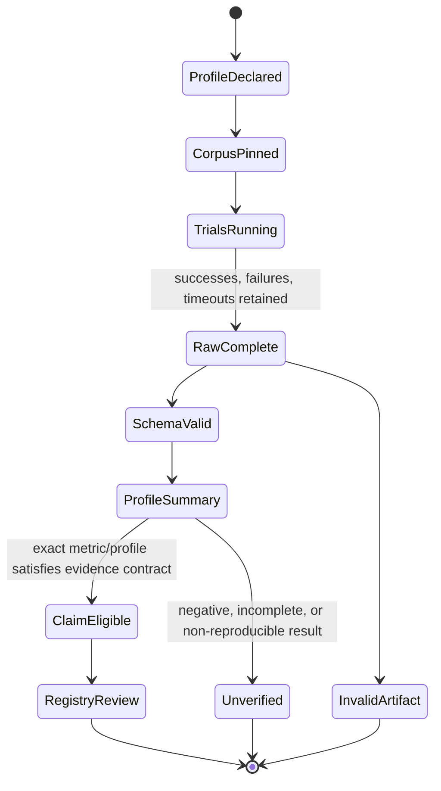

# Benchmarks

This directory owns raw, profile-bound measurement artifacts governed by
[`docs/BENCHMARKS.md`](../docs/BENCHMARKS.md). A number stored here is not authoritative merely because it
is committed.

## Benchmark State Machine



## Data flow

```text
source revision + dirty state
  + pinned corpus/workload
  + model/provider/sampling or deterministic runtime profile
  + environment/tool/dependency identity
  + finite budgets and seed
  -> raw trials including failures/timeouts
  -> schema validation
  -> exact-profile summary
  -> optional claim and traceability review
```

## Inputs, outputs, and consumers

| Item | Required content | Consumer |
|---|---|---|
| Profile manifest | commit, dirty state, OS/architecture, Python/runtime, dependencies, filesystem/storage, model/provider/sampling, budgets, seed | reproduction and comparison |
| Raw trial | exact command/task, start/end, outcome, latency, tokens/cost when available, retries, stop reason, failure/timeout | schema validator and summary |
| Summary | median/distribution, success/failure counts, safety/mutation persistence, limitations | `docs/BENCHMARKS.md`, #11, claim review |
| Reproduction instructions | immutable inputs and exact commands | external reviewer |

## Current integration role

The deterministic runner and finite controller core are current on `main`, but model-backed Harness uplift,
latency, token/cost, and production throughput remain `unverified`. Issue #11 owns the reusable benchmark
harness and raw artifact contract. Issue #29 owns direct/equal-feedback/controller comparisons for the
bounded repair loop.

A lower token count is not a success when task outcome or safety regresses. Direct, equal-feedback, and
controller paths must use the same task set, model, sampling, context budget, environment, and success
criteria.

## Directory ownership

This directory may contain fixtures, profile manifests, raw JSON/JSONL trials, validated summaries, and
reproduction notes. Product code belongs in `src/`; benchmark CLI/scaffolding belongs in `scripts/` or the
explicit package path owned by its issue; claim status belongs in `PROJECT_EVIDENCE.json` only when the
exact evidence gate is satisfied.

## Required evals

- Raw schema accepts successes, failures, timeouts, infrastructure failures, and negative results.
- Aggregation is deterministic for identical raw input.
- No smoke CI enforces unstable wall-clock marketing thresholds.
- Profile comparison rejects mismatched model/corpus/sampling/environment/success contracts.
- Failed and timed-out trials cannot be filtered out to improve a result.
- Links, hashes, commands, and limitations remain sufficient for reproduction.

## Stop and escalate

Stop when the source/profile is incomplete, raw failures are missing, success criteria differ across
baselines, a summary is promoted without raw artifacts, or a local result is described as universal.
Record the blocker in #11 or the owning model-backed issue and keep the claim `unverified`.

See root [`AGENTS.md`](../AGENTS.md), the
[State Machine index](../docs/REPOSITORY_STATE_MACHINES.md), and the
[implementation-stack index](../docs/IMPLEMENTATION_STACKS.md).
