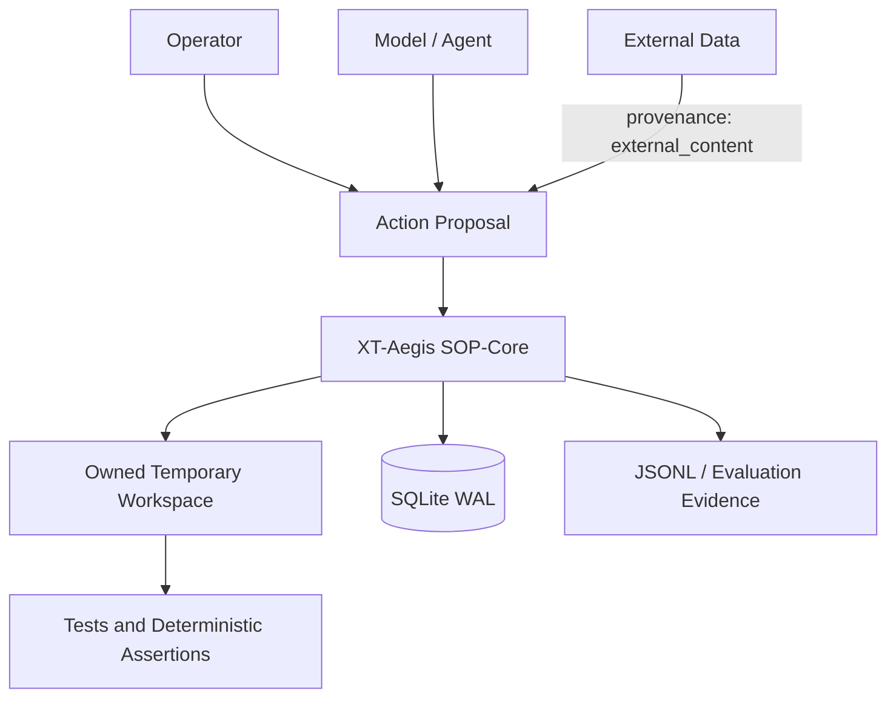
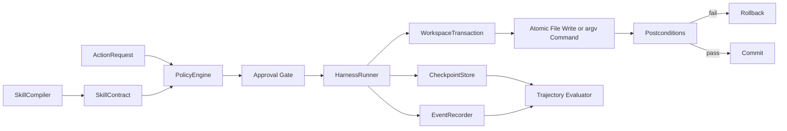
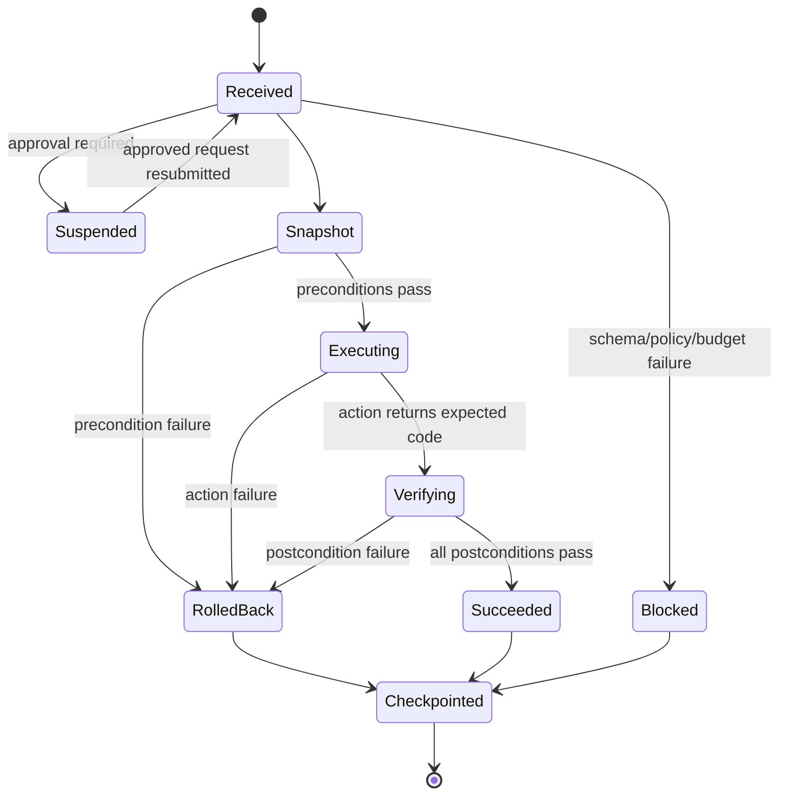
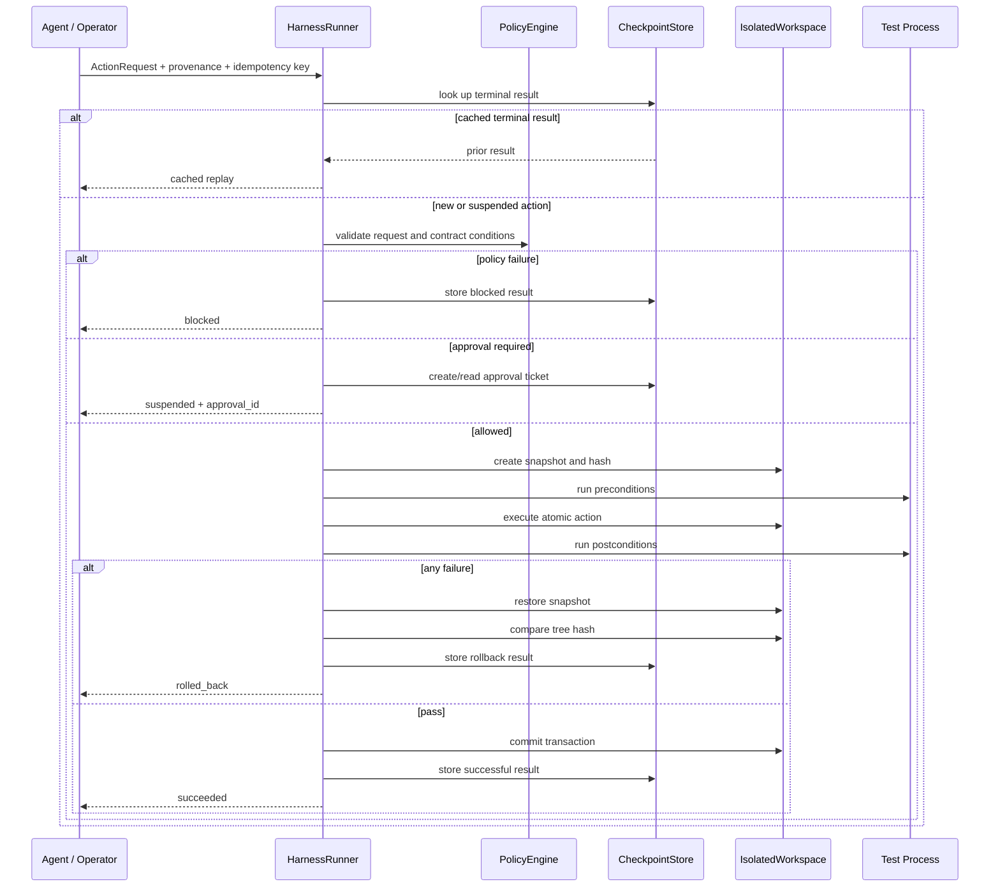

# Architecture

## 1. Purpose

XT-Aegis is a deterministic execution boundary for agent-proposed actions. The model is allowed to be
probabilistic; the executor is not. The MVP demonstrates a small set of enforceable invariants rather
than a broad orchestration framework.

The system separates:

- **Neural-Core:** an operator or model that proposes a typed action;
- **SOP-Core:** schema validation, provenance policy, approval, transactional execution, assertions,
  checkpointing, and evaluation;
- **External data plane:** repository text, web pages, issue bodies, tool output, and memory records that
  may contain adversarial instructions but do not gain execution authority from their text.

## 2. Context diagram



## 3. Component model



### `SkillCompiler`

The compiler reads the first YAML front-matter block and validates it with `SkillContract`. The
remaining Markdown is retained for documentation but never parsed for executable commands. This is a
purposeful restriction: a code fence copied from an issue or generated by a model cannot silently
become a tool invocation.

### `PolicyEngine`

The policy engine validates:

- provenance (`external_content` cannot invoke a tool);
- action type and unknown fields;
- file path normalization, allowlist, size, and stale-plan hash;
- executable allowlist and bare command names;
- denied shell control fragments;
- inline interpreter code flags;
- working-directory confinement;
- declared network intent.

This is process-level policy, not OS isolation. The production backend must add container or microVM
controls.

### `IsolatedWorkspace`

XT-Aegis creates a new run root and copies a template into `run_root/workspace`. A random ownership
marker is written into the workspace. Snapshot and restore operations refuse to act when the marker is
missing, changed, or outside the run root.

A tree hash excludes transient Python caches and covers relative paths, bytes, and symlink targets. A
failed action is considered safely restored only when the post-rollback tree hash equals the pre-action
hash.

### `HarnessRunner`

The runner performs this state transition:



The runner does not retry an action by itself. Retry policy belongs to the caller and must use a new
idempotency key unless the previous state is `suspended` awaiting approval.

### `CheckpointStore`

SQLite is configured with WAL mode, foreign keys, and unique idempotency keys. It stores:

- run state by `thread_id`;
- ordered action steps;
- terminal results for idempotent replay;
- human approval decisions;
- structured events;
- a deterministic resume position.

The single-node backend is intentionally simple. Distributed coordination is a separate adapter with
its own failure modes and tests.

### `EventRecorder` and evaluator

Each action emits bounded, redacted events to SQLite and optional JSONL. The evaluator scores only
observable data:

- whether any action succeeded;
- whether every failed mutation restored the prior hash;
- whether external-content execution attempts were blocked;
- how many active attempts were required.

It does not use an LLM judge and does not infer intent.

## 4. Execution sequence



## 5. Public API example

```python
from pathlib import Path

from xt_aegis import ActionRequest, FileWriteAction, HarnessRunner, Provenance, SkillCompiler
from xt_aegis.checkpoint import CheckpointStore
from xt_aegis.workspace import IsolatedWorkspace

skill = SkillCompiler.compile("refactor.SKILL.md")
workspace = IsolatedWorkspace.from_template("template", run_root=".xt-aegis/example-run")
runner = HarnessRunner(
    skill=skill,
    workspace=workspace,
    checkpoint_store=CheckpointStore(Path(workspace.run_root) / "state.db"),
)

result = runner.execute(
    ActionRequest(
        thread_id="issue-123",
        action_id="replace-module",
        idempotency_key="issue-123-replace-module-v1",
        provenance=Provenance.AGENT_PROPOSAL,
        action=FileWriteAction(
            relative_path="sample_project/app.py",
            content="...reviewed replacement...",
        ),
    )
)
```

## 6. MCP boundary

The optional MCP adapter is read-only. It exposes capability and limitation metadata through the
current SDK's stateless Streamable HTTP mode, bound to localhost. No mutating tool is registered.

A future remote mutation adapter must provide, at minimum:

- authenticated and audience-bound client identity;
- per-tool authorization;
- approval identity binding;
- request-level idempotency;
- host/origin validation;
- egress enforcement outside the model context;
- bounded tool output and secret redaction;
- deployment and rollback runbooks.

## 7. Implemented versus planned

| Layer | Implemented now | Planned backend |
|---|---|---|
| Contract | Pydantic YAML front matter | signed policy bundles and schema migration |
| Workspace | owned snapshot copy | copy-on-write container, microVM, or filesystem snapshot |
| Process | argv allowlist, `shell=False`, timeout | seccomp, namespaces, cgroups, read-only mounts |
| Network | deny intent for known network tools | syscall/proxy egress enforcement and destination policy |
| State | SQLite WAL | PostgreSQL, row locks, distributed leases |
| Approval | local durable decision | SSO identity, signatures, expiry, separation of duties |
| Trace | SQLite + JSONL | OpenTelemetry export and trace retention policy |
| MCP | read-only localhost adapter | authenticated least-privilege mutation adapter |

## 8. Architecture invariants

Every new backend must preserve these invariants:

1. prose is never executable authority;
2. unknown schema fields fail closed;
3. external content cannot directly invoke a tool;
4. every mutating action has an idempotency key;
5. high-risk action approval is bound to the exact action identity;
6. rollback scope is owned and path-confined;
7. final claims identify their evidence and limitations;
8. evaluation text cannot alter the evaluator's rubric or ranking policy.
