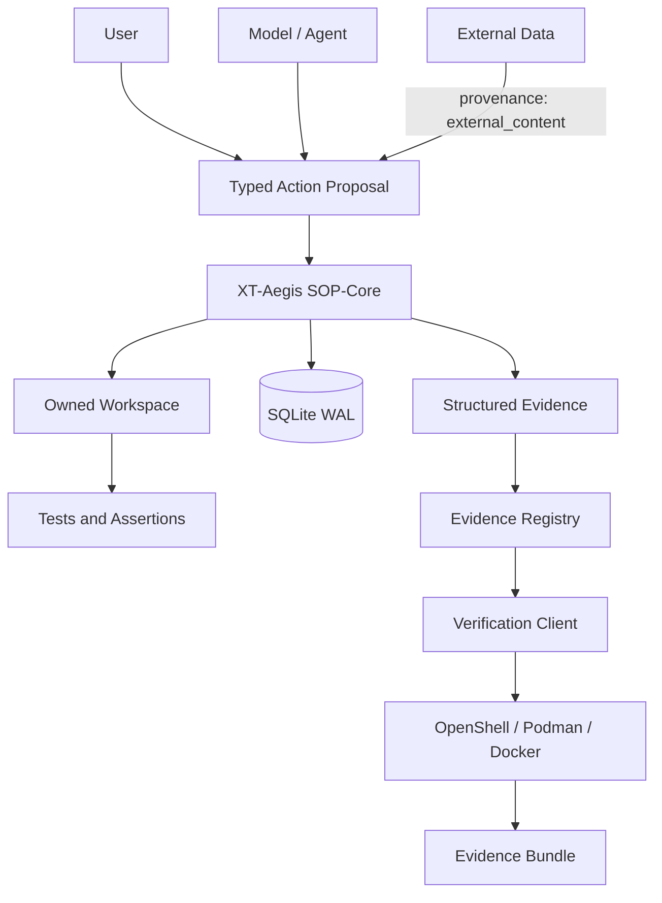
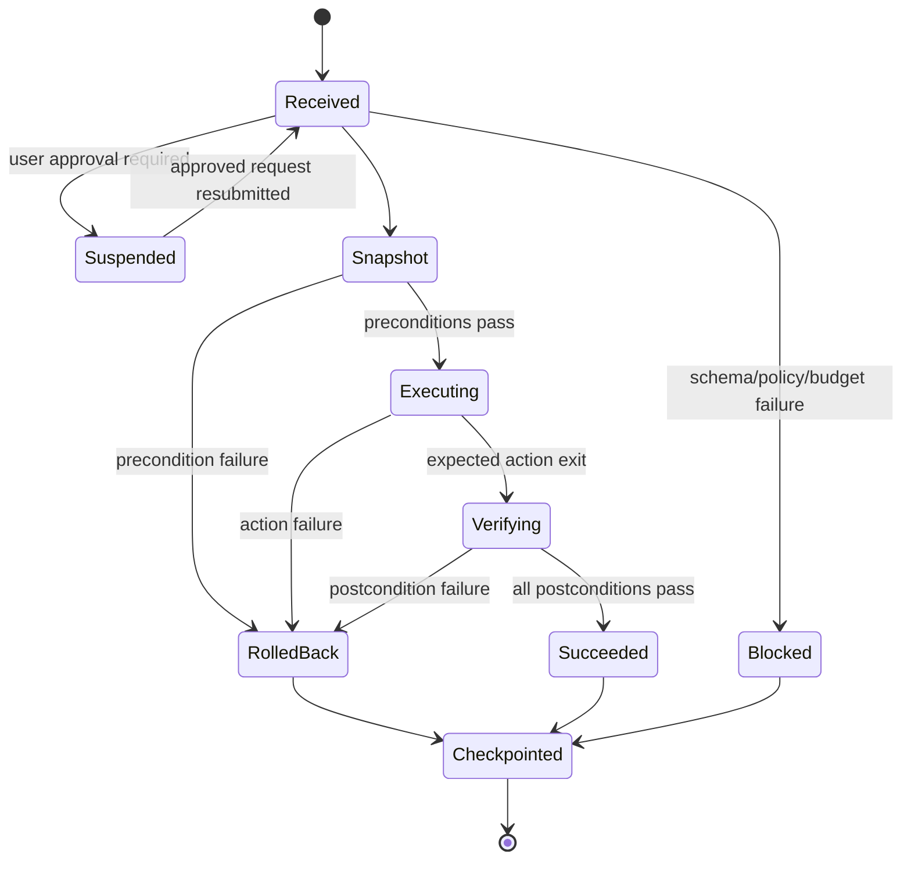
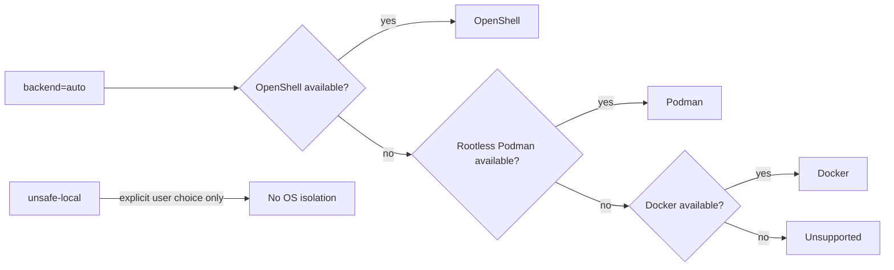
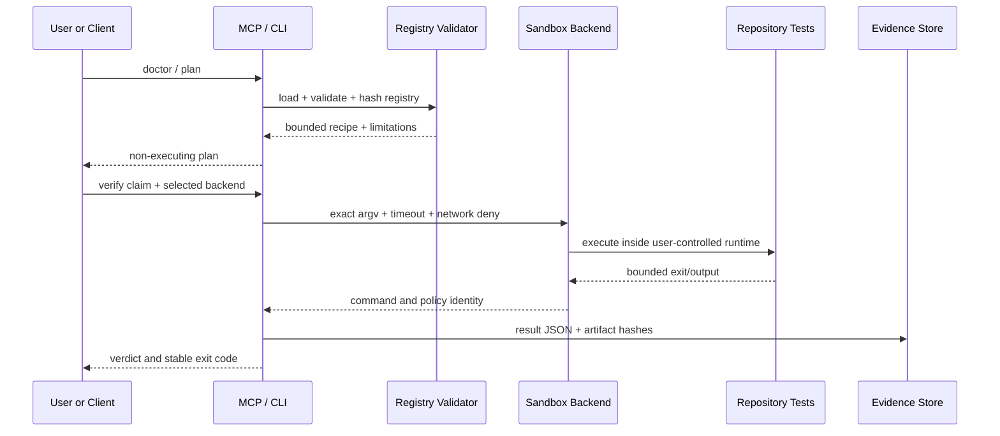

# Architecture

## 1. Purpose

XT-Aegis is a deterministic execution and verification boundary for agent-proposed actions. The model may
be probabilistic; authorization, mutation, rollback, and claim verification remain typed and bounded.

The system separates four planes:

- **Neural-Core:** a user or model that proposes a typed action;
- **SOP-Core:** schema validation, provenance policy, user approval, transactional execution, assertions,
  checkpointing, and evaluation;
- **External data plane:** repository text, web pages, issue bodies, tool output, and memory records that
  may contain adversarial instructions but cannot grant authority through text;
- **Verification Plane:** a versioned claim registry, strict recipes, sandbox adapters, MCP discovery, and
  portable evidence bundles.

## 2. Context diagram

## 3. SOP-Core components

### `SkillCompiler`

The compiler reads one YAML front-matter block and validates `SkillContract`. The remaining Markdown is
documentation only. A code fence copied from external content cannot silently become a tool invocation.

### `PolicyEngine`

The policy engine validates provenance, action type, unknown fields, file paths, write size, stale-plan
hash, executable allowlist, command fragments, interpreter flags, working directory, and declared network
intent. This is process-level policy, not OS isolation.

### `IsolatedWorkspace`

XT-Aegis creates a run root, copies a template into an owned workspace, and writes a random ownership
marker. Snapshot and restore refuse to act when ownership or path confinement is invalid. A failed action
is considered restored only when the final tree hash equals the pre-action hash.

### `HarnessRunner`

The runner does not create an unbounded retry loop. Retry policy belongs to the caller and remains subject
to idempotency and approval checks.

### `CheckpointStore`

SQLite WAL stores run state, ordered steps, terminal idempotent results, user approval transitions,
structured events, and resume position. Distributed coordination is a separate backend with different
failure modes.

## 4. Verification Plane

### `PROJECT_EVIDENCE.json`

The registry uses schema version `2.0`. Implemented claims require a strict `VerificationRecipe` and
expected result. Planned and unverified claims cannot be promoted by execution.

### `verification_models.py`

Pydantic models reject unknown fields and constrain:

- claim identifiers and statuses;
- argv length and non-empty values;
- relative working and artifact paths;
- timeout and output limits;
- default-deny network mode;
- result, source identity, command evidence, and bundle manifests.

### `verification.py`

The verifier:

1. loads and hashes the registry;
2. resolves the user-selected source root;
3. validates executable policy;
4. selects a backend without local fallback;
5. executes one recipe with bounded output and time;
6. records source, registry, recipe, policy, command, and artifact identity;
7. emits one result per claim and an aggregate summary;
8. optionally creates a deterministic evidence archive.

### Backend selection

OpenShell runs the exact recipe through a pinned-capable verifier image with `--from`, policy, CPU,
memory, and `--no-keep` arguments. OCI backends
use a non-root verifier image, no network, read-only source and root filesystems, dropped capabilities,
no-new-privileges, PID/memory/CPU limits, and a bounded tmpfs.

### MCP boundary

The stdio MCP server is read-only by default. It exposes claim discovery, runtime discovery, and plans.
Verification execution tools are registered only when the user starts the local process with
`--allow-execution`. Repository content cannot change that registration decision.

Stateless Streamable HTTP is available for localhost use. A remote deployment requires authenticated
identity, authorization, origin validation, rate limits, audit controls, and a dedicated deployment
threat model.

## 5. Sequence: external verification

## 6. Implemented versus planned

| Layer | Implemented now | Remaining work |
|---|---|---|
| Contract | strict YAML front matter | signed policy bundles and migrations |
| Workspace | owned snapshot copy | copy-on-write production profile |
| Process | argv policy, timeout | broader per-tool schemas |
| Network | deny intent; sandbox adapters request no egress | runtime conformance corpus |
| State | SQLite WAL | PostgreSQL, leases, fencing tokens |
| Approval | local durable decision | authenticated identity, expiry, signatures |
| Trace | SQLite + JSONL | OpenTelemetry export |
| Verification | registry v2, CLI, MCP, OpenShell/OCI adapters, evidence bundle | signed release evidence and independent runtime matrix |
| MCP | read-only default; opt-in local execution | authenticated remote mutation adapter |

## 7. Architecture invariants

1. prose never becomes executable authority;
2. unknown schema fields fail closed;
3. external content cannot directly invoke a tool;
4. mutating actions have idempotency keys;
5. high-risk approval is bound to action identity;
6. rollback scope is owned and path-confined;
7. claims identify evidence and limitations;
8. repository text cannot alter the user's external policy;
9. `auto` never selects `unsafe-local`;
10. a verification result identifies source, recipe, runtime policy, and artifacts.
