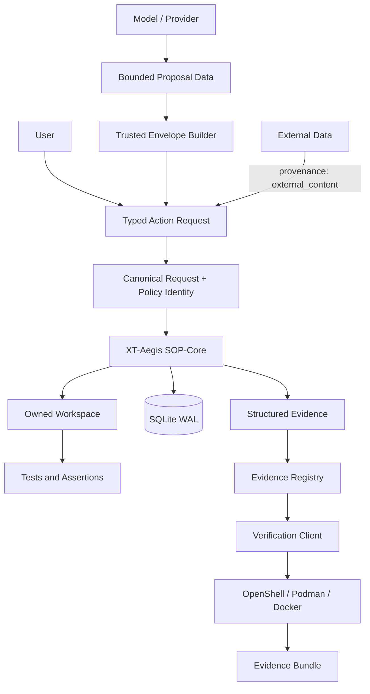
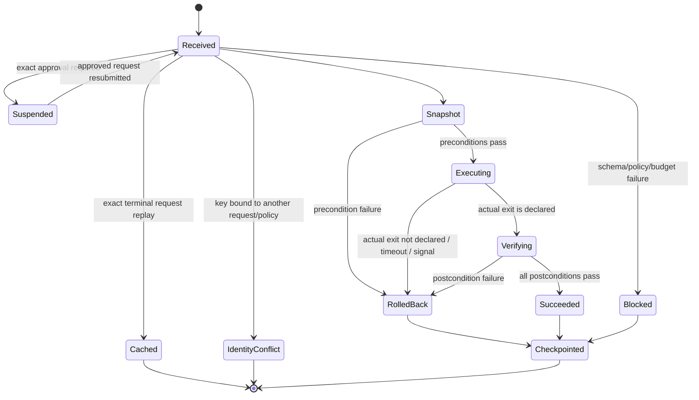
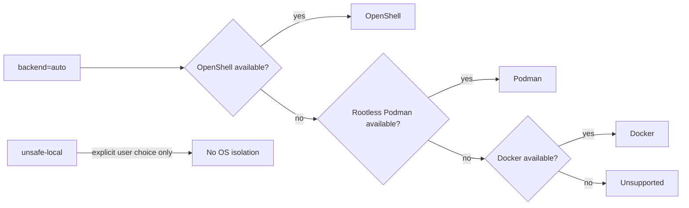

# Architecture

## Status

The canonical request-identity, schema-v2 checkpoint, request-bound approval, and declared command-outcome
controls are current on `main`. The provider-neutral proposal boundary described below is under review in
the #26 change when read from its branch and current only when that exact change is present on `main`.
Status and eval ownership are indexed in [Traceability](TRACEABILITY.md) and [Harness
evals](HARNESS_EVALS.md).

## 1. Purpose

XT-Aegis is a deterministic execution and verification boundary for agent-proposed actions. The model may
be probabilistic; authorization, mutation, rollback, and claim verification remain typed and bounded.
The coding-agent orchestration target is defined in [Harness-Based Coding Agent](CODING_AGENT_HARNESS.md).

The system separates four planes:

- **Neural-Core:** a user, model, or provider that proposes data;
- **SOP-Core:** trusted envelope construction, request identity, schema validation, provenance policy,
  user approval, transactional execution, assertions, checkpointing, and evaluation;
- **External data plane:** repository text, web pages, issue bodies, tool output, and memory records that
  may contain adversarial instructions but cannot grant authority through text;
- **Verification Plane:** a versioned claim registry, strict recipes, sandbox adapters, MCP discovery, and
  portable evidence bundles.

## 2. Context diagram

## 3. SOP-Core components

### `SkillCompiler`

The compiler reads one YAML front-matter block and validates `SkillContract`. The remaining Markdown is
documentation only. A code fence copied from external content cannot silently become a tool invocation.

### `PolicyEngine`

The policy engine validates provenance, action type, unknown fields, file paths, write size, stale-plan
hash, executable allowlist, command fragments, interpreter flags, working directory, and declared network
intent. This is process-level policy, not OS isolation.

### `ProposalProvider` and trusted envelope builder

`ProposalProvider` is a provider-neutral boundary that returns one typed outcome. A ready `Proposal`
contains only replacement content and optional bounded explanation; strict models and
`trusted-proposal.schema.json` reject kind, profile, and control-plane extras. The enclosing outcome retains
redacted profile metadata supplied by trusted adapter code. `build_action_request` accepts only a ready
outcome and combines its proposal with a trusted target, actor label, optional expected source hash, fresh
identifiers, fixed provenance/kind, and the active compiled skill. It rejects path or byte-limit violations
before identity allocation and does not execute the request.

The experimental optional Ollama adapter is local-only: plain HTTP loopback origins, no URL credentials/path/query,
environment proxies disabled, redirects refused, bounded response reads, typed failure outcomes, and exact
configured-model response matching. Provider version metadata is configured rather than remotely attested.
This adapter does not authorize a mutation or prove live-model correctness.

### `RequestIdentity`

`RequestIdentity` serializes request and policy fields through versioned canonical JSON and hashes them with
SHA-256. Unordered sets are sorted; object keys are stable; unsupported values fail closed. The request
digest excludes only the resume-only approval ID. Policy changes, assertions, action payloads, command
arguments, paths, provenance, actor labels, thread/action IDs, or idempotency keys produce a new identity.

The digest is an integrity binding. It does not authenticate the actor or prove that an approved action is
safe.

### `IsolatedWorkspace`

XT-Aegis creates a run root, copies a template into an owned workspace, and writes a random ownership
marker. Snapshot and restore refuse to act when ownership or path confinement is invalid. A failed action
is considered restored only when the final tree hash equals the pre-action hash.

### `HarnessRunner`

A command action succeeds when the actual exit code belongs to `expected_exit_codes`; zero is merely the
default. Timeouts and signal termination never satisfy that contract. The same `_run_command` semantics
are used by actions, preconditions, and postconditions.

The runner does not create an unbounded retry loop. Retry and candidate selection belong to a bounded
controller and remain subject to fresh identities, policy, approval, isolation, and evidence rules.

### `CheckpointStore`

SQLite WAL stores run state, ordered steps, request and policy digests, terminal idempotent results,
request-bound approval transitions, structured events, and resume position. The current state schema is
version 2. Legacy rows without identity fields remain readable for migration but cannot replay or authorize
an action. Unknown future schema versions are rejected rather than downgraded.

Approvals are exact-request, policy, optional-actor, time, and single-use bindings. Consumption before a
crash fails closed and the next attempt receives a fresh approval; authenticated identity and distributed
recovery remain future work. A pending token may be returned to resume its decision flow, but a decided
token is never disclosed again: an otherwise identical request that omits it rotates the record to a fresh
pending token and invalidates the old capability.

## 4. Verification Plane

### `PROJECT_EVIDENCE.json`

The registry uses schema version `2.0`. Implemented claims require a strict `VerificationRecipe` and
expected result. Planned and unverified claims cannot be promoted by execution.

### `verification_models.py`

Pydantic models reject unknown fields and constrain:

- claim identifiers and statuses;
- argv length and non-empty values;
- relative working and artifact paths;
- timeout and output limits;
- default-deny network mode;
- result, source identity, command evidence, and bundle manifests.

### `verification.py`

The verifier:

1. loads and hashes the registry;
2. resolves the user-selected source root;
3. validates executable policy;
4. selects a backend without local fallback;
5. executes one recipe with bounded output and time;
6. records source, registry, recipe, policy, command, and artifact identity;
7. emits one result per claim and an aggregate summary;
8. optionally creates a deterministic evidence archive.

### Backend selection

OpenShell and OCI behavior remains subject to runtime conformance evidence. Adapter construction alone does
not prove host isolation.

### MCP boundary

The stdio MCP server is read-only by default. It exposes claim discovery, runtime discovery, and plans.
Verification execution tools are registered only when the user starts the local process with
`--allow-execution`. Repository content cannot change that registration decision.

Stateless Streamable HTTP is available for localhost use. A remote deployment requires authenticated
identity, authorization, origin validation, rate limits, audit controls, and a dedicated deployment threat
model.

## 5. Delivery state and remaining work

| Layer | Delivered state | Remaining work |
|---|---|---|
| Contract | strict YAML front matter and declared command exits | signed policy bundles and migrations |
| Identity | canonical request and policy digests | signed subjects and cross-service identity |
| Workspace | owned snapshot copy | copy-on-write production profile |
| Process | argv policy, timeout, and declared exit set | broader per-tool schemas |
| Network | deny intent; sandbox adapters request no egress | runtime conformance corpus |
| State | SQLite WAL schema v2 | PostgreSQL, leases, and fencing tokens |
| Approval | expiring, single-use exact-request binding | authenticated identity and crash-safe recovery |
| Trace | SQLite + JSONL request/exit evidence | OpenTelemetry export |
| Coding agent | deterministic execution substrate; #26 proposal boundary when this exact change is on `main` | strong mutation backend, bounded repair controller, live provider evidence |
| Verification | registry v2, CLI, MCP, sandbox adapters, evidence bundle | signed release evidence and independent runtime matrix |
| MCP | read-only default; opt-in local execution | authenticated remote mutation adapter |

## 6. Architecture invariants

1. prose never becomes executable authority;
2. unknown schema fields fail closed;
3. external content cannot directly invoke a tool;
4. an idempotency key is bound to one canonical request and policy;
5. approval is exact, expiring, and single-use;
6. command success follows the declared exit set plus assertions;
7. rollback scope is owned and path-confined;
8. claims identify evidence and limitations;
9. repository text cannot alter the user's external policy;
10. `auto` never selects `unsafe-local`;
11. a verification result identifies source, recipe, runtime policy, and artifacts;
12. a repair attempt receives a new identity and remains bounded by deterministic policy.
