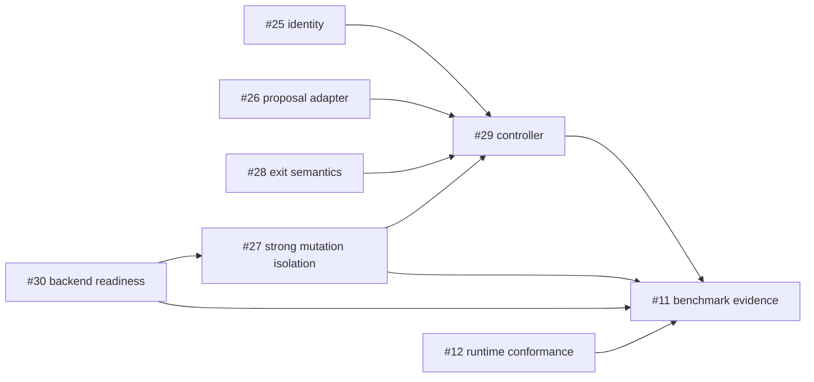

# Coding-Agent Harness Contract

## Status

Proposed architecture contract for issue #35. It documents intended boundaries and acceptance criteria.
It does not claim that every component is implemented on `main`.

## Goal

Add an experimental orchestration layer around the deterministic XT-Aegis core without allowing model
output to own security-sensitive control-plane fields.

```text
provider-neutral proposal
  -> trusted envelope
  -> canonical request and policy identity
  -> required isolation
  -> HarnessRunner
  -> assertions and structured diagnosis
  -> bounded repair / selection
  -> terminal evidence
```

## Trust boundary

| Field or decision | Model/provider may supply | Trusted integration owns |
|---|---:|---:|
| replacement code or typed change content | yes | validates size, encoding, kind, and scope |
| bounded explanation | optional | redacts and limits persistence |
| target path / symbol scope | no | yes |
| thread, action, and idempotency identity | no | yes |
| provenance label | no | yes |
| active policy and assertions | no | yes |
| approval identity, actor binding, expiry | no | yes |
| execution backend and isolation requirement | no | yes |
| attempt/token/time/output budgets | no | yes |
| retry/stop classification | no | yes |
| claim status | no | evidence review only |

Unknown or extra model fields are rejected, not ignored when they could be mistaken for authority.

## Component responsibilities

### Proposal provider

Returns a typed provider outcome: ready, refused, timed out, malformed, oversized, truncated, or provider
error. Provider credentials, prompts, and wire formats stay outside the deterministic runner. Malformed or
non-ready output never reaches mutation.

### Trusted envelope builder

Combines validated proposal content with configured target scope, optimistic source identity, generated
request identity, provenance, policy, assertions, backend requirement, and budgets. A changed proposal
gets a changed request digest and cannot reuse prior approval or idempotent success.

### Action execution boundary

The mutation plane must distinguish:

- action execution success;
- assertion outcome;
- workspace rollback integrity;
- strong-isolation availability;
- external side-effect containment.

Snapshot rollback only covers the owned workspace. A command requiring strong isolation fails closed when
no conformant backend is ready.

### Diagnose-repair controller

Lives outside `HarnessRunner`. It converts bounded, redacted failure evidence into a provider-neutral
repair request and records every attempt.

## Failure taxonomy

| Outcome | Retry? | Required evidence | Stop reason |
|---|---:|---|---|
| proposal rejected or malformed | no | provider status and bounded diagnostic | `proposal_rejected` |
| policy denied | no | policy reasons and digests | `policy_denied` |
| approval required/mismatch | no automatic retry | exact action digest and approval state | `approval_required` |
| baseline precondition invalid | no | failed baseline check | `baseline_invalid` |
| required isolation unavailable | no | readiness component and backend reason | `infrastructure_unavailable` |
| action execution failed | yes, within budget | exit/timeout/output and rollback verdict | `execution_failed` |
| postcondition failed | yes, within budget | failed assertion and rollback verdict | `assertion_failed` |
| rollback integrity failed | no | before/after identity and recovery diagnostics | `recovery_failed` |
| identical proposal/failure cycle | no | stable cycle fingerprint | `repeated_failure` |
| attempt/token/time/output budget reached | no | consumed and configured budgets | `budget_exhausted` |
| passed | no | assertions, source/result identity, final evidence | `passed` |

Security or infrastructure failures are never retried until they happen to pass.

## Budgets

The controller must enforce finite maximums for:

- proposal attempts;
- prompt and completion tokens;
- wall-clock duration;
- proposal and diagnostic bytes;
- command output;
- repeated-equivalent failures;
- candidate branches when branch-and-evaluate is enabled later.

Budget checks occur before the next provider or execution call. Exhaustion is a terminal, schema-valid
result.

## Attempt evidence

Each attempt records, with secret-safe bounds:

- source commit and dirty state;
- provider/model/version and sampling identity;
- request and policy digests;
- target scope and proposal digest, not private prompt content by default;
- backend/readiness profile;
- execution, assertion, rollback, and isolation verdicts;
- actual and expected exit codes;
- token, byte, latency, and attempt counters;
- classification and next transition;
- artifact identities and limitations.

## Measurement contract

A model-backed comparison uses the same corpus, model, sampling, context budget, environment, and success
criteria for:

1. direct execution;
2. equal diagnostic feedback without the Harness controller;
3. Harness-controlled repair.

Report separately:

- first-pass and post-repair correctness;
- Harness-specific correctness uplift;
- clean-or-passing final workspace rate;
- failed-mutation persistence;
- policy/safety outcomes;
- retries and stop reasons;
- prompt/completion tokens and cost;
- latency and infrastructure failures.

One model or machine profile does not generalize to other profiles. A reproducible negative result leaves
the uplift claim unverified.

## Dependency order



PR #31 addresses #25 and #28 under review. PR #23 advances source-bound OpenShell verification but does not
close #30 or prove the mutation-plane isolation required by #27.

## Implementation issue gate

Each implementation issue must define, before code:

- trusted/untrusted field matrix;
- state transitions and terminal outcomes;
- path and side-effect scope;
- positive, negative, timeout, crash, replay, and substitution evals;
- exact backend/profile requirements;
- evidence schema and raw artifact retention;
- claim wording and non-goals;
- stack parent and path ownership.

## Non-goals

- unbounded autonomous retries;
- model-selected policy, approval, provenance, assertion, backend, or identity;
- host mutation fallback when strong isolation is required;
- automatic approval;
- universal exactly-once external effects;
- universal correctness, latency, token, or isolation claims;
- treating retrieved repository text or memory as tool authority.
