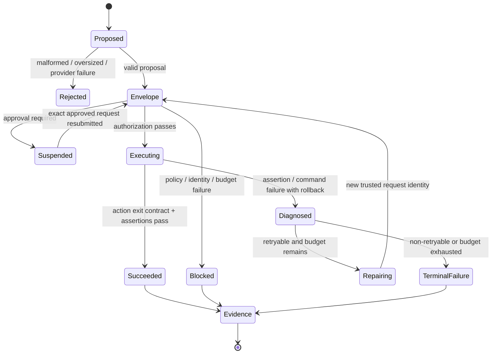

# Harness-Based Coding Agent

## Purpose

XT-Aegis already provides the deterministic safety boundary needed by a coding agent: typed actions,
policy checks, owned workspaces, transactional rollback, assertions, checkpoints, approvals, and evidence.
It does not yet provide the complete model-facing loop that proposes, diagnoses, repairs, and selects code.

The target is a bounded coding agent in which the model can suggest work but cannot manufacture authority:

```text
model/provider proposal
  -> trusted envelope construction
  -> canonical request and policy identity
  -> isolated Harness execution
  -> structured failure diagnosis
  -> bounded repair or candidate selection
  -> terminal evidence
```

## Separation of responsibilities

| Layer | May do | Must not do |
|---|---|---|
| Proposal provider | return a candidate patch, command intent, or refusal | choose durable IDs, approval scope, policy, budgets, or assertions |
| Trusted envelope builder | validate proposal shape and construct `ActionRequest` | execute repository text or silently broaden policy |
| Harness | authorize, checkpoint, execute, assert, roll back, and emit evidence | invent a repair or run an unbounded retry loop |
| Diagnosis | classify observable failure evidence | reinterpret failed evidence as success |
| Controller | choose stop, repair, or candidate selection within budgets | retry after terminal policy, approval, or infrastructure failures |
| Sandbox backend | isolate the selected source and command | fall back to host execution without explicit user choice |

## Request identity contract

Every executable request is bound to a versioned canonical identity. The digest includes the thread,
action, idempotency key, optional actor label, provenance, action payload, command exit contract, and the
complete structured `SkillContract`. The resume-only `approval_id` is excluded so the exact request can be
resubmitted after approval.

The identity is used for three decisions:

1. an idempotency key replays only the exact same request under the same policy;
2. an approval authorizes only the exact request, policy, and actor label;
3. persisted results and events identify the request and policy that produced them.

Legacy rows without a digest fail closed. A digest is an integrity binding, not authenticated identity or
proof that the request is safe.

## Command outcome contract

A command succeeds when its actual process exit code belongs to its declared `expected_exit_codes` set and
all postconditions pass. Exit code zero has no special bypass. Timeouts, signal termination, undeclared
codes, and failed assertions remain failures and trigger rollback when a transaction exists. Process
supervisors may expose signal termination as a negative return code or translate it to a generic nonzero
status, so portable evidence checks rejection against the declared set rather than one numeric encoding.

## Controller state machine



A repair is a new request with a new idempotency key. It never mutates or reuses the identity of the failed
attempt.

## Failure taxonomy

| Class | Typical evidence | Retry policy |
|---|---|---|
| `proposal_invalid` | schema error, oversized output, refusal | stop or request one fresh proposal within provider budget |
| `policy_blocked` | provenance, path, executable, argument, or network violation | terminal until trusted policy or input changes |
| `approval_required` | suspended result and approval ID | wait for an exact user decision; no autonomous retry |
| `command_failed` | undeclared exit code, timeout, or signal | diagnose once; repair only when task policy allows |
| `assertion_failed` | precondition or postcondition evidence | repair only from structured evidence and within attempt budget |
| `rollback_failed` | integrity mismatch or restore exception | terminal infrastructure failure |
| `backend_unavailable` | no strong sandbox or readiness failure | terminal unless the user selects another strong backend |
| `budget_exhausted` | step, time, token, or candidate limit | terminal |

## Issue dependency map

The coding-agent path is intentionally ordered:

1. **#25** canonical request and policy binding;
2. **#28** declared command exit-code semantics;
3. **#26** provider-neutral proposal adapter and trusted envelope;
4. **#27** strong-isolation mutation backend;
5. **#29** bounded diagnose-repair controller;
6. **#30** OpenShell readiness and conformance;
7. **#11** benchmark and evidence publication.

#25 and #28 are safety prerequisites. A controller built before them could replay an approval for changed
code or misclassify a tool's documented nonzero success code as failure.

## Definition of done for the first coding-agent slice

The first end-to-end slice is complete only when all of the following are true:

- a deterministic fake provider can drive the same interface as an optional local model provider;
- trusted code owns IDs, policy, assertions, budgets, and provenance labels;
- mutation runs only through an explicitly selected strong backend;
- one retryable failure produces structured diagnosis and at most one bounded repair;
- policy, approval, rollback, backend, and budget failures terminate without repair;
- every attempt has a unique canonical request identity and durable evidence;
- all required CI gates pass: formatting, lint, type checks, tests, claim validation, package and image builds, and CodeQL;
- a benchmark corpus measures task success, safety, attempts, latency, and token use without unsupported claims.

## Non-goals

This design does not make model output trusted, authenticate `actor_id`, prove kernel isolation, permit an
anonymous remote mutating MCP service, or justify an unbounded autonomous loop.
