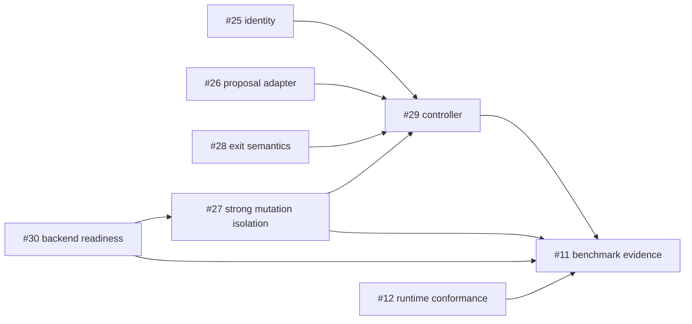

# Coding-Agent Harness Contract

## Status

Partially implemented architecture contract for issue #35. Canonical request identity, declared command
outcomes, and the provider-neutral proposal boundary are current on `main`. The finite controller core is
under review in the #29 change when read from its branch and current only when that exact change is present on
`main`. Strong mutation isolation, process-restart resume, candidate selection, and model-backed benchmark
evidence remain tracked work.

## Goal

Add an experimental orchestration layer around the deterministic XT-Aegis core without allowing model
output to own security-sensitive control-plane fields.

```text
provider-neutral proposal
  -> trusted envelope
  -> canonical request and policy identity
  -> required isolation
  -> HarnessRunner
  -> assertions and structured diagnosis
  -> bounded repair / selection
  -> terminal evidence
```

## Trust boundary

| Field or decision | Model/provider may supply | Trusted integration owns |
|---|---:|---:|
| replacement code or typed change content | yes | validates size, encoding, kind, and scope |
| bounded explanation | optional | redacts and limits persistence |
| target path / symbol scope | no | yes |
| thread, action, and idempotency identity | no | yes |
| provenance label | no | yes |
| active policy and assertions | no | yes |
| approval identity, actor binding, expiry | no | yes |
| execution backend and isolation requirement | no | yes |
| attempt/token/time/output budgets | no | yes |
| retry/stop classification | no | yes |
| claim status | no | evidence review only |

Unknown or extra model fields are rejected, not ignored when they could be mistaken for authority.

## Component responsibilities

### Proposal provider

Returns a typed provider outcome: ready, refused, timed out, malformed, oversized, truncated, or provider
error. Provider credentials, prompts, and wire formats stay outside the deterministic runner. Malformed or
non-ready output never reaches mutation.

The first experimental optional adapter uses Ollama's non-streaming local generate API for code-only `replace_file`
proposals. Its default transport accepts only a loopback HTTP origin, disables environment proxies, rejects
redirects, bounds response bytes and time, and checks the returned model against the configured model. The
configured provider version is retained as operator-supplied profile metadata; it is not a server
attestation. No live-model correctness or availability claim follows from adapter unit tests.

### Trusted envelope builder

Combines validated proposal content with a trusted target path, optional optimistic source hash and actor
label, generated thread/action/idempotency identifiers, `agent_proposal` provenance, and the active compiled
skill identity. The current builder rejects non-normalized or non-allowlisted paths and enforces the active
skill's UTF-8 byte limit before allocating identifiers. It returns an `ActionRequest` envelope but never
invokes `HarnessRunner`; approval, backend selection, assertions, and controller budgets remain outside this
proposal slice. A changed proposal with fresh identifiers gets a changed request digest and cannot be
mistaken for an earlier request.

The portable `trusted-proposal.schema.json` and the Pydantic `Proposal` model accept only bounded content
and optional explanation. They reject unknown fields, including kind, provider profile, target, identity,
approval, provenance, policy, backend, and budget fields. Trusted adapter code supplies the fixed proposal
kind and retains redacted provider profile metadata separately in `ProposalOutcome`. The schema character
bound is not a substitute for the builder's active-policy byte bound.

### Request identity

Every executable request is bound to a versioned canonical identity. The digest includes the thread,
action, idempotency key, optional actor label, provenance, action payload, command exit contract, and the
complete structured `SkillContract`. The resume-only `approval_id` is excluded so the exact request can be
resubmitted after approval.

The identity has three enforcement uses:

1. an idempotency key replays only the exact same request under the same policy;
2. an approval authorizes only the exact request, policy, and actor label;
3. persisted results and events identify the request and policy that produced them.

Legacy rows without a digest fail closed. A digest is an integrity binding, not authenticated identity or
proof that the request is safe.

### Command outcome

A command succeeds when its actual process exit code belongs to its declared `expected_exit_codes` set and
all postconditions pass. Exit code zero has no special bypass. Timeouts, signal termination, undeclared
codes, and failed assertions remain failures and trigger rollback when a transaction exists. Process
supervisors may expose signal termination as a negative return code or translate it to a generic nonzero
status, so portable evidence checks rejection against the declared set rather than one numeric encoding.

### Action execution boundary

The mutation plane must distinguish:

- action execution success;
- assertion outcome;
- workspace rollback integrity;
- strong-isolation availability;
- external side-effect containment.

Snapshot rollback only covers the owned workspace. A command requiring strong isolation fails closed when
no conformant backend is ready.

### Diagnose-repair controller

Lives outside `HarnessRunner`. It converts bounded, redacted failure evidence into a provider-neutral
repair request and records every attempt. The #29 implementation under review covers deterministic
classification, fresh request identity, repeated-cycle detection, strict run context, and finite
attempt/token/time/proposal/diagnostic/retained-output budgets. Executor results are accepted only when
their thread, action, idempotency, request-digest version/value, and policy identities match the trusted
envelope. It does not promote a live-model uplift claim.

## Failure taxonomy

| Outcome | Retry? | Required evidence | Stop reason |
|---|---:|---|---|
| proposal rejected or malformed | no | provider status and bounded diagnostic | `proposal_rejected` |
| policy denied | no | policy reasons and digests | `policy_denied` |
| approval required/mismatch | no automatic retry | exact action digest and approval state | `approval_required` |
| baseline precondition invalid | no | failed baseline check | `baseline_invalid` |
| required isolation unavailable | no | readiness component and backend reason | `infrastructure_unavailable` |
| action execution failed | yes, within budget | exit/timeout/output and rollback verdict | `execution_failed` |
| postcondition failed | yes, within budget | failed assertion and rollback verdict | `assertion_failed` |
| rollback integrity failed | no | before/after identity and recovery diagnostics | `recovery_failed` |
| identical proposal/failure cycle | no | stable cycle fingerprint | `repeated_failure` |
| attempt/token/time/output budget reached | no | consumed and configured budgets | `budget_exhausted` |
| passed | no | assertions, source/result identity, final evidence | `passed` |

Security or infrastructure failures are never retried until they happen to pass.

## Budgets

The controller must enforce finite maximums for:

- proposal attempts;
- prompt and completion tokens;
- wall-clock duration;
- proposal and diagnostic bytes;
- command output;
- repeated-equivalent failures;
- candidate branches when branch-and-evaluate is enabled later.

Budget checks occur before the next provider or execution call. The Ollama adapter receives the remaining
provider timeout and proposal-byte limit; `HarnessRunner` clamps command timeouts and returned action output
to the controller's remaining allowance. Exhaustion is a terminal, schema-valid result.

The wall budget is a cooperative provider/executor deadline plus a terminal gate. A non-conforming provider
or an in-process file write cannot be preempted by this Python controller; an overrun is recorded and no
later side effect is started. Prompt/completion counters are likewise provider-reported cooperative limits:
an over-reporting call is rejected before execution, but cannot be retroactively shortened. Returned action
output is bounded as retained evidence after the child exits; hard streaming process-output termination and
strong process cancellation remain planned work.

## Attempt evidence

Each attempt records, with secret-safe bounds:

- source commit and dirty state;
- provider/model/version and sampling identity;
- request and policy digests;
- target scope and proposal digest, not private prompt content by default;
- backend/readiness profile;
- execution, assertion, rollback, and isolation verdicts;
- actual and expected exit codes;
- token, byte, latency, and attempt counters;
- classification and next transition;
- artifact identities and limitations.

## Measurement contract

A model-backed comparison uses the same corpus, model, sampling, context budget, environment, and success
criteria for:

1. direct execution;
2. equal diagnostic feedback without the Harness controller;
3. Harness-controlled repair.

Report separately:

- first-pass and post-repair correctness;
- Harness-specific correctness uplift;
- clean-or-passing final workspace rate;
- failed-mutation persistence;
- policy/safety outcomes;
- retries and stop reasons;
- prompt/completion tokens and cost;
- latency and infrastructure failures.

One model or machine profile does not generalize to other profiles. A reproducible negative result leaves
the uplift claim unverified.

## Dependency order



PR #31 delivered #25 and #28 to `main`. The #26 proposal slice remains under review until its exact change
reaches `main`. PR #23 advances source-bound OpenShell verification but does not close #30 or prove the
mutation-plane isolation required by #27.

## Implementation issue gate

Each implementation issue must define, before code:

- trusted/untrusted field matrix;
- state transitions and terminal outcomes;
- path and side-effect scope;
- positive, negative, timeout, crash, replay, and substitution evals;
- exact backend/profile requirements;
- evidence schema and raw artifact retention;
- claim wording and non-goals;
- stack parent and path ownership.

## Non-goals

- unbounded autonomous retries;
- model-selected policy, approval, provenance, assertion, backend, or identity;
- host mutation fallback when strong isolation is required;
- automatic approval;
- universal exactly-once external effects;
- universal correctness, latency, token, or isolation claims;
- treating retrieved repository text or memory as tool authority.
