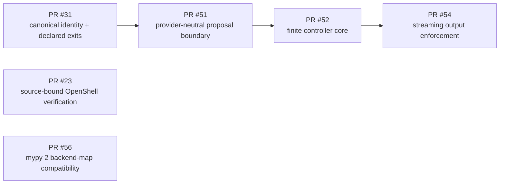
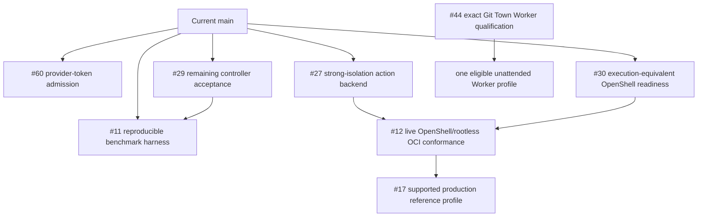

# Molecular Implementation Stack Index

Status: implementation and handoff index for the source revision containing this file.
Owning issue / delivery PR: #57 / #58.
Intent: `INTENT-022`.

This document records product dependencies, molecular leaf boundaries, path ownership, evidence gates, and
conflict ownership. It does not activate Git Town, authorize branch mutation, or replace each issue and PR
as the source of truth.

## Three different graphs

Do not confuse:

1. **Product dependency graph** — one capability requires another behavior or evidence contract.
2. **Review/merge sequence** — one PR must merge before a dependent PR is rebased and re-evaluated.
3. **Git Town active stack** — open PR rows in `scripts/git-town/stack.tsv` with verified parent/base
   lineage and an authorized exact Worker profile.

The first two graphs may exist while the Git Town manifest remains header-only. That is the current
repository state.

## Merged foundation on `main`



| Foundation slice | State | Primary owned area | What it does not prove |
|---|---|---|---|
| PR #23 | merged/current | source-bound verification adapter and integration contracts | strong mutation isolation or execution-equivalent readiness |
| PR #31 | merged/current | identity, checkpoint, approval, replay, runner exit semantics | actor authentication or external exactly-once side effects |
| PR #51 | merged/current | proposals, provider adapter, proposal schema/tests | live model correctness, privacy, availability, or deployment |
| PR #52 | merged/current partial controller | controller, runner seam, result schema/tests/evidence | complete #29 acceptance, model uplift, restart resume, candidate selection |
| PR #54 | merged/current | streaming runner output, typed reason/result evidence, tests and mirrors | strong process isolation or hard provider-token admission |
| PR #56 | merged/current | one-file backend-map typing compatibility | new backend behavior, readiness, isolation, or live conformance |

The compatibility and streaming-output PRs have completed their historical review sequence. They are no
longer active leaves and must not be added to the Git Town manifest.

## Current open molecular leaves



These are product/evidence dependencies. They are not active stacked PRs until open PRs with reviewed
parents, bases, paths, and evals exist.

## Issue #29 terminal split

Issue #29 remains open after the finite controller core and streaming-output enforcement. Its remaining
acceptance work must be split rather than delivered as one large PR.

### Leaf 29-A — provider-token admission (owned by #60)

| Field | Required content |
|---|---|
| Outcome | Refuse a next provider call before it can exceed an enforceable prompt/completion budget for one declared provider/tokenizer profile |
| Owning issue | #60 |
| Branch | `agent/controller-provider-token-admission` |
| Primary paths | provider/controller request contracts, focused provider/controller tests, matching schema/docs |
| Excluded paths | strong backend implementation, benchmark corpus/results, Git Town tooling |
| Positive eval | known tokenizer/profile admits a call within remaining budget |
| Negative eval | missing usage/tokenizer, zero remaining budget, overflow, profile mismatch fail before another call |
| Claim boundary | exact provider/tokenizer profile only; no universal token-count guarantee |

### Leaf 29-B — restart-safe controller state (owned by #68)

| Field | Required content |
|---|---|
| Outcome | Persist/resume a controller between attempts or fail closed with an explicit terminal recovery state |
| Suggested branch | `agent/controller-restart-state` |
| Primary paths | controller-state schema/store, migration/restart tests, checkpoint integration owned by the issue |
| Excluded paths | distributed leases/fencing (#14), external exactly-once effects (#15) |
| Positive eval | kill/restart at each persisted transition resumes only documented safe states |
| Negative eval | stale schema, mismatched source/policy/provider, consumed approval, ambiguous execution outcome fail closed |
| Claim boundary | single-node supported backend until #14 provides multi-worker coordination |

### Leaf 29-C — bounded candidate selection

| Field | Required content |
|---|---|
| Outcome | Compare multiple proposals in bounded child workspaces and select only an assertion-passing, conflict-checked candidate |
| Suggested branch | `agent/controller-candidate-selection` |
| Primary paths | candidate/result models, controller selection logic, child-workspace tests and schema/docs |
| Depends on | explicit isolation/workspace design; strong mutation claims remain #27/#12 |
| Positive eval | deterministic candidates produce one reproducible selected result |
| Negative eval | branch escape, shared-state mutation, tie, no passing candidate, merge conflict, budget exhaustion stop safely |
| Claim boundary | selection quality is task/profile specific and not model uplift by itself |

### Leaf 29-D — model-backed comparison evidence

| Field | Required content |
|---|---|
| Outcome | Publish direct, equal-feedback, and controller baselines using identical model/task/sampling/success conditions |
| Suggested branch | `agent/controller-model-evidence` |
| Primary paths | benchmark schemas/fixtures/raw artifacts/summaries and evidence documentation owned by #11/#29 |
| Depends on | accepted controller profile and exact provider/corpus/environment identity |
| Required metrics | first-pass success, post-repair success, Harness-specific uplift, failed-mutation persistence, latency, tokens, retries, stops |
| Result rule | non-zero uplift may be reported only for the exact profile; a reproducible negative result is also valid evidence |
| Claim boundary | failed/timed-out trials remain raw artifacts; no cross-model/repository generalization |

Each leaf needs its own eval-first issue or an explicitly separated child issue under #29 before code work.

## Independent risk-reduction lanes

| Workstream | State | Observable outcome | Shared-path rule |
|---|---|---|---|
| #30 backend readiness | adapter probe current | `auto` selects OpenShell only after execution-equivalent readiness; infrastructure failure remains typed | coordinate `verification.py` with #27 and live #12 work |
| #27 strong mutation isolation | current for the Docker profile | mutating commands require a conformant strong backend and expose isolation separately from rollback | name integration owner before touching runner, backend, threat-model, schema, or evidence paths |
| #12 live runtime conformance | open live gate | adversarial evidence for pinned OpenShell/rootless OCI profiles | adapter unit tests are insufficient; evidence paths own raw results |
| #11 benchmark harness | deterministic harness current; model-backed open/unverified | schema-valid raw deterministic artifacts committed; optional model-backed artifacts pending | no runtime source edits without a separate issue |
| #9 observability | current | schema-versioned event/trace contract without secret export or authorization coupling | coordinate event/checkpoint schemas and redaction owner |
| #10 crash/deadline recovery | current | kill/restart/cancellation matrix reaches documented safe states | coordinate checkpoint, runner, workspace, and event owners |
| #44 Git Town Worker qualification | deployment-blocked | exact package/binary/config/conflict/race/timeout/secret acceptance | evidence path is separate from Python product runtime |

## Parallel Worker allocation

Parallel work is allowed only with disjoint paths or a named shared-file integration owner.

| Worker lane | Primary area | May proceed with | Must stop before |
|---|---|---|---|
| Controller token admission | provider/controller contracts and focused tests | benchmark schema design when paths are disjoint | changing backend/isolation or broad checkpoint semantics |
| Restart state | controller/checkpoint persistence and migration tests | observability design with named event-schema owner | distributed coordination or external side-effect guarantees |
| Candidate selection | controller/candidate/workspace contracts | benchmark corpus preparation | claiming strong isolation without #27/#12 evidence |
| Strong isolation | action backend, runner integration, adversarial tests | readiness work with explicit `verification.py` owner | weakening to `unsafe-local` or conflating rollback with isolation |
| Backend readiness | doctor/probe/launch agreement | live conformance harness | modifying runner/controller behavior outside issue scope |
| Benchmark evidence | benchmark CLI/schema/raw artifacts | live runtime evidence when profiles are distinct | changing product behavior to improve a score |
| Git Town evidence | `docs/evidence/git-town-worker/**` and accepted status links | all disjoint Python work | modifying product runtime or using production secrets |

## Molecular PR contract

Every terminal implementation PR must state:

| Field | Required content |
|---|---|
| Outcome | one observable result that can be independently accepted or rejected |
| Issue | one eval-first owner and parent program/issue when applicable |
| Branch and base | exact branch, parent, expected PR base, and merge method |
| Paths | owned, excluded, shared integration paths, generated/mirrored owner |
| State Machine delta | states/transitions/reasons added, removed, or preserved |
| Data-flow delta | producer, consumer, persisted field, authority boundary, or evidence path |
| Evals | positive, negative, timeout/crash/replay/substitution/recovery cases as applicable |
| Evidence | commands, artifacts, exact source/profile, limitations, failed/not-run results |
| Merge order | predecessor first; dependent rebase/re-evaluation procedure |
| Conflict owner | named owner for semantic conflicts and shared documents |
| Claim impact | current/under-review/planned/unverified/deployment-blocked change, or explicit none |

## Git Town active-manifest rule

The committed `scripts/git-town/stack.tsv` is header-only. Therefore:

```text
product dependency graph exists
  != open review stack
  != active Git Town stack
  != authorization to run git town sync
```

Add active rows only when all of the following are true:

1. every row names an open eval-first PR;
2. PR head equals the manifest branch;
3. PR base equals the manifest parent;
4. local Git Town parent metadata matches;
5. the dedicated checkout contains only declared branches and parents;
6. the exact Worker profile is authorized for the requested mode;
7. semantic-conflict ownership is named.

Merged or closed PR rows are removed immediately. Placeholder rows are prohibited.

## Merge and handoff algorithm

For each molecular leaf:

1. Re-read root/local `AGENTS.md`, this index, the owning issue, and current PR metadata.
2. Fetch `main` and verify the expected parent/base has not changed.
3. Search open PRs for path overlap and name a conflict owner.
4. Implement only issue-owned paths.
5. Run issue-specific evals and preserve failed/not-run evidence.
6. Reconcile State Machine, data-flow, schema, recipe, evidence, and README changes in one reviewable scope.
7. Record current-head checks; do not reuse evidence from an older head.
8. Merge the oldest accepted predecessor first.
9. Rebase each dependent PR onto current `main`, rerun evals, and update its PR body/traceability.
10. Remove merged/closed rows from an active Git Town manifest, or keep the manifest header-only.

## Status update rule

Update this file whenever an issue/PR opens, merges, closes, changes base, changes path ownership, gains a
new blocker, or changes evidence state. `docs/TRACEABILITY.md` remains the stable intent index; this file is
the current executable handoff view of the implementation graph.
