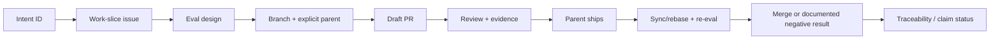

# Molecular Issue and Stacked-PR Contract

## Purpose

Turn design intent into small, traceable, independently reviewable changes that multiple Worker Agents
can complete without silent dependency or path collisions.

## One outcome per slice

An issue/PR is molecular when it has:

- one observable outcome;
- one owning branch;
- one explicit parent;
- one declared path set;
- a finite eval manifest;
- a terminal definition of done;
- explicit non-goals;
- no unrelated cleanup needed only to make the PR appear complete.

Split a slice when it mixes product behavior with repository tooling, changes unrelated trust boundaries,
requires different reviewers/evals, or lets one part ship safely without the other.

## Lifecycle



Implementation does not begin before the issue contains the eval manifest.

## Issue contract

Every issue records:

1. parent program/issue;
2. problem and one desired outcome;
3. intent IDs and source documents;
4. in-scope deliverables;
5. explicit non-goals;
6. owned and excluded paths;
7. blockers and parallel-safe siblings;
8. trust-boundary, claim, and evidence impact;
9. stable eval IDs with procedure, expected result, and evidence path;
10. target branch and expected PR base;
11. parent/children, merge order, conflict/rebase owner;
12. stop, rollback, and follow-on conditions.

## PR contract

Every PR records actual branch lineage and eval results. The base branch equals the declared parent. The PR
uses the issue's path set; expansion requires updating the issue first.

The eval table uses:

- `passed`: observed result matches expected result;
- `failed`: observed result contradicts the gate;
- `not run`: required or optional eval was not executed, with reason;
- `not applicable`: the eval does not apply, with rationale.

A checked box without command output, artifact, or review procedure is not evidence.

## Parallel Worker rules

- The foundation branch may have multiple child stacks.
- Sibling agents edit disjoint paths.
- Shared files have one integration owner.
- An agent does not repair another branch by editing outside its issue.
- Parent movement triggers sync/rebase and re-evaluation.
- A stale base or semantic conflict is reported, not guessed through.
- Handoffs name branch, base SHA, paths, eval status, blockers, and next safe command.

## Conflict matrix

| Situation | Automated action | Owner |
|---|---|---|
| no overlapping edits | rebase/sync and re-run evals | Worker Agent |
| recognized phantom conflict | Git Town auto-resolve, then full evals | Worker Agent |
| semantic content conflict | stop and recover | named human/integration owner |
| source-of-truth disagreement | preserve stricter behavior and stop | architecture/security owner |
| generated shared-file drift | designated integration PR updates it | integration owner |
| remote branch changed unexpectedly | safe push fails; fetch/rebase/review | branch owner |

## Claim impact

A documentation or code PR does not promote a claim unless the owning issue includes implementation,
positive and negative tests, bounded recipe, raw evidence for the declared environment, limitations, and
registry status change. Negative or inconclusive results are valid terminal outcomes.

## Mapping to traceability

The issue and PR fields populate:

```text
Intent ID -> source -> owning issue -> branch parent -> PR -> path ownership
          -> eval ID -> evidence -> claim/status -> limitation/follow-on
```

Update `TRACEABILITY.md` when any relation changes.

## Existing-work compatibility

PR #23 and PR #31 predate this template. They remain valid work items, but their owners should add lineage,
path ownership, eval evidence, conflict hotspots, and follow-on gaps before merge. This metadata update
must not broaden their code scope.

## Non-goals

- replacing code review with forms;
- automatic merging;
- automatic semantic conflict resolution;
- hiding failed evals;
- forcing independent work into a linear stack;
- treating issue prose as execution authority.
