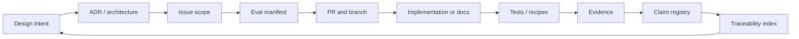

# Documentation Router

This directory turns project intent into reviewable architecture, policy, evals, evidence, runbooks, and
reusable Agent prompt contracts. Repository prose is guidance and evidence input; it does not grant
execution authority.

## Read by task

| Task | Required documents |
|---|---|
| Any non-trivial change | root `AGENTS.md`, `TRACEABILITY.md`, `EVALS.md`, owning issue |
| Runtime or mutation boundary | `ARCHITECTURE.md`, `THREAT_MODEL.md`, relevant ADR and negative tests |
| External verification | `EXTERNAL_VERIFICATION.md`, `OPENSHELL.md`, registry and schemas |
| Harness coding-agent work | `CODING_AGENT_HARNESS.md` and `HARNESS_EVALS.md` |
| Stacked PR or unattended Git work | `STACKED_PRS.md` and `GIT_TOWN_LICENSE.md` |
| Reuse the Git Town adoption workflow in another repository | `prompts/git-town-repository-bootstrap/README.md` and its complete prompt package |
| Claim or benchmark change | `EVIDENCE.md`, `BENCHMARKS.md`, `PROJECT_EVIDENCE.json` |
| Issue or PR design | `ISSUE_PR_CONTRACT.md` and the eval manifest in `EVALS.md` |

## Document classes

- **Normative contracts:** root `AGENTS.md`, schemas, policies, accepted ADRs, integration requirements,
  `EVALS.md`, and issue acceptance criteria.
- **Architecture and risk:** `ARCHITECTURE.md`, `THREAT_MODEL.md`, and ADRs.
- **Evidence and measurement:** `EVIDENCE.md`, `BENCHMARKS.md`, registry entries, raw artifacts, and recipes.
- **Runbooks:** verification, OpenShell, stacked PR, release, and user guides.
- **Reusable prompts:** `prompts/` packages versioned system instructions, inputs, outputs, evals, and
  checklists without granting tool authority.
- **Design provenance:** `design/` records why a direction was chosen and what remains unverified.
- **Navigation:** local `README.md` files describe directory purpose, data flow, and source-of-truth paths.

## Precedence

When documents disagree, apply the source-of-truth precedence in the root `AGENTS.md`. Preserve the more
restrictive behavior until code, tests, schemas, evidence, and docs agree in one reviewable change.

## Data flow

No node may skip directly from intent to a verified claim. A reusable prompt starts this flow in a new
repository; it does not replace that repository's issue, implementation, tests, or live evidence.

## Index

- [Traceability](TRACEABILITY.md)
- [Eval contract](EVALS.md)
- [Architecture](ARCHITECTURE.md)
- [Threat model](THREAT_MODEL.md)
- [Roadmap](ROADMAP.md)
- [Evidence](EVIDENCE.md)
- [Benchmark contract](BENCHMARKS.md)
- [External verification](EXTERNAL_VERIFICATION.md)
- [OpenShell](OPENSHELL.md)
- [Coding-agent Harness contract](CODING_AGENT_HARNESS.md)
- [Harness eval matrix](HARNESS_EVALS.md)
- [Stacked PR workflow](STACKED_PRS.md)
- [Git Town license and supply-chain gate](GIT_TOWN_LICENSE.md)
- [Issue and PR contract](ISSUE_PR_CONTRACT.md)
- [Reusable Agent prompts](prompts/README.md)
- [Prompt-injection and policy integrity](PROMPT_INJECTION.md)
- [Engineering references](REFERENCES.md)
- [Design provenance](design/README.md)
