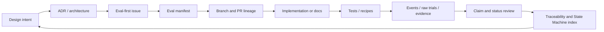
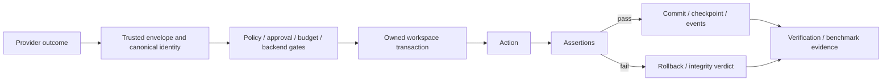

# Documentation Router

This directory turns project intent into reviewable architecture, policy, State Machines, evals, evidence,
runbooks, implementation-stack indexes, and reusable Agent prompt contracts. Repository prose is guidance
and evidence input; it does not grant execution authority.

## Read by task

| Task | Required documents |
|---|---|
| Any non-trivial change | root `AGENTS.md`, `TRACEABILITY.md`, `REPOSITORY_STATE_MACHINES.md`, `IMPLEMENTATION_STACKS.md`, `EVALS.md`, owning issue |
| Understand current integration state | `REPOSITORY_STATE_MACHINES.md`, `TRACEABILITY.md`, root/local README files |
| Select a molecular implementation leaf | `IMPLEMENTATION_STACKS.md`, `ISSUE_PR_CONTRACT.md`, owning issue/PR and local `AGENTS.md` |
| Runtime or mutation boundary | `ARCHITECTURE.md`, `THREAT_MODEL.md`, `CODING_AGENT_HARNESS.md`, relevant ADR and negative tests |
| Provider or controller work | `CODING_AGENT_HARNESS.md`, `HARNESS_EVALS.md`, package/provider README files |
| External verification | `INTEGRATION_REQUIREMENTS.md`, `EXTERNAL_VERIFICATION.md`, `OPENSHELL.md`, registry and schemas |
| Stacked PR or unattended Git work | `STACKED_PRS.md`, `IMPLEMENTATION_STACKS.md`, `GIT_TOWN_LICENSE.md`, `scripts/git-town/README.md` |
| Reuse the Git Town adoption workflow in another repository | `prompts/git-town-repository-bootstrap/README.md` and its complete prompt package |
| Claim or benchmark change | `EVIDENCE.md`, `BENCHMARKS.md`, `PROJECT_EVIDENCE.json`, benchmark README |
| Issue or PR design | `ISSUE_PR_CONTRACT.md` and the eval manifest in `EVALS.md` |

## Document classes

- **Normative contracts:** root `AGENTS.md`, schemas, policies, accepted ADRs, integration requirements,
  `EVALS.md`, and issue acceptance criteria.
- **State and handoff indexes:** `REPOSITORY_STATE_MACHINES.md`, `IMPLEMENTATION_STACKS.md`,
  `TRACEABILITY.md`, and local README files. They mirror current code/schema/GitHub state but do not
  override it.
- **Architecture and risk:** `ARCHITECTURE.md`, `THREAT_MODEL.md`, `CODING_AGENT_HARNESS.md`, and ADRs.
- **Evidence and measurement:** `EVIDENCE.md`, `BENCHMARKS.md`, registry entries, raw artifacts, and recipes.
- **Runbooks:** verification, OpenShell, stacked PR, release, and user guides.
- **Reusable prompts:** `prompts/` packages versioned system instructions, inputs, outputs, evals, and
  checklists without granting tool authority.
- **Design provenance:** `design/` records why a direction was chosen and what remains unverified.
- **Navigation:** local `README.md` files describe directory purpose, State Machine role, producer/consumer
  flow, source-of-truth paths, evals, and stop conditions.

## Precedence

When documents disagree, apply the source-of-truth precedence in the root `AGENTS.md`. Preserve the more
restrictive behavior until code, tests, schemas, evidence, State Machine diagrams, and status indexes agree
in one reviewable change.

## Repository change data flow

## Coding-agent data flow

No node may skip directly from intent, model output, adapter construction, a green generic CI run, or
repository prose to a verified claim. A reusable prompt starts this flow in a new repository; it does not
replace that repository's issue, implementation, tests, or live evidence.

## State-machine directory index

| Area | State Machine focus | Local guide |
|---|---|---|
| `.github/` | issue → branch/PR → checks → review/merge | [GitHub metadata README](../.github/README.md) |
| `src/xt_aegis/` | proposal → controller → runner → checkpoint/verification | [Package README](../src/xt_aegis/README.md) |
| `src/xt_aegis/providers/` | private provider request → typed non-authoritative outcome | [Provider README](../src/xt_aegis/providers/README.md) |
| `tests/` | contract/fixture → positive/negative/failure evidence | [Test README](../tests/README.md) |
| `verification/` | registry/recipe/policy → typed result → bundle | [Verification README](../verification/README.md) |
| `benchmarks/` | pinned profile → raw trials → exact-profile summary | [Benchmark README](../benchmarks/README.md) |
| `scripts/` | explicit invocation → preflight → bounded operation/status | [Scripts README](../scripts/README.md) |
| `scripts/git-town/` | no-active-stack/preflight → dry run → sync/recovery | [Git Town README](../scripts/git-town/README.md) |

The complete cross-directory transition table is in
[`REPOSITORY_STATE_MACHINES.md`](REPOSITORY_STATE_MACHINES.md).

## Index

- [Repository State Machines and directory data flow](REPOSITORY_STATE_MACHINES.md)
- [Molecular implementation stacks](IMPLEMENTATION_STACKS.md)
- [Traceability](TRACEABILITY.md)
- [Eval contract](EVALS.md)
- [Architecture](ARCHITECTURE.md)
- [Threat model](THREAT_MODEL.md)
- [Roadmap](ROADMAP.md)
- [Evidence](EVIDENCE.md)
- [Benchmark contract](BENCHMARKS.md)
- [Egress policy and credential injection](EGRESS.md)
- [External verification](EXTERNAL_VERIFICATION.md)
- [OpenShell](OPENSHELL.md)
- [Coding-agent Harness contract](CODING_AGENT_HARNESS.md)
- [Harness eval matrix](HARNESS_EVALS.md)
- [Stacked PR workflow](STACKED_PRS.md)
- [Git Town license and supply-chain gate](GIT_TOWN_LICENSE.md)
- [Issue and PR contract](ISSUE_PR_CONTRACT.md)
- [Reusable Agent prompts](prompts/README.md)
- [Prompt-injection and policy integrity](PROMPT_INJECTION.md)
- [Engineering references](REFERENCES.md)
- [Design provenance](design/README.md)

## Update rule

Update this router when a maintained directory, controlling document, State Machine owner, evidence layer,
or implementation-stack source of truth changes. Do not leave a link conditional after its document is
merged, and do not mark a planned or under-review state as current before its owning evidence is accepted.
