# Repository State Machines and Directory Data Flow

Status: integration index for the source revision containing this file.
Owning issue / delivery PR: #57 / #58.
Intent: `INTENT-022`.

This document lets a Human or Worker Agent reconstruct how XT-Aegis moves from design intent to a
terminal, evidence-bearing result. It is an index, not execution authority. Source code, schemas,
executable policy, tests, accepted ADRs, and issue acceptance criteria retain the precedence defined by
root [`AGENTS.md`](../AGENTS.md).

Before acting, compare this file with the current default branch, open issues/PRs, and the exact source
revision. Do not derive current state from a branch name or an old PR description.

## Current integration snapshot

| Capability | Source of truth | State | Remaining gate |
|---|---|---|---|
| Canonical request/policy identity, approval binding, exact replay | `identity.py`, `checkpoint.py`, `runner.py`; PR #31 | `current` | authenticated actor identity and external-side-effect idempotency remain separate work |
| Declared command exit-code semantics | `models.py`, `runner.py`; PR #31 | `current` | exit membership is an outcome contract, not semantic correctness by itself |
| Provider-neutral proposal boundary and trusted envelope | `proposals.py`, `providers/ollama.py`; PR #51 | `current` | no live-provider correctness, availability, privacy, or version-attestation claim |
| Finite diagnose-repair controller core | `controller.py`; PR #52 | `current partial` | issue #29 retains token-admission, restart, candidate-selection, and model-evidence leaves |
| Streaming subprocess output enforcement | `runner.py`, result models/tests/evidence; PR #54 | `current` | lower-bound byte count after excess and OS pipe buffering remain documented limits; no strong isolation |
| Mypy 2 backend-map compatibility | `verification.py`; PR #56 | `current` | static compatibility only; backend selection and live conformance claims are unchanged |
| Source-bound OpenShell verification | `verification.py`, integration docs; PR #23 | `current` | strong action isolation and execution-equivalent readiness remain #27/#30 |
| Strong isolation for mutating commands | `action_backend.py`, `runner.py`, [`ACTION_ISOLATION.md`](ACTION_ISOLATION.md); issue #27 | `current for the Docker profile` | pinned OpenShell and rootless Podman adversarial evidence remains #12 |
| Execution-equivalent OpenShell readiness | issue #30 | `planned` | version-pinned doctor/execution agreement required |
| Span vocabulary, attribute allowlist, versioned event envelope, offline replay | `telemetry.py`, `replay.py`, `events.py`; issue #9 | `current` | telemetry is off by default; a trace is not evidence of semantic correctness |
| Named transitions, kill-tested recovery, cancellation and deadlines | `lifecycle.py`, `runner.py`, [`RECOVERY.md`](RECOVERY.md); issue #10 | `current` | single-node only; distributed failover remains #14 and external exactly-once remains #15 |
| Model-backed Harness uplift and performance evidence | issues #11/#24/#29 | `unverified` | pinned corpus, equal baselines, raw failed/timed-out trials |
| Git Town repository-side Worker contract | `scripts/git-town/`; PR #41 | `merged contract` | exact live Worker profile remains `deployment-blocked` by #44 |

## Directory-to-State-Machine ownership

| Directory | State Machine responsibility | Primary inputs | Primary outputs | Next consumer / stop condition |
|---|---|---|---|---|
| `.github/` | contribution and project-operated CI lifecycle | eval-first issues, PR metadata, workflow policy | review state, checks, artifacts, release actions | merge gate; CI is not independent reproduction |
| `benchmarks/` | profile-bound measurement lifecycle | pinned source/corpus/model/environment/budgets | raw trials, summaries, limitations | claim review; missing raw failures keeps claim `unverified` |
| `docs/` | intent, architecture, risk, eval, runbook, and traceability lifecycle | user goal, issues, code/tests/evidence | controlling contracts and indexes | implementation/evidence owner; prose never grants authority |
| `scripts/` | explicit repository/developer operation lifecycle | user/Worker invocation and fixed configuration | bounded logs, status, local artifacts | operator review; scripts do not become model authority |
| `scripts/git-town/` | stacked-branch Worker lifecycle | exact tool identity, active manifest, repository/PR lineage | sync status, bounded log, recovery evidence | semantic conflict owner; header-only manifest blocks before mutation |
| `src/` | installable product package lifecycle | validated contracts and trusted configuration | typed runtime results and verification APIs | tests and external verification |
| `src/xt_aegis/` | proposal, controller, runner, checkpoint, verification, and MCP State Machines | untrusted proposal plus trusted policy/identity/backend scope | terminal typed results, events, checkpoints, evidence plans | tests, recipes, evidence registry, caller |
| `src/xt_aegis/providers/` | provider transport and response normalization | private task, explicit provider profile and budgets | typed `ProposalOutcome` only | trusted envelope builder; non-ready outcomes never execute |
| `tests/` | deterministic acceptance and failure-path lifecycle | contracts, implementation, fixtures, negative cases | pass/fail evidence and regression protection | CI/claim review; green tests alone do not prove production safety |
| `verification/` | external claim-verification lifecycle | evidence registry, schemas, policies, argv-only recipes | typed results and deterministic bundles | independent reviewer; unavailable strong backend fails closed |
| `verification/schemas/` | portable evidence-shape validation | registry/result/controller/bundle documents | accepted or rejected machine-readable contract | verifier or CI; schema success is not runtime success |
| `verification/recipes/` | bounded executable claim procedure | claim ID, argv, cwd, expected exits, limits | command evidence and artifacts | verification result aggregation |
| `verification/policies/` | backend execution-policy input | explicit supported runtime profile | deny/allow decision and policy identity | backend launch; missing protection is terminal |
| `third_party/` | license/notice provenance lifecycle | exact upstream release and license text | copied notices and identity metadata | legal/supply-chain review; no zero-risk claim |

Local `README.md` files narrow this table for their directory. Local `AGENTS.md` files may narrow root
rules but may not broaden authority.

## End-to-end integration data flow

```mermaid
flowchart LR
    U[User goal] --> I[Intent ID / architecture]
    I --> S[Eval-first issue]
    S --> G[Owned branch / PR lineage]
    G --> P[Provider-neutral proposal]
    P --> E[Trusted envelope + canonical identity]
    E --> A[Policy / approval / attempt / time / output / backend gates]
    A --> W[Owned workspace transaction]
    W --> X[Action execution]
    X --> C[Assertions]
    C -->|pass| K[Commit + checkpoint]
    C -->|fail or output excess| R[Rollback + integrity verdict]
    K --> V[Events / verification result]
    R --> V
    V --> B[Evidence bundle / benchmark raw trials]
    B --> T[Claim and traceability review]
    T --> I
```

No edge may skip from model output, repository prose, adapter construction, or a green generic check
directly to a verified product claim.

## 1. Change-lifecycle State Machine

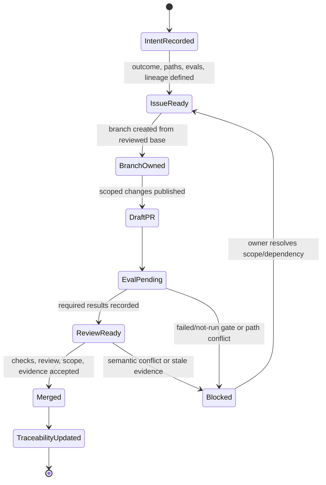

Ownership:

- `.github/ISSUE_TEMPLATE/work_slice.yml` defines issue inputs.
- `.github/pull_request_template.md` defines PR lineage and evidence outputs.
- `docs/EVALS.md` defines result semantics.
- `docs/TRACEABILITY.md` records the terminal repository state.

## 2. Provider proposal and trusted-envelope State Machine

Exact `ProposalStatus` values:

```text
ready | refused | timed_out | malformed | oversized | truncated | provider_error
```

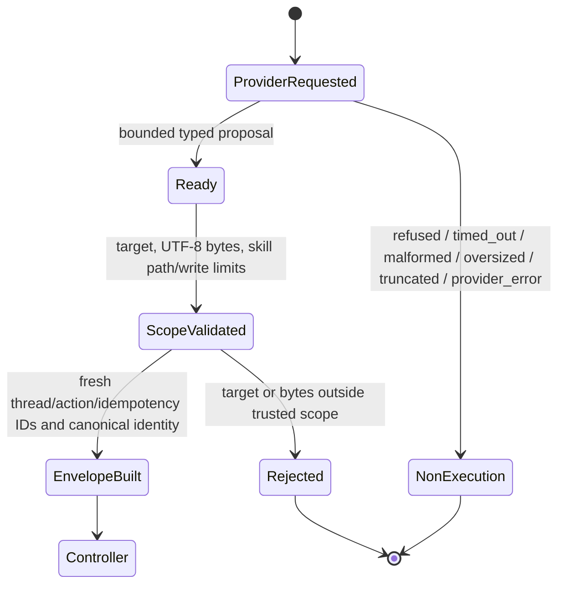

The provider controls code content and optional explanation only. Trusted integration code controls target,
provenance, actor scope, policy, assertions, approval, request identity, backend, and budgets.

## 3. Diagnose-repair controller State Machine

Exact `ControllerStopReason` values:

```text
proposal_rejected
policy_denied
approval_required
baseline_invalid
infrastructure_unavailable
execution_failed
assertion_failed
recovery_failed
repeated_failure
budget_exhausted
passed
```

Only `execution_failed` and `assertion_failed` are retryable.

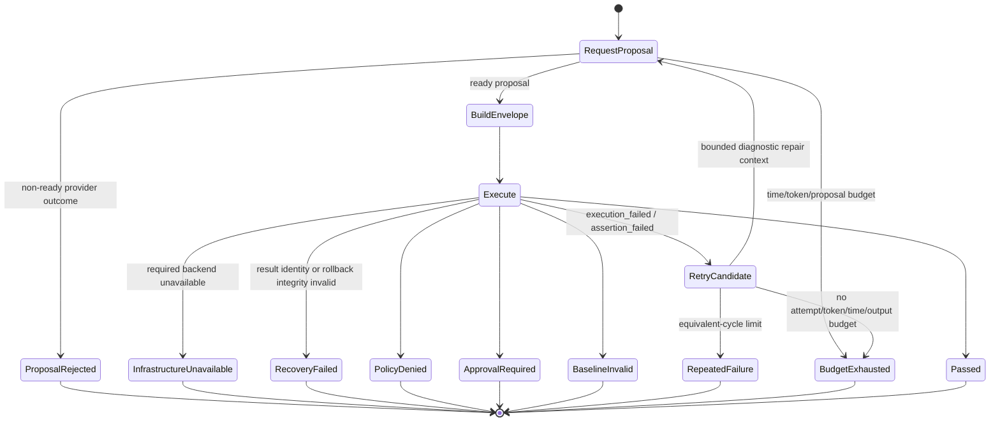

The controller is current as a finite core. Streaming execution-output enforcement is also current. Issue
#29 remains open for provider-token admission, restart-safe state, candidate selection, and pinned
model-backed acceptance.

## 4. Deterministic runner State Machine

Exact terminal `ExecutionStatus` values:

```text
succeeded | rolled_back | blocked | suspended | failed
```

Exact `ExecutionReasonCode` values currently include:

```text
policy_denied | approval_denied | approval_required | budget_exhausted
identity_conflict | output_budget_exhausted | cancelled | deadline_exceeded
isolation_unavailable
```

`cancelled` and `deadline_exceeded` are terminal and persisted. A cancelled or expired request keeps its
step row, so a restart replays that terminal record instead of becoming executable again; executing it
requires a new authorized request with a new identity.

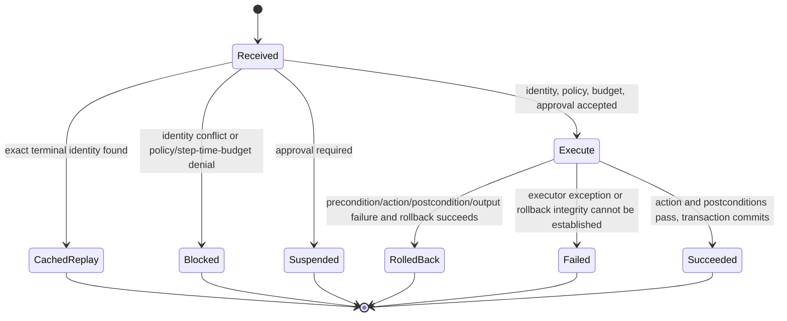

Command execution uses `shell=False`, a new process session, streaming stdout/stderr collection, one shared
byte budget across preconditions/action/postconditions, and process-group termination on timeout or
observed output excess. Output excess cannot be success and is recorded as
`output_budget_exhausted`. Retained output is bounded and redacted.

`output_original_bytes` is a lower bound after an excess is observed; OS pipes may buffer bounded data
before userspace reacts. `rolled_back` proves only the owned workspace transaction stated by the result. It
does not prove host, process, network, or arbitrary external-side-effect containment.

## 5. Approval, checkpoint, and replay State Machine

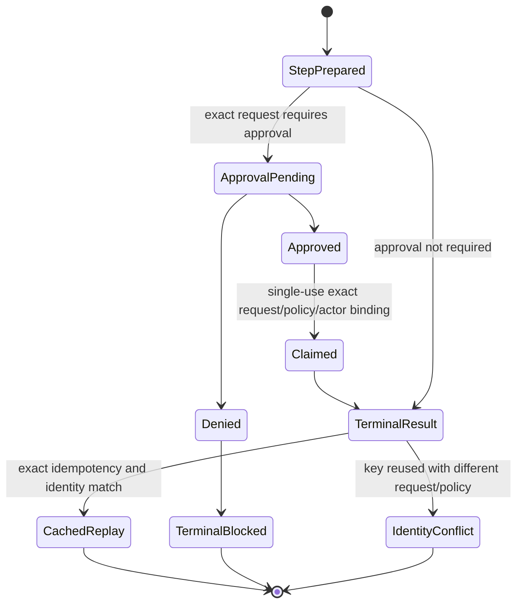

A digest is an integrity binding, not authentication. External exactly-once effects remain issue #15.

## 6. External verification State Machine

Exact `VerificationStatus` values:

```text
verified | failed | unsupported | policy_denied | inconclusive | error
```

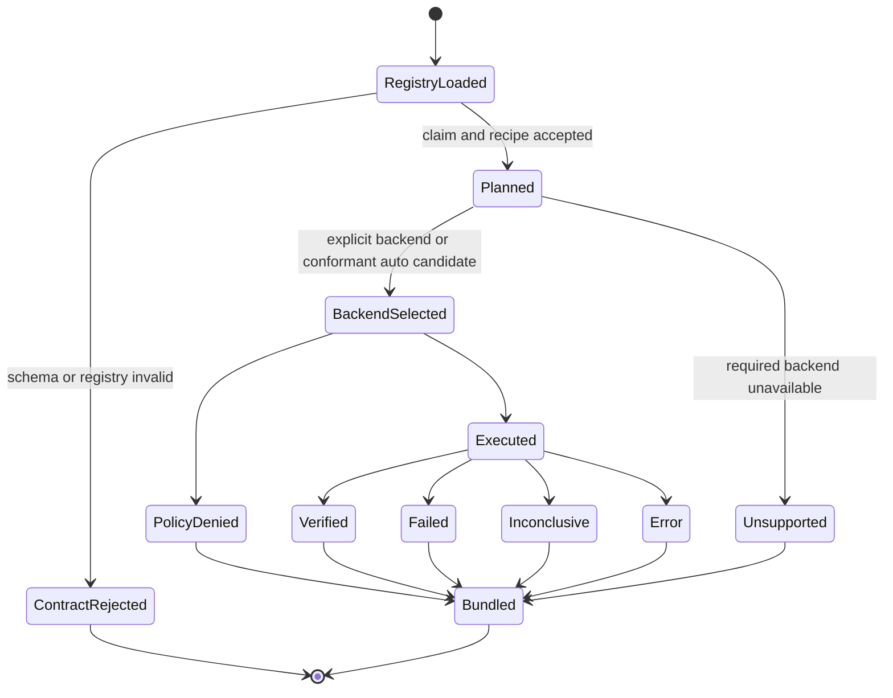

`unsafe-local` is explicit development mode and is never an automatic strong-backend fallback. PR #56
changes only static typing of the backend map; it does not add readiness or isolation evidence.

## 7. Benchmark and claim State Machine

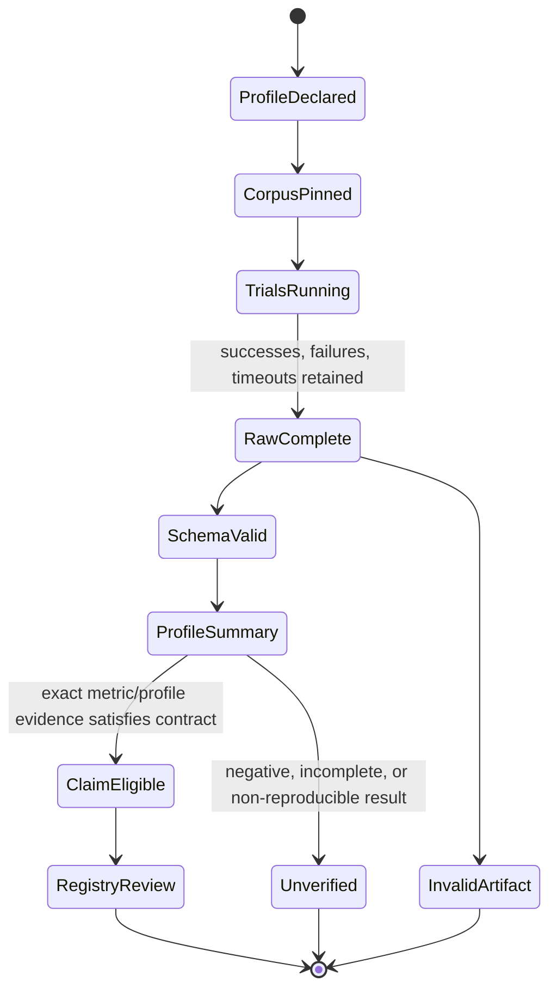

A lower token count is not a success when outcome or safety regresses. Issue #11 owns reproducible raw
benchmark publication.

## 8. Git Town Worker State Machine

The repository-side contract is merged, but real unattended use is blocked by #44.

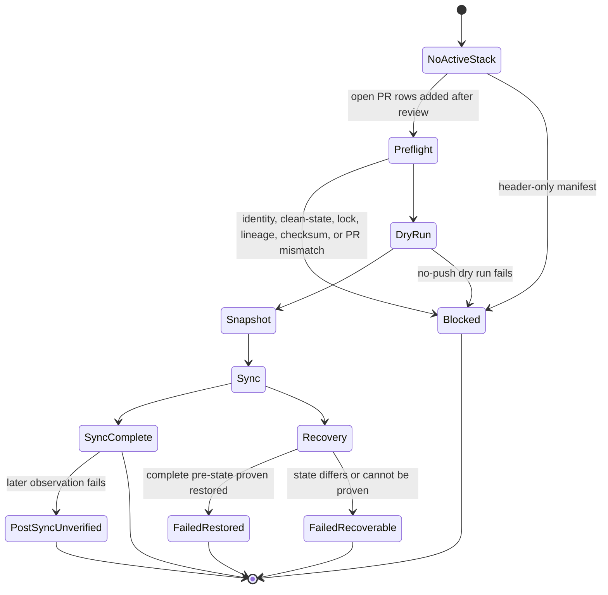

Preflight failure never invokes `git town undo`. A semantic conflict is terminal for unattended work. The
committed `scripts/git-town/stack.tsv` is header-only, so no foreground/background mutation is authorized.

## Current implementation dependency graph

Merged foundation:

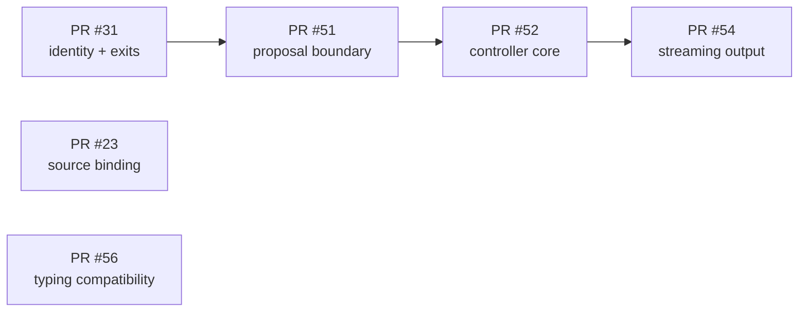

Open leaves:

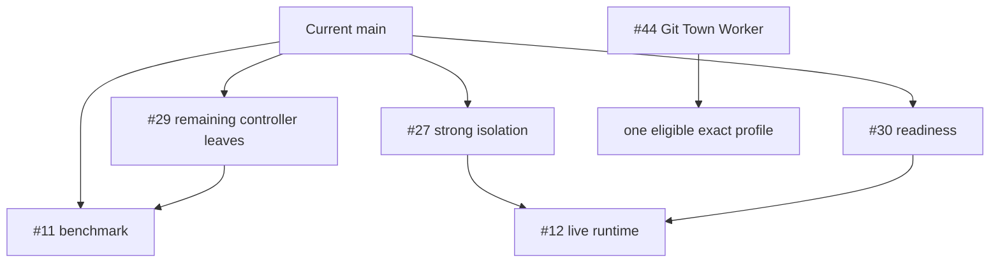

See [`IMPLEMENTATION_STACKS.md`](IMPLEMENTATION_STACKS.md) for path ownership and split rules. These graphs
are not an active Git Town manifest.

## Agent routing by task

| Task | Read first | State Machine owner | Required evidence before completion |
|---|---|---|---|
| Provider/model adapter | `CODING_AGENT_HARNESS.md`, provider README | proposal/envelope | proposal negative cases and exact profile metadata |
| Controller behavior | `HARNESS_EVALS.md`, controller tests | diagnose-repair controller | every transition, budget, cycle, redaction, identity case |
| Action execution | architecture, threat model, runner/workspace tests | deterministic runner | policy, approval, assertion, rollback, output, identity evidence |
| Strong backend | integration requirements, OpenShell docs, #12/#27/#30 | verification/isolation | adversarial live profile and no unsafe fallback |
| Benchmark/claim | `BENCHMARKS.md`, `EVIDENCE.md`, #11 | benchmark/claim | raw trials, environment, commands, failures, limitations |
| Git Town/Stacked PR | `STACKED_PRS.md`, implementation-stack index | Git Town Worker/change lifecycle | open PR lineage, dry run, exact tool identity; #44 for live use |
| Documentation/index | root/local AGENTS, this file, traceability | change lifecycle | links, state fidelity, claim honesty, status reconciliation |

## Update rule

Update this file and affected local `README.md` files in the same PR whenever one of these changes:

- a state or terminal reason is added, removed, or renamed;
- a directory gains or loses ownership of a transition or evidence artifact;
- a capability moves between planned, under review, current, unverified, or deployment-blocked;
- a PR parent/base, merge order, conflict owner, or leaf dependency changes;
- an evidence layer is accepted or invalidated.

Stop and open a reconciliation issue when code, schema, tests, README diagrams, and current GitHub status do
not agree.
