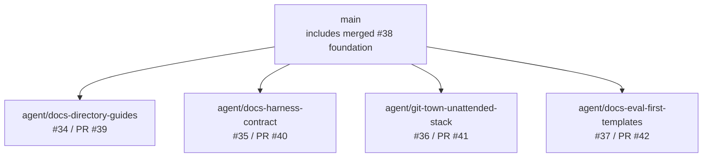
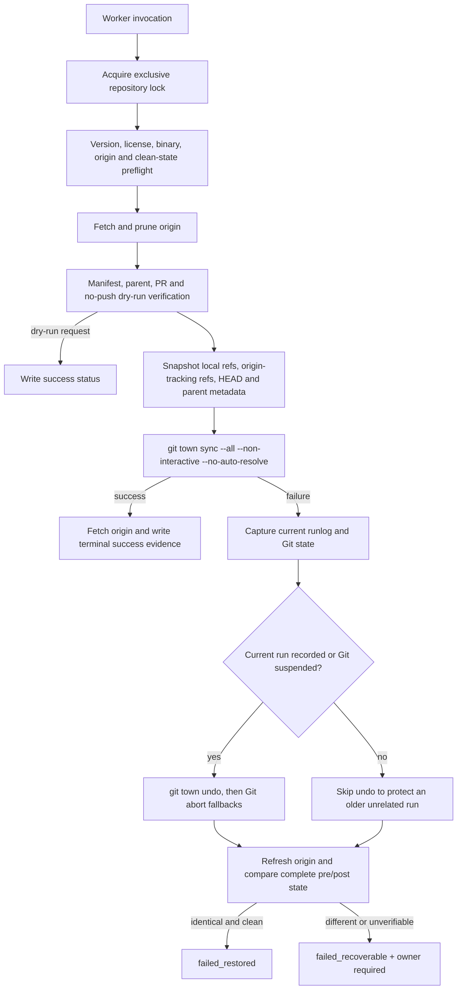

# Stacked PR Workflow

## Decision

Use Git Town when all of the following are true:

- a change must be reviewed as small dependent branches rather than one large PR;
- the team prefers an open-source CLI over a proprietary stacked-PR service dependency;
- every branch has one owner, one declared parent, one PR, and disjoint path ownership;
- Worker Agents need deterministic Bash entry points and non-interactive synchronization;
- feature branches may be rebased and updated through Git Town's safe-push behavior;
- the worker image can pin Git Town, Git, GitHub CLI, Bash, GNU `timeout`, and ShellCheck.

Do not use this workflow for one independent PR, a checkout containing unrelated local branches, shared
branches with unclear ownership, repositories that prohibit safe force-updates of rebased feature
branches, or any process that expects an unattended tool to decide semantic conflicts.

## Source of truth

Stack lineage is declared in `scripts/git-town/stack.tsv`. The PR base must equal the manifest parent.
Git Town's local parent metadata is stored in Git config and must resolve to the same value. Branch names
alone are never used to infer lineage.



PR #38 supplied the documentation foundation and is now merged into `main`. The active worker manifest
contains only the four open child PRs, each with `main` as its parent. Closed or merged PRs do not remain
in an active manifest because `verify-stack.sh` requires every row to name an open PR.

## Branch and PR rules

1. One issue, branch, and PR carry one independently reviewable outcome.
2. The PR base, manifest parent, and Git Town parent metadata must agree.
3. Parent changes ship before their children.
4. Siblings own disjoint paths; shared generated files belong to a named integration PR.
5. Every PR lists parent, children, merge order, path ownership, evals, evidence, and conflict owner.
6. After a parent ships, update lineage, run sync, and rerun child evals before merging a child.
7. Feature and prototype branches use rebase; `main` uses fast-forward-only synchronization.
8. A dedicated worker checkout contains only manifest-declared local branches and their parents.
9. Semantic conflicts are terminal and require a named human or Agent owner.
10. Stack synchronization never grants product runtime, policy, model, or deployment authority.

## Conservative Git Town profile

`.git-town.toml` is checksum-bound by `scripts/git-town/git-town.lock`. The accepted repository profile:

- disables interactive prompts;
- does not implicitly publish newly created branches;
- disables proposal breadcrumbs and forge-side PR-body mutation;
- disables push hooks in the unattended worker;
- disables automatic sync and automatic conflict resolution;
- uses feature `rebase`, perennial `ff-only`, no tag sync, and no upstream sync;
- pushes only during the explicit mutating `sync-stack.sh` phase.

The scripts also pass `--non-interactive` and `--no-auto-resolve` explicitly. Repository prose, issue text,
or model output cannot change these controls at runtime.

## Worker entry points

```bash
scripts/git-town/verify-release-artifact.sh /secure/input/git-town_linux_intel_64.deb
scripts/git-town/verify-license.sh
scripts/git-town/bootstrap.sh
scripts/git-town/bootstrap.sh --apply
scripts/git-town/verify-stack.sh
scripts/git-town/sync-stack.sh --dry-run
scripts/git-town/sync-stack.sh
scripts/git-town/sync-background.sh --dry-run
scripts/git-town/sync-background.sh
scripts/git-town/test-fixture.sh
```

`bootstrap.sh --apply` writes reviewed parent relationships directly to repository-local Git config. It
does not switch branches, rebase commits, or push. `verify-stack.sh` then validates exact origin identity,
GitHub repository identity, open PR head/base lineage, local and tracking refs, upstream configuration,
parent metadata, branch allowlisting, config checksum, and a no-push dry run.

## Unattended sync flow



Preflight failures never invoke `git town undo`. A successful mutating sync followed by an unverifiable
post-sync fetch also does not auto-undo; the status becomes `post_sync_unverified_*` and requires an owner.
This avoids rolling back a completed operation merely because later observation failed.

## Recovery and evidence contract

The worker records a private, bounded log and an atomic status file. By default they live under
`.git/xt-aegis/git-town/`; a worker-controlled `XT_AEGIS_GIT_TOWN_STATE_DIR` may override that path.
Status includes result, phase, mode, exit code, PID, branch, HEAD, and pre/post repository-state digests.

A failure is `failed_restored` only when all local branch refs, `origin/*` tracking refs, current branch,
HEAD, Git Town parent metadata, operation state, and worktree cleanliness match the pre-sync snapshot.
Checking only the current branch is insufficient because an all-stack command can mutate siblings.

The scripts never use `git reset --hard`, delete untracked files, embed credentials, or make semantic
conflict decisions. Logs are byte-bounded, commands have a configurable wall-clock deadline, and lock
contention is terminal.

## Background execution

`sync-background.sh` starts the same foreground contract through `nohup` and writes:

- a wrapper log;
- a PID file;
- a launch metadata file;
- the child sync log and terminal status produced by `sync-stack.sh`.

Background execution changes scheduling only. It does not weaken preflight, locking, timeout, lineage,
recovery, or conflict rules.

## Eval layers

`test-fixture.sh` is the repository-side no-network contract test. It covers:

- a parent advancing after children are created;
- clean foreground and background dry-run/sync paths;
- missing and undeclared local branches;
- parent metadata, PR base, and repository identity mismatches;
- dirty and suspended Git state;
- version, binary, license, config, and artifact checksum failures;
- preflight failure without undo;
- lock contention, semantic failure, timeout, and bounded output;
- complete-ref recovery detection, including a sibling mutation that cannot be labeled restored.

The fixture uses behavior-compatible fake Git Town and GitHub CLIs. It validates Bash orchestration but is
not live acceptance of the pinned binary. Exact package, binary, ShellCheck, real conflict, safe-force,
remote-race, and secret-canary evidence are tracked by #44. No unattended deployment is authorized until
that issue's supported profile is accepted.

## Existing code PR reconciliation

| PR / branch | Conflict hotspots | Required order |
|---|---|---|
| PR #23 `fix/openshell-source-bound-verification` | root `AGENTS.md`; integration docs | rebase after the documentation foundation; preserve stricter source-binding and runtime requirements |
| PR #31 `agent/harness-request-identity-exit-contract` | root README and architecture/risk docs | rebase after the documentation foundation; rerun #25/#28 evals and retain only code-supported claims |
| `agent/harness-proposal-adapter` | future Harness files | keep parked until #35 and #26 eval contracts are accepted |

Documentation workers do not force-update these branches. Their owners resolve semantic conflicts and
rerun implementation-specific evals.

## Merge sequence

1. PR #38 is merged and its documentation foundation is present on `main`.
2. PRs #39–#42 target `main`; `stack.tsv` records this active topology.
3. Run `bootstrap.sh --apply`, `verify-stack.sh`, and child-specific evals in a dedicated checkout.
4. Merge path-disjoint documentation children in any order after green CI and review.
5. Keep real unattended deployment blocked on #44.
6. Rebase existing code PRs #23 and #31 through their owners and rerun their full evals.
7. Start future Harness Python stacks only from accepted contracts and current `main`.

## Non-goals

- automatic PR merge or shipping;
- automatic semantic conflict decisions;
- bypassing branch protection or CI;
- storing forge credentials in repository files;
- treating MIT licensing or checksums as a zero-risk legal or supply-chain guarantee.
