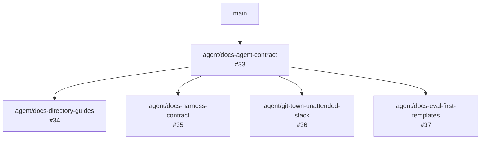
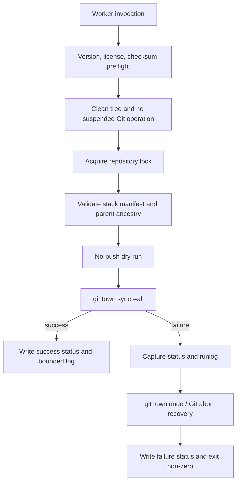

# Stacked PR Workflow

## Decision

Use Git Town when all of the following are true:

- changes must be reviewed and shipped as small dependent branches;
- a CLI-only workflow is preferred over a proprietary stacked-PR service;
- Worker Agents need deterministic Bash entry points;
- feature branches should rebase onto their declared parents;
- branch lineage and recovery must remain visible in Git and GitHub;
- the worker image can pin and verify Git Town, Git, and GitHub CLI inputs.

Git Town is not required for a single independent PR or for environments that cannot safely force-update
rebased feature branches.

## Repository topology



This is a fan-out of four independent stacks sharing one root documentation PR. After the foundation
ships, each child is synchronized onto `main` and can ship in any order. Git history remains a tree; the
diagram is not a merge DAG.

The machine-readable source is `scripts/git-town/stack.tsv`.

## Branch and PR rules

1. One issue, branch, and PR carry one independently reviewable outcome.
2. The PR base equals the branch parent.
3. The oldest branch ships first.
4. A child does not edit a sibling's owned paths.
5. A PR lists its parent, children, merge order, path ownership, evals, and conflict owner.
6. Shared generated files belong to a named integration PR.
7. After a parent ships, run sync, re-run evals, and update review evidence before shipping a child.
8. Feature branches use rebase. `main` uses fast-forward-only synchronization.
9. Squash merges can create phantom conflicts; sync frequently and prefer history-preserving merge
   behavior for stacks where repository policy allows it.

## Worker entry points

```bash
scripts/git-town/verify-release-artifact.sh /secure/input/git-town_linux_intel_64.deb
scripts/git-town/verify-license.sh
scripts/git-town/verify-stack.sh
scripts/git-town/sync-stack.sh --dry-run
scripts/git-town/sync-stack.sh
scripts/git-town/sync-background.sh
```

All scripts require a clean, unsuspended checkout and an exclusive repository lock. They set
`GIT_TOWN_INTERACTIVE=false` and pass `--non-interactive`.

## Unattended sync flow



A background process does not mean a conflict is safe to decide automatically. Git Town may automatically
resolve recognized phantom conflicts. A real semantic conflict stops the worker.

## Recovery contract

On failure the worker:

1. records the current branch, HEAD, Git Town status, and runlog;
2. attempts `git town undo --non-interactive`;
3. aborts a remaining rebase, merge, or cherry-pick without resetting committed work;
4. verifies whether the pre-sync HEAD and operation state were restored;
5. writes a non-zero status artifact and names the manual owner.

The scripts never use `git reset --hard`, delete untracked files, or overwrite remote commits without the
safe-force protections supplied by Git Town/Git.

## Existing code PR reconciliation

| PR / branch | Current base | Conflict hotspots | Required order |
|---|---|---|---|
| PR #23 `fix/openshell-source-bound-verification` | `main` | root `AGENTS.md`; integration docs | ship/rebase after #33; preserve stricter source-binding and runtime requirements |
| PR #31 `agent/harness-request-identity-exit-contract` | `main` | root README and architecture/risk docs | rebase after #33; rerun #25/#28 evals; do not let prose override tested code |
| `agent/harness-proposal-adapter` | identical to PR #31 head at program start | future Harness files | keep parked until #35 and #26 eval contract are accepted |

Documentation workers do not force-update these branches. Their owners perform the rebase and resolve
semantic conflicts.

## Parallel Agent allocation

| Lane | Issue | Owned paths |
|---|---:|---|
| Foundation | #33 | root `AGENTS.md`, root `README.md`, routing/traceability/eval/design docs |
| Directory guides | #34 | directory-level README/AGENTS files |
| Harness contract | #35 | three new Harness/ADR docs |
| Git Town | #36 | Git Town config, runbooks, Bash scripts, third-party notice |
| Issue/PR contract | #37 | work-slice form, PR template, issue/PR contract |

No lane may expand into another lane without updating both issues and naming the conflict owner.

## Merge sequence

1. Review and ship #33.
2. Run `git town sync --all --non-interactive`.
3. Re-run each child PR's evals against the new `main`.
4. Ship #34–#37 in any order because paths are disjoint.
5. Rebase existing code PRs #23 and #31 using their owners and rerun their full implementation evals.
6. Start future Harness implementation stacks only from accepted contracts and current `main`.

## Non-goals

- automatic PR merge or shipping;
- automatic semantic conflict decisions;
- bypassing branch protection or CI;
- storing forge credentials in repository files;
- treating stack synchronization as product runtime authority.
