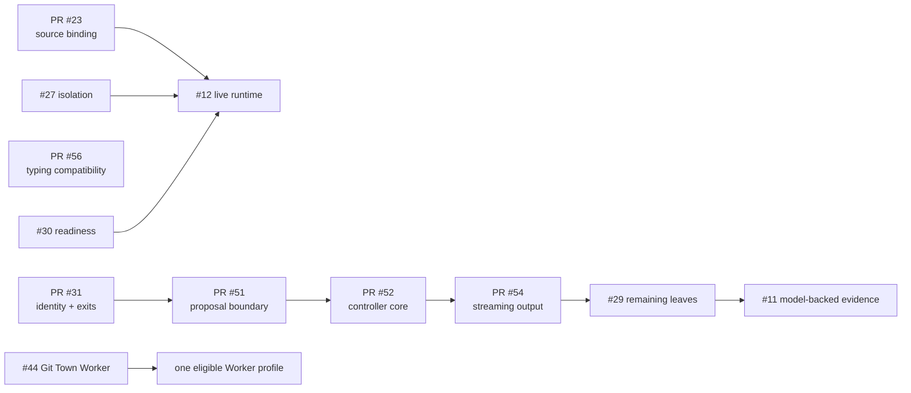

# Intent, State Machine, Issue, PR, Eval, and Evidence Traceability

This index lets a Human or Worker Agent reconstruct project intent without relying on conversation memory.
It records the path from source intent to controlling contract, State Machine, directory owner, issue,
branch/PR, evals, evidence state, and known limitation. An index entry is not execution authority and does
not prove its claim.

## Trace path

```text
source intent
  -> stable INTENT ID
  -> controlling contract and State Machine
  -> eval-first issue
  -> branch / PR lineage and owned directories
  -> implementation / tests / recipes
  -> evidence level
  -> status and limitation
```

Update this file in the same reviewable PR whenever a source, state, transition, directory owner, branch
parent, PR base, eval, evidence level, or capability status changes.

## Status vocabulary

| Status | Meaning |
|---|---|
| `current` | Implemented or accepted on `main`, supported only to the stated evidence level. |
| `current partial` | A useful bounded implementation is on `main`, but the parent issue retains separate acceptance leaves. |
| `merged contract` | Documentation or repository tooling is accepted on `main`; target/live evidence may still be pending. |
| `under review` | Exists only in an open PR or unmerged branch. |
| `planned` | Required behavior is specified, but no accepted implementation exists on `main`. |
| `unverified` | Implementation or exploratory results exist, but the claimed profile lacks accepted reproducible evidence. |
| `deployment-blocked` | Repository-side tooling exists, but real unattended use is prohibited until an exact live profile passes. |
| `unsupported` | A required backend or protection is unavailable; no weaker automatic fallback is permitted. |

## Intent index

| Intent | Requirement | State Machine / controlling source | Issue / PR | Primary evals | Status | Limitation or next gate |
|---|---|---|---|---|---|---|
| `INTENT-001` | Bind approvals and idempotency to versioned canonical request and policy identity. | runner/checkpoint State Machine; [`CODING_AGENT_HARNESS.md`](CODING_AGENT_HARNESS.md) | #25; merged PR #31 | identity substitution, restart, replay, legacy/future schema, approval cases | `current` | Digest integrity is not actor authentication; external exactly-once remains #15. |
| `INTENT-002` | Honor declared `expected_exit_codes` while preserving assertion and rollback semantics. | runner State Machine; `models.py`, `runner.py` | #28; merged PR #31 | zero/non-zero/multiple, timeout, signal, postcondition cases | `current` | Exit membership is not semantic correctness without assertions. |
| `INTENT-003` | Limit provider output to bounded proposal content; trusted code constructs the execution envelope. | proposal/envelope State Machine; `proposals.py`, provider README, ADR 0005 | #26; merged PR #51 | `EVAL-HARNESS-PROP-*` | `current` | No live provider correctness, availability, privacy, or version-attestation claim. |
| `INTENT-004` | Add finite diagnose-repair transitions with explicit stop conditions and bounded command output. | controller/runner State Machines; `controller.py`, `runner.py`, [`HARNESS_EVALS.md`](HARNESS_EVALS.md) | #29; merged PRs #52 and #54; closed #53 | controller transition/budget/cycle/redaction/identity/output cases | `current partial` | Finite controller core and streaming output enforcement are current. Provider-token admission, restart-safe state, candidate selection, strong isolation, and model-backed acceptance remain open. |
| `INTENT-005` | Route mutating command actions through a conformant strong-isolation backend. | runner/isolation State Machine; [`ACTION_ISOLATION.md`](ACTION_ISOLATION.md), [`THREAT_MODEL.md`](THREAT_MODEL.md) | #27; live evidence #12 | isolation adversarial matrix | `current for the Docker profile` | Live evidence covers one Docker version on one host. Workspace rollback and process-group termination are still not host containment, and the pinned OpenShell/rootless Podman matrix remains #12. |
| `INTENT-006` | Make OpenShell auto-selection depend on execution-equivalent readiness and typed infrastructure verdicts. | verification/backend State Machine; [`OPENSHELL.md`](OPENSHELL.md) | #30; related #12; PR #23 supplies source binding only | readiness component and version-pinned doctor/execution cases | `planned` | Binary/gateway presence alone is insufficient; no unsafe-local fallback. |
| `INTENT-007` | Measure first-pass/post-repair success, Harness uplift, mutation persistence, latency, cost, tokens, retries, and stops separately. | benchmark/claim State Machine; [`BENCHMARKS.md`](BENCHMARKS.md) | #11, #24, #29 | `EVAL-BENCH-*` | `unverified` | Preserve failed/timed-out raw trials; one model/machine profile does not generalize. |
| `INTENT-008` | Separate model correctness, orchestration effect, and safety/failure containment. | controller and benchmark State Machines; ADR 0005 | #35 / merged PR #40; evidence #11/#24/#29 | Harness measurement and benchmark comparisons | `merged contract` | Measurement rules are accepted; model-backed uplift remains unverified. |
| `INTENT-009` | Preserve failed, timed-out, unsupported, policy-denied, and negative-result evidence. | verification/benchmark/evidence State Machines; [`EVALS.md`](EVALS.md), [`EVIDENCE.md`](EVIDENCE.md) | merged PRs #38/#40 and ongoing evidence issues | common evidence/claim evals | `current` | Raw model/runtime artifacts remain with their owning issues. |
| `INTENT-010` | Scope security, correctness, latency, compatibility, and supply-chain claims to exact profiles. | evidence/claim State Machine; threat model and Git Town license gate | merged PRs #38/#41; live gates #11/#12/#44 | profile and live acceptance evals | `current` | Individual profiles remain unverified or blocked until exact evidence passes. |
| `INTENT-011` | Require eval-first issues and PRs with explicit evidence status. | change-lifecycle State Machine; [`EVALS.md`](EVALS.md), [`ISSUE_PR_CONTRACT.md`](ISSUE_PR_CONTRACT.md) | #33/#37; merged PRs #38/#42 | foundation/meta evals | `current` | New work declares outcome, paths, State Machine/data-flow delta, lineage, evals, and stops. |
| `INTENT-012` | Provide local directory routing, source-of-truth, data-flow, and escalation instructions. | directory ownership table; root/local README and AGENTS files | #34 / PR #39; #57 / PR #58 | directory and `EVAL-STATE-*` checks | `current` when this index is on `main` | Scoped guides mirror source/schema state and narrow root rules; they never grant authority. |
| `INTENT-013` | Make branch/PR lineage explicit and machine-readable for parallel Workers. | change-lifecycle and Git Town Worker State Machines; [`STACKED_PRS.md`](STACKED_PRS.md) | merged PRs #38/#41/#42 | lineage/manifest/PR-base evals | `merged contract` | Product dependency or merge order is not automatically an active Git Town stack. |
| `INTENT-014` | Use an exact permissively licensed Git Town release with license and artifact identity gates. | Git Town Worker preflight; [`GIT_TOWN_LICENSE.md`](GIT_TOWN_LICENSE.md) | #36; merged PR #41 | `EVAL-GIT-03`, `EVAL-GIT-04` | `merged contract` | MIT removes a proprietary-service dependency but does not guarantee zero legal/supply-chain risk. |
| `INTENT-015` | Provide Bash-only foreground/background non-interactive stack synchronization that fails closed. | Git Town Worker State Machine; [`scripts/git-town/README.md`](../scripts/git-town/README.md) | #36 / PR #41; live #44 | repository fixture and `EVAL-GIT-LIVE-*` | `deployment-blocked` | Header-only manifest blocks mutation; exact binary/conflict/race/secret evidence remains #44. |
| `INTENT-016` | Allow multiple Worker Agents only with disjoint paths and named conflict owners. | change-lifecycle State Machine; root [`AGENTS.md`](../AGENTS.md), issue/PR contract | merged PRs #38/#42 | path/lineage/meta evals | `current` | Scope expansion requires issue update before editing. |
| `INTENT-017` | Bind external verification to the user-selected source revision. | verification State Machine; [`INTEGRATION_REQUIREMENTS.md`](INTEGRATION_REQUIREMENTS.md) | #12; merged PR #23 | source-matched adapter/live conformance | `current` source binding | Strong action isolation/readiness and live adversarial profiles remain #27/#30/#12. |
| `INTENT-018` | Keep repository prose, issues, retrieved memory, and model text outside execution authority. | every State Machine boundary; root AGENTS, threat/prompt-injection docs | established on `main` | policy, negative, and authority-boundary evals | `current` | External integrations still own correct provenance and authorization. |
| `INTENT-019` | Accept one exact Git Town Worker image before real unattended use. | Git Town Worker qualification State Machine | #44; evidence path `docs/evidence/git-town-worker/v24.0.0/**` | `EVAL-GIT-LIVE-01..12` | `deployment-blocked` | No scheduled/background Worker may operate on a real checkout until accepted. |
| `INTENT-020` | Reconcile documentation-program state without promoting runtime claims. | documentation/change lifecycle | #45 / PR #46; parent #32 closed | closeout evals | `current` | Documentation completion does not close benchmark, isolation, readiness, or live Worker gates. |
| `INTENT-021` | Package Git Town adoption rules as a repository-portable system prompt. | prompt contract lifecycle | #49 / merged PR #50 | `EVAL-PROMPT-01..12` | `current` | Copying the prompt does not authorize target-repository writes or deployment. |
| `INTENT-022` | Maintain a directory-to-State-Machine-to-data-flow-to-leaf-stack index for Agent handoff. | [`REPOSITORY_STATE_MACHINES.md`](REPOSITORY_STATE_MACHINES.md), [`IMPLEMENTATION_STACKS.md`](IMPLEMENTATION_STACKS.md), root/local README files | #57 / PR #58 | `EVAL-STATE-01..09` | `current` when merged on `main`; otherwise `under review` | The index must follow current source and GitHub state without activating Git Town or promoting claims. |

## Current capability graph



## Current molecular implementation index

| Lane | Issue / PR | State | Primary owned area | Next required action |
|---|---|---|---|---|
| merged foundation | PRs #23/#31/#51/#52/#54/#56 | `current` to stated evidence | source binding, identity/exits, proposal, controller core, output enforcement, typing | preserve contracts and limitations in future leaves |
| controller A | #29 child to create | planned | provider-token admission | define exact tokenizer/profile and pre-call rejection evals |
| controller B | #29 child to create | planned | restart-safe controller state | define persistence/migration/kill-restart matrix |
| controller C | #29 child to create | planned | bounded candidate selection | define child workspace, conflict, and selection contract |
| controller evidence | #11/#29 child to create | unverified | direct/equal-feedback/controller raw comparison | pin corpus/model/sampling/environment and preserve failures |
| isolation | #27 | planned | strong-isolation action backend | design adapter, negative tests, and live #12 gate |
| readiness | #30 | planned | execution-equivalent OpenShell readiness | typed probe and doctor/launch agreement |
| runtime evidence | #12 | open | pinned adversarial OpenShell/rootless OCI artifacts | publish exact environment and failed trials |
| repository ops | #44 | deployment-blocked | exact Git Town Worker acceptance | package/binary/ShellCheck/conflict/race/secret matrix |
| documentation delivery | #57 / PR #58 | current on `main` after merge | README and central indexes | future status changes update these files in owning PRs |

See [`IMPLEMENTATION_STACKS.md`](IMPLEMENTATION_STACKS.md) for split details, path allocation, and handoff
procedure.

## Directory/state ownership map

| Area | Owned State Machine or evidence role | Index |
|---|---|---|
| `.github/` | issue/PR/check/review lifecycle | [README](../.github/README.md) |
| `src/xt_aegis/` | proposal, controller, runner, checkpoint, verification, MCP | [README](../src/xt_aegis/README.md) |
| `src/xt_aegis/providers/` | provider response normalization | [README](../src/xt_aegis/providers/README.md) |
| `tests/` | positive/negative/failure-path evidence lifecycle | [README](../tests/README.md) |
| `verification/` | claim plan/backend/result/bundle lifecycle | [README](../verification/README.md) |
| `benchmarks/` | pinned profile/raw trial/summary lifecycle | [README](../benchmarks/README.md) |
| `scripts/git-town/` | no-active-stack/preflight/sync/recovery lifecycle | [README](../scripts/git-town/README.md) |

## Active Git Town state

The committed [`scripts/git-town/stack.tsv`](../scripts/git-town/stack.tsv) contains its header and no
active rows. Therefore:

- no unattended XT-Aegis stack synchronization is authorized;
- `verify-stack.sh`, foreground sync, and background sync fail before mutation;
- product dependency sequences in this index do not become manifest rows automatically;
- future rows require open eval-first PRs, matching bases/parents, a dedicated allowlisted checkout, and an
  authorized exact Worker profile;
- merged or closed PR rows are removed immediately.

## Open implementation and evidence work

| Work | State | Required next artifact |
|---|---|---|
| #29 remaining controller acceptance | open/current partial parent | molecular child issues for token admission, restart state, candidate selection, and model evidence |
| #27 strong mutation isolation | planned | architecture/adapter issue-owned PR with adversarial tests and separate isolation verdict |
| #30 OpenShell readiness | planned | version-aware probe and doctor/launch consistency tests |
| #11 reproducible benchmarks | open/unverified | raw schema-valid trials, environment manifest, exact commands, summaries |
| #12 live runtime conformance | open | pinned OpenShell/rootless OCI adversarial evidence |
| #9 observability | current | delivered: span vocabulary, allowlisted attributes, versioned JSONL envelope, offline replay |
| #10 crash recovery | current | delivered: named transitions, process-kill matrix, cancellation and deadline reason codes, recovery table |
| #10 crash/deadline recovery | open | kill/restart/cancellation State Machine and fault-injection evidence |
| #14/#15 | planned | distributed coordination and protected external-side-effect contracts |
| #16 | planned | authenticated fail-closed mutating MCP adapter after prerequisites |
| #17 | planned | exact production reference profile and supply-chain evidence |
| #44 Git Town Worker | deployment-blocked | exact live Worker evidence bundle |

## Claim-change rule

A stronger product/runtime claim requires the same PR to contain or link:

- implementation within a bounded trust boundary;
- corresponding State Machine/data-flow/schema updates;
- positive, negative, failure, migration, replay, timeout, and recovery tests required by its issue;
- a reproducible recipe or raw artifact for the exact profile;
- explicit limitations and non-goals;
- matching architecture, threat model, roadmap, schema, and `PROJECT_EVIDENCE.json` changes where
  applicable.

Documentation completion, a diagram, generic green CI, adapter construction, a fake-client fixture, or one
local model run is not enough to promote runtime, isolation, correctness uplift, performance,
compatibility, deployment, or production claims.
