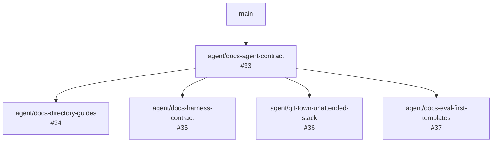

# Traceability Index

This index preserves project intent across documents, issues, branches, PRs, evals, evidence, and known
limitations. It is not a claim registry and does not replace `PROJECT_EVIDENCE.json`.

## Stable intent map

| Intent ID | Decision or requirement | Primary source | Owning document / issue | Branch or PR | Required evals | Status / limitation |
|---|---|---|---|---|---|---|
| `INTENT-001` | Keep side-effect authority outside the model | ADR 0001, architecture | #24 | PR #31 and follow-ons | Harness/security evals | deterministic core exists; orchestration incomplete |
| `INTENT-002` | Model proposes bounded code/change content only | #26, #24 | #35 | `agent/docs-harness-contract` | `EVAL-HARNESS-01` | design required; provider behavior not universally verified |
| `INTENT-003` | Trusted code owns identity, provenance, policy, assertions, approval, backend, and budgets | #25, #26, #29 | #35 | PR #31 covers part | `EVAL-HARNESS-01..03` | request identity work is under review |
| `INTENT-004` | Bind approval and idempotency to canonical request/policy identity | #25 | PR #31 | `agent/harness-request-identity-exit-contract` | #25 acceptance evals | code PR open; not in `main` |
| `INTENT-005` | Honor declared command exit semantics | #28 | PR #31 | same as above | #28 acceptance evals | code PR open; not in `main` |
| `INTENT-006` | Retry only bounded candidate execution/assertion failures | #29 | #35 | `agent/docs-harness-contract` | `EVAL-HARNESS-02..03` | controller evidence incomplete |
| `INTENT-007` | Separate workspace rollback from process isolation | #27, threat model | #35 | future implementation stack | `EVAL-HARNESS-04` | strong mutation isolation unimplemented |
| `INTENT-008` | Select OpenShell only with execution-equivalent readiness | #30 | future implementation issue | PR #23 is related, not sufficient | runtime conformance evals | readiness gap remains |
| `INTENT-009` | Bind verification to selected source revision | #12 | PR #23 | `fix/openshell-source-bound-verification` | PR #23 verification plan | open code PR; conflict hotspot: root `AGENTS.md` |
| `INTENT-010` | Separate correctness, safety, cost, latency, and persistence metrics | #11, #24 | #35 | future benchmark stack | `EVAL-HARNESS-05` | no universal uplift or token claim |
| `INTENT-011` | Design evals before implementation | #32, #33 | `docs/EVALS.md` | `agent/docs-agent-contract` | `EVAL-FOUNDATION-*` | documentation program |
| `INTENT-012` | Make directory purpose and path ownership locally discoverable | #34 | local README/AGENTS | `agent/docs-directory-guides` | `EVAL-DIR-*` | parallel docs child |
| `INTENT-013` | Use molecular stacked PRs with explicit parent and disjoint sibling paths | #32, #36, #37 | stacked-PR and issue/PR contracts | parallel docs branches | `EVAL-GIT-09`, `EVAL-META-*` | documentation program |
| `INTENT-014` | Use pinned MIT Git Town with Bash-only unattended sync | #36 | Git Town license/runbook | `agent/git-town-unattended-stack` | `EVAL-GIT-*` | exact binary checksums remain deployment inputs |
| `INTENT-015` | Stop unattended sync on real semantic conflicts | #36 | stacked-PR runbook/scripts | same as above | `EVAL-GIT-07..08` | phantom auto-resolution is not semantic authority |
| `INTENT-016` | Preserve external policy integrity | ADR 0002, prompt-injection policy | root `AGENTS.md` | all PRs | `EVAL-COMMON-03` | permanent invariant |
| `INTENT-017` | Keep public MCP read-only by default | ADR 0003, #16 | architecture / MCP docs | current `main` | existing claim recipe | remote mutation remains out of scope |
| `INTENT-018` | Claims require source, recipe, policy, backend, artifacts, and limitations | evidence docs, registry | #11, #12 | all claim PRs | evidence-specific evals | exact-profile only |

## Documentation program stack

The four child branches are independent stacks sharing one documentation foundation. They are not a merge
DAG: after the foundation ships, each child root is synchronized onto `main` and may ship in any order.

## Existing branch reconciliation

| Existing work | Base | Overlap with documentation program | Owner and order |
|---|---|---|---|
| PR #23 OpenShell source binding | `main` | root `AGENTS.md`; integration documentation | PR #23 owner rebases after foundation; preserve stricter integration requirements |
| PR #31 Harness identity/exit contract | `main` | root `README.md`, architecture/roadmap/threat-model docs in its diff | PR #31 owner rebases after foundation; code semantics win only with its tests/evidence |
| `agent/harness-proposal-adapter` | currently identical to PR #31 head | future Harness files and root docs | do not implement until #35 contract and #26 evals are accepted |

Documentation workers MUST NOT force-update these existing code branches.

## Status meanings

- `current`: present on `main` with matching tests/evidence.
- `under review`: present only on an open branch or PR.
- `partial`: some prerequisites exist; full acceptance criteria do not.
- `planned`: no accepted implementation.
- `unverified`: implementation may exist, but required evidence is missing.
- `blocked`: a named dependency prevents safe progress.

Update this file whenever a source issue, branch parent, PR base, eval contract, or capability status changes.
