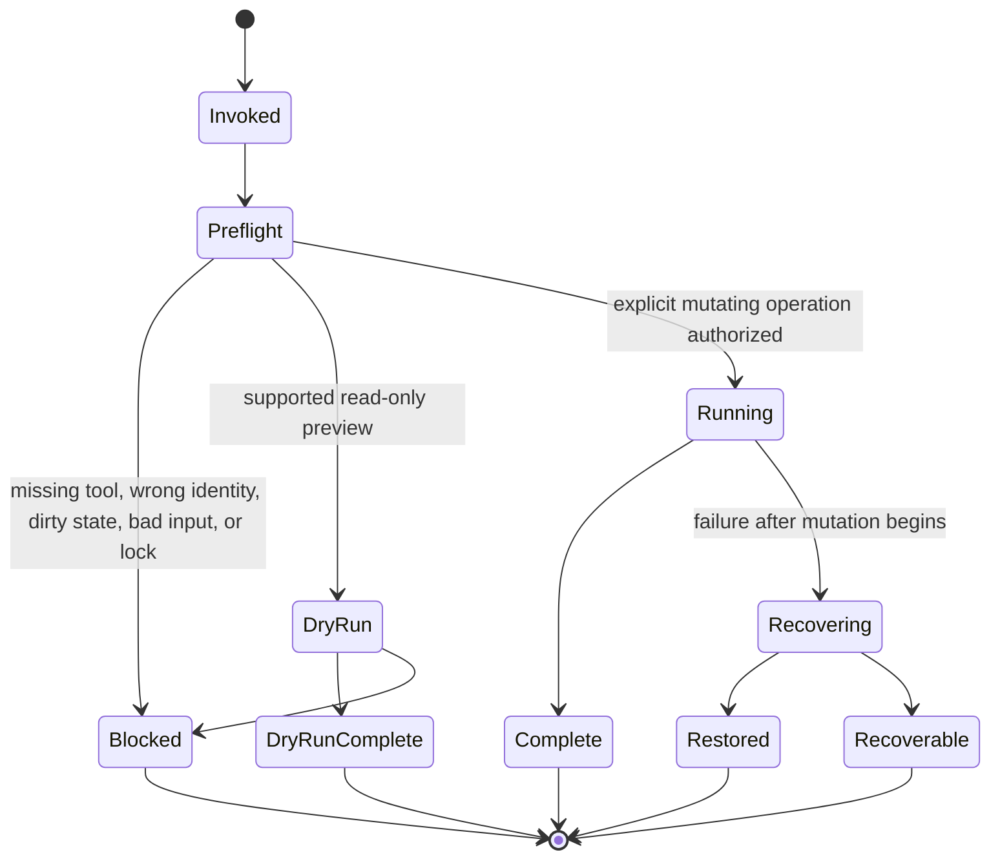

# Repository Scripts

Scripts provide bounded developer, benchmark, release, or Git-management entry points. They are explicitly
invoked repository operations, not model authority, and must never turn repository prose into commands.

## Script-operation State Machine



Each script documents which subset of these conceptual phases it implements. A script that cannot prove
recovery must report a blocker or recoverable state rather than success.

## Areas

| Area | Responsibility | Inputs → outputs |
|---|---|---|
| `benchmark.py` | local deterministic/model measurement scaffold governed by `docs/BENCHMARKS.md` | pinned profile/workload → raw results and summary |
| `git-town/` | Bash-only stacked-branch Worker contract | exact tool/repository/manifest lineage → dry-run, sync, recovery status |

## Common data flow

```text
explicit user or authorized Worker invocation
  -> validate arguments and repository/tool identity
  -> clean-state / scope / lock / budget preflight
  -> optional non-mutating dry run
  -> bounded operation
  -> bounded log and atomic/typed status
  -> evidence or explicit recovery owner
```

## Source of truth

- Root [`AGENTS.md`](../AGENTS.md)
- [`docs/REPOSITORY_STATE_MACHINES.md`](../docs/REPOSITORY_STATE_MACHINES.md)
- [`docs/IMPLEMENTATION_STACKS.md`](../docs/IMPLEMENTATION_STACKS.md)
- [`docs/BENCHMARKS.md`](../docs/BENCHMARKS.md)
- [`docs/STACKED_PRS.md`](../docs/STACKED_PRS.md)
- Local [`AGENTS.md`](AGENTS.md)
- [`git-town/README.md`](git-town/README.md)

## Current implementation relationship

PR #54 and PR #56 are merged on `main`: streaming command-output enforcement and mypy 2 backend-map
compatibility are current. Remaining product leaves are tracked by issue #29 and the independent #27,
#30, #11, and #12 workstreams. Issue #44 remains the separate Git Town live-Worker gate.

This dependency graph is documented in `docs/IMPLEMENTATION_STACKS.md`; it is not an active Git Town
manifest. The committed `git-town/stack.tsv` remains header-only, so repository scripts stop before
unattended stack mutation.

## Script requirements

- Use explicit argv and bounded inputs; do not use repository text as a shell program.
- Use strict mode, quoting, private state, finite timeout, bounded output, and explicit status where
  applicable.
- Keep credentials out of files, prompts, arguments, logs, and committed evidence.
- Preserve non-zero exits and failed/not-run evidence.
- Never use destructive recovery such as unreviewed hard reset, broad clean, or raw force-push.
- Separate repository-side fixtures from exact-binary/live-profile qualification.

## Stop and escalate

Stop when tool/version/checksum identity is unresolved, repository state is dirty or suspended, scope or
lineage does not match an open issue/PR, a semantic conflict appears, output/deadline bounds cannot be
enforced, or recovery cannot be proven. Record the exact state, evidence path, and owner needed to resume.
