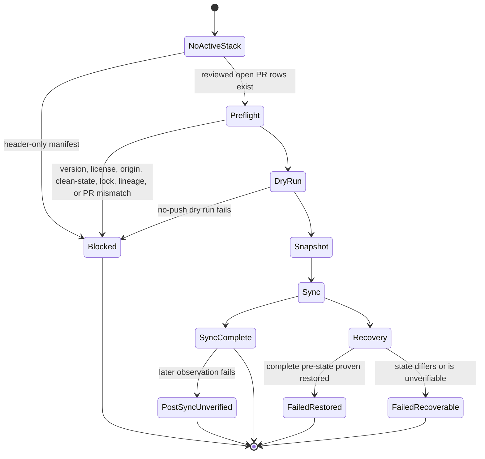

# Git Town Worker Scripts

These Bash-only scripts manage repository stacks. They are repository-operations tools, not XT-Aegis
product runtime tools. Product dependencies recorded in documentation do not become an active Git Town
stack without an accepted manifest and an authorized exact Worker profile.

## Worker State Machine



Preflight failures never call `git town undo`. Once mutating sync starts, recovery is limited to the current
run and must compare complete local/tracking refs, current branch, HEAD, parent metadata, operation state,
and worktree cleanliness.

## Commands and ownership

| Script or file | State Machine responsibility |
|---|---|
| `verify-release-artifact.sh` | verify pinned package hash, version, and architecture before installation |
| `verify-license.sh` | verify exact Git Town version, binary checksum, release/config identity, and copied license |
| `bootstrap.sh` | print or write reviewed local parent metadata without rebase or branch switching |
| `verify-stack.sh` | verify identity, state, refs, upstreams, parents, open-PR lineage, allowlist, and no-push dry run |
| `sync-stack.sh` | foreground finite sync with deadline, bounded evidence, snapshots, and current-run recovery |
| `sync-background.sh` | detached wrapper preserving foreground behavior and observable PID/status/logs |
| `common.sh` | shared hashing, origin, lock, snapshot, timeout, log, and atomic-status helpers |
| `test-fixture.sh` | disposable no-network contract evals with synthetic rows and fake clients |
| `stack.tsv` | reviewed active PR lineage; header-only means no active stack |
| `git-town.lock` | exact repository-side version/license/package/config identity contract |

## Required environment

```bash
export GIT_TOWN_BINARY_SHA256="<approved SHA-256 of the installed git-town binary>"
```

The Worker image provides credentials and platform checksum inputs. It pins Bash 4+, Git, GitHub CLI,
GNU `timeout`, ShellCheck, and the exact Git Town version declared by `git-town.lock`.

Optional Worker-controlled limits:

```bash
export XT_AEGIS_GIT_TOWN_TIMEOUT_SECONDS=1800
export XT_AEGIS_GIT_TOWN_MAX_LOG_BYTES=1048576
export XT_AEGIS_GIT_TOWN_STATE_DIR=/secure/worker-state/xt-aegis-git-town
```

Timeout must be `1..7200` seconds. Log capacity must be `65536..8388608` bytes. Without an override,
private runtime artifacts are written under `.git/xt-aegis/git-town/`.

## Active-manifest and dedicated-checkout contract

`stack.tsv` is currently header-only. That state blocks `verify-stack.sh`, foreground sync, and background
sync before mutation. Do not add placeholder, merged, closed, unpublished, or merely planned branches to
make the command pass.

When an active stack exists, every local branch must appear as a branch or parent in `stack.tsv`. Every
manifest branch must:

- exist locally and as `origin/<branch>`;
- track its same-name origin branch;
- share Git history with its parent;
- have local Git Town parent metadata matching the manifest;
- name an open eval-first PR whose head and base match branch and parent;
- have one owner, owned paths, evals, evidence locations, and a semantic-conflict owner.

A parent may advance beyond a child before synchronization. Shared history, not “parent remains an
ancestor,” is the valid pre-rebase condition.

## Current product/review graph

The following foundation is merged on `main`:

```text
PR #31 identity + declared exits
  → PR #51 provider-neutral proposal boundary
  → PR #52 finite controller core
  → PR #54 streaming command-output enforcement

PR #23 source-bound verification
PR #56 mypy 2 backend-map compatibility
```

Remaining work is independent unless a future issue explicitly creates parent/child PRs:

- #29 — provider-token admission, restart-safe controller state, candidate selection, model-backed evidence;
- #27 — strong-isolation action backend;
- #30 — execution-equivalent OpenShell readiness;
- #11 — reproducible benchmark artifacts;
- #12 — live OpenShell/rootless OCI conformance;
- #44 — exact Git Town Worker qualification.

This graph is indexed in [`docs/IMPLEMENTATION_STACKS.md`](../../docs/IMPLEMENTATION_STACKS.md). It is not
an active Git Town stack. Do not populate `stack.tsv` from it.

## Usage

```bash
scripts/git-town/verify-release-artifact.sh /secure/input/git-town_linux_intel_64.deb
scripts/git-town/verify-license.sh
scripts/git-town/bootstrap.sh
scripts/git-town/bootstrap.sh --apply
scripts/git-town/verify-stack.sh
scripts/git-town/sync-stack.sh --dry-run
scripts/git-town/sync-stack.sh
scripts/git-town/sync-background.sh --dry-run
scripts/git-town/sync-background.sh
scripts/git-town/test-fixture.sh
```

`bootstrap.sh --apply` updates repository-local Git config only. Review its printed plan first. It does not
authorize sync, push, merge, or conflict resolution.

## Data flow

```text
exact release/license/binary/config identity
  + clean dedicated checkout
  + reviewed active manifest and local parent metadata
  + live open PR head/base/state
  -> exclusive lock and fetch
  -> no-push dry run
  -> complete pre-sync ref/config snapshot
  -> git town sync --all --non-interactive --no-auto-resolve
  -> bounded log + atomic status
  -> success or current-run-only recovery evidence
```

## Failure semantics

Terminal phases include:

- `preflight_*` — no mutating sync started; never call undo;
- `failed_restored` — complete pre-sync state was proven restored;
- `failed_recoverable` — state differs or restoration cannot be proven;
- `post_sync_unverified_*` — sync returned success but later observation failed; no automatic undo;
- `dry_run_complete` and `sync_complete` — terminal success.

A non-zero result is a blocker. Do not continue a semantic conflict or `failed_recoverable` state without
an explicit owner. Never use hard reset, broad clean, raw force-push, or credential-bearing arguments as
recovery.

## Evidence levels

1. `test-fixture.sh` validates repository-side orchestration with synthetic rows and fake clients.
2. Exact-binary/static acceptance verifies the release package, installed binary, config schema/CLI, and
   ShellCheck for one immutable Worker image.
3. Live qualification exercises real PR lineage, conflict-free sync, semantic conflict, partial mutation,
   remote race, timeout/process tree, output bounds, secret canaries, and reproducibility.

Only level 3 can make one exact profile eligible. Issue #44 owns that gate. Merging scripts or documents
does not authorize unattended deployment.

## Source of truth and handoff

- [`docs/STACKED_PRS.md`](../../docs/STACKED_PRS.md) — workflow contract.
- [`docs/GIT_TOWN_LICENSE.md`](../../docs/GIT_TOWN_LICENSE.md) — license/supply-chain gate.
- [`docs/REPOSITORY_STATE_MACHINES.md`](../../docs/REPOSITORY_STATE_MACHINES.md) — Worker transitions.
- [`docs/IMPLEMENTATION_STACKS.md`](../../docs/IMPLEMENTATION_STACKS.md) — current product/review graph.
- [`scripts/AGENTS.md`](../AGENTS.md) — scoped script rules.

Stop when these disagree with `git-town.lock`, `stack.tsv`, local Git config, repository identity, or live
PR metadata.
