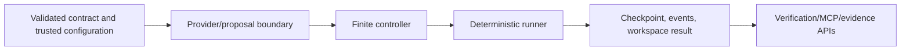

# Source Packages

`src/` contains installable product code. It owns typed runtime behavior, not repository workflow policy.
Documentation-only work does not modify files here unless its eval-first issue explicitly owns an
implementation State Machine delta.

## Package-level State Machine role



The package boundary is [`xt_aegis/`](xt_aegis/README.md). Provider-specific transport adapters are under
[`xt_aegis/providers/`](xt_aegis/providers/README.md).

## Data flow

```text
compiled SKILL contract
  + trusted target/identity/policy/backend scope
  + typed provider or operator proposal
  -> canonical request and policy identity
  -> policy / approval / attempt / time / output gates
  -> owned workspace transaction
  -> action and assertions
  -> commit, rollback, block, suspend, or fail
  -> checkpoint, events, verification result, and evidence consumer
```

## Directory ownership

| Path | State Machine ownership | Inputs | Outputs |
|---|---|---|---|
| `xt_aegis/models.py`, `verification_models.py` | shared state/result/contract vocabulary | parsed configuration and runtime facts | strict typed models and enums |
| `xt_aegis/proposals.py`, `providers/` | provider proposal and trusted-envelope boundary | private task, profile, finite limits | typed `ProposalOutcome` or fresh trusted request |
| `xt_aegis/controller.py` | finite diagnose-repair transitions | provider outcome and runner result | `ControllerResult` with terminal stop reason |
| `xt_aegis/runner.py` | deterministic action transaction and streaming output enforcement | exact `ActionRequest`, compiled skill, workspace/store | terminal `ExecutionResult` |
| `xt_aegis/checkpoint.py`, `events.py` | durable approval/replay/audit lifecycle | exact identity and terminal transitions | SQLite state and bounded event records |
| `xt_aegis/workspace.py`, `policy.py`, `skill.py` | compilation, authorization, path transaction | SKILL source and request | compiled contract, policy verdict, rollback/commit hashes |
| `xt_aegis/verification.py`, `sandbox_exec.py` | external verification/backend lifecycle | registry/recipe/policy/source/backend | plan, typed result, artifacts, bundle |
| `xt_aegis/mcp_server.py` | read-only discovery and explicit local verification surface | validated registry and explicit user mode | bounded MCP responses |
| asset directories | packaged mirrors/fixtures | repository source-of-truth files | wheel/container runtime assets |

Generated or packaged mirrors are consumers, not independent sources of truth. Their integration owner
must update the source and mirror together when an issue owns both.

## Current integration state

- Canonical request/policy identity and declared command exits are current through PR #31.
- Provider-neutral proposals and trusted envelope construction are current through PR #51.
- The finite controller core is current through PR #52.
- Combined streaming stdout/stderr enforcement is current through PR #54. Excess output terminates the
  command process group, returns `output_budget_exhausted`, preserves bounded evidence, and rolls back a
  failed mutation when integrity can be established.
- Mypy 2 backend-map compatibility is current through PR #56 without changing backend selection behavior.
- Issue #29 remains open for provider-token admission, restart-safe state, candidate selection, and
  model-backed acceptance evidence.
- Strong mutation isolation and execution-equivalent readiness remain planned in #27/#30.

See [`docs/REPOSITORY_STATE_MACHINES.md`](../docs/REPOSITORY_STATE_MACHINES.md) and
[`docs/IMPLEMENTATION_STACKS.md`](../docs/IMPLEMENTATION_STACKS.md).

## Source-change requirements

A source change must identify:

- the exact State Machine state/transition/result field being changed;
- trusted versus untrusted fields;
- producer and every persisted/downstream consumer;
- positive, negative, timeout/crash/replay/substitution/recovery tests as applicable;
- schema, recipe, evidence, threat-model, README, and mirror deltas;
- issue/PR path ownership and shared integration owner.

## Stop and escalate

Stop when an issue does not own the source path, state/result enums disagree with README/schema/tests,
required isolation or live evidence is unavailable, a generated mirror would diverge, or a claim would be
promoted without exact-profile evidence.

See root [`AGENTS.md`](../AGENTS.md) and local [`AGENTS.md`](AGENTS.md).
