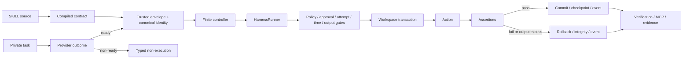
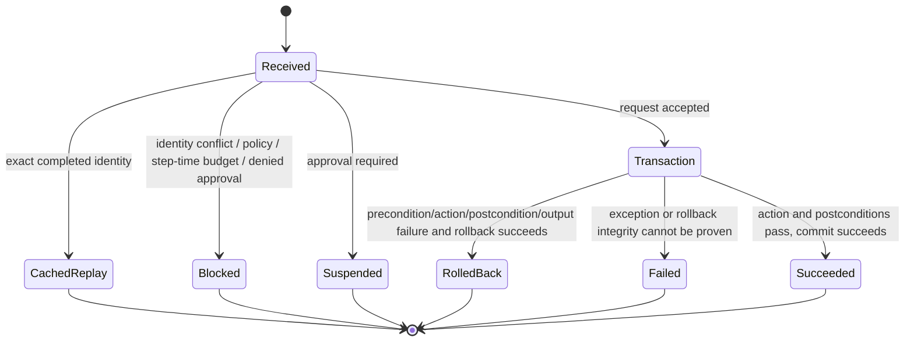

# `xt_aegis` Package

This package owns the deterministic control-plane implementation and external-verification APIs. A model,
provider, repository document, or caller may propose data; this package validates, authorizes, executes,
checks, persists, verifies, or rejects it through typed boundaries.

## Component and State Machine map

| Area | Responsibility | State Machine role | Primary output |
|---|---|---|---|
| `models.py`, `verification_models.py` | strict shared contracts and enums | define legal states, terminal reasons, and serialized evidence shapes | validated Pydantic models |
| `skill.py` | compile SKILL YAML front matter | source bytes → validated executable contract or rejection | `CompiledSkill` and source hash |
| `proposals.py` | provider-neutral proposals and trusted envelope | provider outcome → non-execution or fresh scoped `ActionRequest` | `ProposalOutcome`, `TrustedActionEnvelope` |
| `providers/ollama.py` | optional loopback Ollama transport | private bounded request → normalized typed outcome | provider profile/usage/diagnostic without authority |
| `controller.py` | finite diagnose-repair orchestration | proposal → execute/classify → bounded repair or terminal stop | `ControllerResult` |
| `identity.py` | canonical request/policy binding | exact request + compiled skill → versioned digests | `RequestIdentity` |
| `policy.py` | provenance/path/command/network-intent authorization | request/conditions → allow or typed reasons | policy verdict |
| `workspace.py` | owned workspace transaction | snapshot → write/command/assert → commit or rollback | tree hashes and rollback integrity |
| `runner.py` | deterministic single-request executor | receive → policy/approval/budget → streaming process execution → terminal result | `ExecutionResult` |
| `checkpoint.py` | durable run/step/approval/result state | prepare/approve/claim/save/replay/conflict | SQLite checkpoint and idempotent replay |
| `events.py` | bounded audit trajectory | runtime transition → redacted event | trace/event records |
| `verification.py` | registry, backend, recipe, evidence execution | validate/plan/select/execute/bundle | `VerificationResult` / summary / bundle |
| `sandbox_exec.py` | confined argv launcher inside verifier runtime | validated recipe → bounded process evidence | exit/output/artifact evidence |
| `mcp_server.py` | MCP discovery and explicit verification | read-only query or explicit local execution request | bounded MCP result |
| `redaction.py` | secret-safe bounded text | raw diagnostic/output → redacted limited text | safe evidence string |
| `demo_assets/`, `verification_assets/` | packaged fixtures and mirrored contracts | repository source → distribution/runtime consumer | wheel/container assets |

## Package data flow



## Proposal State Machine

Exact `ProposalStatus` values:

```text
ready | refused | timed_out | malformed | oversized | truncated | provider_error
```

Only `ready` may carry proposal content. A ready proposal still cannot choose target path, provenance,
request IDs, policy, approval, assertions, backend, or budgets. `build_action_request()` validates the
trusted target and byte limits, creates fresh identities, sets `agent_proposal` provenance, and computes the
canonical request/policy identity.

See [`providers/README.md`](providers/README.md).

## Controller State Machine

Exact `ControllerStopReason` values:

```text
proposal_rejected
policy_denied
approval_required
baseline_invalid
infrastructure_unavailable
execution_failed
assertion_failed
recovery_failed
repeated_failure
budget_exhausted
passed
```

Only `execution_failed` and `assertion_failed` are retryable. Every retry rebuilds a fresh trusted envelope.
Missing token usage before a retry, an equivalent-failure cycle, result identity mismatch, rollback failure,
or exhausted attempts/time/tokens/output is terminal.

The finite core is current through PR #52. Streaming command-output enforcement is current through PR #54:
stdout and stderr share one budget across preconditions, action, and postconditions; excess terminates the
process group, returns bounded evidence, and prevents success. Issue #29 remains open for provider-token
admission, restart-safe state, candidate selection, and model-backed evidence.

## Runner State Machine

Exact terminal `ExecutionStatus` values:

```text
succeeded | rolled_back | blocked | suspended | failed
```

Exact machine-readable `ExecutionReasonCode` values currently include:

```text
policy_denied | approval_denied | approval_required | budget_exhausted
identity_conflict | output_budget_exhausted
```



Command execution uses `shell=False`, a new process session, streaming stdout/stderr collection, a shared
byte budget, bounded redacted persistence, and process-group termination on timeout or observed output
excess. `output_original_bytes` is a lower bound after excess is observed; OS pipe buffering is not zero.
These controls are not strong process isolation.

Workspace rollback covers only the owned workspace. Issue #27 owns strong isolation for mutating commands;
issue #30 owns execution-equivalent OpenShell readiness; issue #12 owns live runtime conformance.

## Checkpoint, approval, and replay State Machine

```text
step prepared
  → approval pending when required
  → approved or denied
  → approved capability claimed once for exact request/policy/actor
  → terminal result persisted
  → exact cached replay or identity conflict
```

Legacy/unknown schema, expired/consumed/substituted approval, and reused idempotency key with a different
identity fail closed. Digest binding is not authentication and does not provide universal exactly-once
external effects.

## Verification State Machine

Exact `VerificationStatus` values:

```text
verified | failed | unsupported | policy_denied | inconclusive | error
```

```text
registry/schema validation
  → non-executing plan
  → explicit or conformant automatic backend selection
  → bounded argv-only recipe
  → typed result and artifacts
  → deterministic evidence bundle
```

`unsafe-local` is explicit development mode and never an automatic strong-backend fallback. Verification
source binding is current through PR #23. PR #56 keeps the backend adapter map compatible with mypy 2
without changing selection behavior. Live strong-profile claims remain gated by #12/#27/#30.

## Producer and consumer matrix

| Producer | Output | Consumer |
|---|---|---|
| `skill.py` | compiled contract/source identity | identity, policy, runner, controller |
| provider adapter | `ProposalOutcome` | trusted envelope/controller |
| `proposals.py` | request + canonical identity + provider profile | controller/runner/evidence |
| controller | attempt list, stop reason, totals, limitations | caller, schema/recipe, benchmark |
| runner | terminal execution result | controller, checkpoint, events, tests |
| checkpoint/events | durable result and trajectory | replay, audit, recovery/observability work |
| verification | plan/result/summary/bundle | CLI, MCP, independent reviewer |
| tests/recipes | pass/fail/raw artifacts | CI and claim/traceability review |

## Current molecular leaves

Merged foundation:

```text
PR #31 identity + declared exits
  → PR #51 proposal boundary
  → PR #52 finite controller core
  → PR #54 streaming output enforcement

PR #23 source-bound verification
PR #56 backend typing compatibility
```

Open independent leaves:

```text
#29 restart state / candidate selection / model-backed acceptance (provider-token admission delivered by #60)
#27 strong mutation isolation
#30 execution-equivalent readiness
#11 benchmark evidence
#12 live runtime conformance
#44 Git Town live Worker qualification (repository operations only)
```

See [`docs/IMPLEMENTATION_STACKS.md`](../../docs/IMPLEMENTATION_STACKS.md). This graph is not an active Git
Town manifest.

## Change requirements

A package change must update all affected:

- typed states/reasons and schema;
- producer/consumer code;
- positive, negative, timeout/crash/replay/substitution/recovery tests;
- local and central State Machine documentation;
- threat model, evidence registry, recipes, and packaged mirrors when the verified contract changes;
- issue/PR lineage and current implementation-stack status.

## Boundary and stop conditions

Stop when untrusted data is being treated as authority, an issue does not own the path, a result identity or
rollback verdict is ambiguous, a required strong backend/live profile is unavailable, a mirror would
diverge, or code/schema/tests/README State Machines disagree.

See local [`AGENTS.md`](AGENTS.md), root [`AGENTS.md`](../../AGENTS.md),
[`docs/REPOSITORY_STATE_MACHINES.md`](../../docs/REPOSITORY_STATE_MACHINES.md), and
[`docs/TRACEABILITY.md`](../../docs/TRACEABILITY.md).
