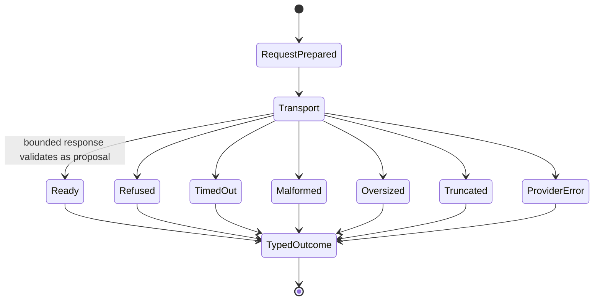

# Provider Adapters

This directory contains optional provider-specific transports behind the provider-neutral proposal
contract. A provider adapter is a data normalizer, not an execution-authority boundary.

## Provider State Machine

Exact portable outcomes are defined by `ProposalStatus`:

```text
ready | refused | timed_out | malformed | oversized | truncated | provider_error
```



Only `ready` carries proposal content. Every other outcome is terminal non-execution at the provider
boundary.

## Data flow and authority

```text
private task + explicit provider/model/version/sampling + finite request limits
  -> provider-specific transport
  -> response-size / redirect / endpoint / encoding / schema checks
  -> redacted typed ProposalOutcome
  -> trusted envelope builder or terminal non-execution
```

The adapter may provide:

- bounded code/change content;
- bounded optional explanation;
- provider/model/version/sampling identity;
- token and duration counters when available;
- a bounded redacted diagnostic.

The adapter and provider may not provide or override:

- target path or symbol scope;
- thread, action, idempotency, approval, or policy identity;
- provenance;
- executable assertions or policy;
- backend/isolation selection;
- retry/stop decisions or budgets;
- claim status.

## Current adapter

`ollama.py` implements an optional loopback-only Ollama response adapter with bounded HTTP transport,
explicit profile metadata, redirect/proxy/credential restrictions, response/proposal size limits, and typed
outcomes. Its presence does not prove a live Ollama server, model quality, model privacy, version
attestation, token accuracy, or correctness uplift.

Provider-neutral envelope construction lives in `../proposals.py`; the finite retry/stop policy lives in
`../controller.py`. Provider code must not import execution authority into the transport layer.

## Inputs and outputs

| Input | Trust | Output / consumer |
|---|---|---|
| private `ProposalRequest` | trusted caller configuration; task content is not persisted by default | provider transport |
| endpoint/profile/sampling | explicit integration configuration | exact-profile metadata in outcome |
| provider response | untrusted | strict parse, bounds, redaction, typed status |
| `ProposalOutcome.READY` | still untrusted content | `build_action_request()` validates trusted target/scope and generates fresh IDs |
| non-ready outcome | non-executable evidence | controller terminal `proposal_rejected` path |

## Required evals

- Valid ready response with exact bounded profile/usage metadata.
- Refusal, timeout, malformed JSON/schema, empty content, invalid encoding, oversize, truncation, and
  transport failure.
- Credentials in endpoint, non-loopback host, redirect, and proxy bypass attempts fail closed for the
  supported adapter profile.
- Extra control-plane fields are rejected or remain impossible by schema.
- Diagnostics and retained response metadata are bounded/redacted.
- Rerunning with a changed proposal produces a new trusted request identity downstream.

Live provider profiles and model-backed outcome evidence belong to issue #11/#29, not this directory.

## Stop and escalate

Stop when the exact provider/version/profile is unknown, endpoint or redirect authority is broader than the
issue allows, token usage is required but unavailable, response bytes cannot be bounded, private task or
credentials would be persisted, or provider output is being treated as trusted control-plane state.

See [`../README.md`](../README.md), local [`AGENTS.md`](../AGENTS.md), root
[`AGENTS.md`](../../../AGENTS.md), and the
[State Machine index](../../../docs/REPOSITORY_STATE_MACHINES.md).
