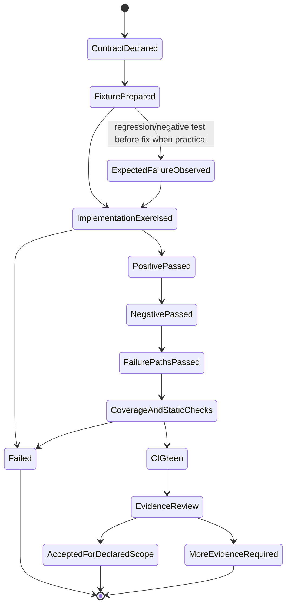

# Test Suite

Tests provide positive, negative, failure-path, compatibility, migration, replay, budget, and integrity
evidence for repository contracts. Passing tests are necessary but not sufficient for production,
independent reproduction, live-runtime conformance, or universal security claims.

## Test-evidence State Machine



A test result never promotes a broader claim than its fixture, source revision, environment, and asserted
boundary.

## Data flow

```text
controlling contract / State Machine / issue acceptance criteria
  -> deterministic fixture and explicit expected outcome
  -> implementation transition
  -> positive + negative + failure-path results
  -> coverage/static/type/CI evidence
  -> recipe/live-profile/claim review where required
```

## Test ownership by State Machine

| Test area | Contract exercised | Required failure emphasis |
|---|---|---|
| model/skill/policy tests | strict input and authorization boundary | malformed/extra input, provenance confusion, path/argv/network denial |
| identity/checkpoint tests | canonical identity, approval, idempotency, replay | substitution, expiry, consumption, legacy/future schema, restart conflict |
| proposal/provider tests | typed non-authoritative outcomes | refusal, timeout, malformed, oversize, redirect/proxy/endpoint, extra authority fields |
| controller tests | terminal/retry transitions and finite budgets | every stop reason, cycle, token/output/time/attempt boundary, redaction, result identity mismatch |
| runner/workspace tests | deterministic transaction and terminal execution states | pre/action/post failure, rollback integrity, timeout, streaming output excess, exception, replay |
| verification/backend tests | registry/plan/backend/result/bundle lifecycle | unsupported/policy/infrastructure, wrong source, cleanup, artifact and output bounds |
| MCP/CLI/demo tests | public interface and distribution behavior | read-only default, explicit execution, malformed requests, packaged asset drift |
| integrity tests | source/mirror/schema/recipe/registry synchronization | missing/stale mirrors, invalid hashes/links/statuses |

## Current implementation relationships

- PR #31 tests establish current identity and declared-exit semantics.
- PR #51 tests establish the provider-neutral proposal boundary.
- PR #52 tests establish the finite controller core but do not close all #29 evidence.
- PR #54 tests establish streaming output enforcement across stdout, stderr, mixed streams, UTF-8,
  timeout, exact-boundary, persistence, replay, and rollback cases.
- PR #56 restores mypy 2 compatibility for the backend map without changing runtime behavior.
- #27/#30/#12 require adversarial/live tests beyond unit adapter construction.
- #11 requires raw benchmark artifacts, not only pytest assertions.

See [`docs/IMPLEMENTATION_STACKS.md`](../docs/IMPLEMENTATION_STACKS.md).

## Required evidence fields

A meaningful test handoff records:

- source commit and dirty state;
- exact command and environment/tool versions;
- issue, PR, intent, State Machine transition, and owned path;
- expected versus observed result;
- pass/fail/not-run/not-applicable state;
- coverage/static/type results when required;
- artifact/log location and limitations;
- whether the result is unit, integration, repository fixture, exact-binary, or live-profile evidence.

## Local rules

- New enforcement logic includes a negative or failure-path test.
- State and reason enums are covered exhaustively or through an explicit completeness assertion.
- Secret-canary tests use synthetic values and verify absence from results, logs, events, and artifacts.
- Timing tests avoid unstable hard thresholds unless the exact profile and tolerance are the subject.
- Failed/timed-out results remain visible; do not delete them to make a claim pass.
- Unit fakes cannot be described as exact-binary or live-runtime conformance.

## Stop and escalate

Stop when the test does not match the documented state/transition, fixtures cross issue-owned boundaries,
live prerequisites are missing, a failure is treated as success, or a green suite would be used to promote
a broader isolation/performance/production claim.

See local [`AGENTS.md`](AGENTS.md), root [`AGENTS.md`](../AGENTS.md), and the
[State Machine index](../docs/REPOSITORY_STATE_MACHINES.md).
