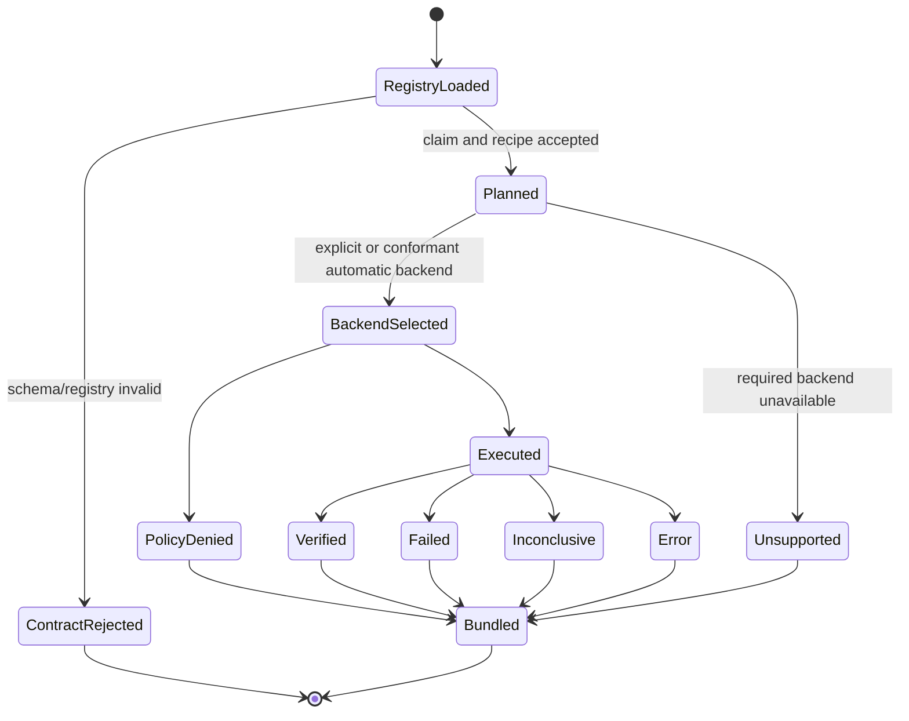

# Verification Assets

This directory contains the versioned external-verification contract. It converts a repository claim into a
bounded plan, backend execution result, and deterministic evidence bundle without treating repository
content as execution authority.

## Verification State Machine

Exact terminal `VerificationStatus` values are:

```text
verified | failed | unsupported | policy_denied | inconclusive | error
```



A repository claim failure and an infrastructure/backend failure are separate outcomes. `auto` must never
hide missing protection by selecting `unsafe-local`.

## Directory ownership

| Area | Responsibility | Input → output |
|---|---|---|
| `schemas/` | strict registry/result/controller/bundle shapes | JSON document → accepted typed contract or rejection |
| `recipes/` | bounded argv-only claim procedures | claim/profile → command evidence and artifacts |
| `policies/` | runtime backend policy input | explicit supported profile → deny/allow and policy identity |

The Python implementation that consumes these assets lives in `src/xt_aegis/verification.py` and
`verification_models.py`. Packaged mirrors under `src/xt_aegis/verification_assets/` are distribution
consumers and must remain synchronized with their source files.

## Data flow

```text
PROJECT_EVIDENCE.json
  -> evidence-registry schema validation
  -> claim selection and non-executing plan
  -> source identity and recipe/policy digest
  -> explicit backend or conformant automatic selection
  -> bounded argv-only command and artifact collection
  -> typed VerificationResult / VerificationSummary
  -> deterministic evidence bundle manifest
  -> claim and traceability review
```

## Backend selection and readiness

Exposed backends are:

```text
auto | openshell | podman | docker | unsafe-local
```

- `unsafe-local` requires explicit development opt-in and is not independently sandboxed.
- Missing or misconfigured required protection returns `unsupported`, policy/infrastructure evidence, or
  another typed non-success outcome rather than weakening the request.
- Source-bound OpenShell adapter behavior is current through PR #23.
- Mypy 2 backend-map compatibility is current through PR #56 and does not change backend selection.
- Execution-equivalent OpenShell readiness remains issue #30.
- Strong isolation for mutating command actions remains issue #27.
- Live OpenShell/rootless OCI adversarial conformance remains issue #12.

Unit adapter tests and a source-matched image build do not by themselves satisfy those live gates.

## Inputs, outputs, and consumers

| Producer | Output | Consumer |
|---|---|---|
| project evidence registry | claim/status/evidence/recipe/limitations | schema validator and planner |
| schema validator | accepted typed contract or error | CLI/MCP/CI caller |
| backend doctor/planner | availability, reason, selected backend | verifier and operator |
| recipe execution | exit/output/duration/timeout/artifact evidence | typed verification result |
| result aggregation | counts and overall status | evidence pack and reviewer |
| evidence pack | deterministic archive and hash manifest | independent verifier / release review |

A bundle hash provides integrity checking only. It does not establish publisher identity.

## Current implementation relationships

- PR #54 is current for streaming output enforcement in the product runner and synchronized controller
  result/evidence contracts; it is not a strong-isolation claim.
- PR #56 is current for static backend-map typing compatibility only.
- #27 and #30 may both touch backend/runner concepts and must name shared-path conflict owners.
- #11 consumes verification/evidence metadata for reproducible benchmark profiles.
- #44 is Git Town Worker evidence and does not change this product verification State Machine.

See [`docs/IMPLEMENTATION_STACKS.md`](../docs/IMPLEMENTATION_STACKS.md).

## Required evals

- Registry, result, summary, controller, and bundle schemas reject malformed/extra/stale fields.
- Recipe path, cwd, argv, expected exits, network, timeout, output, and artifact bounds fail closed.
- Source revision/dirty state and registry/recipe/policy identities are preserved.
- Backend selection distinguishes missing binary, invalid policy, unavailable gateway/runtime, launch failure,
  policy denial, repository failure, timeout, cleanup failure, and success.
- Artifact collection rejects traversal, absolute paths, symlinks, and unbounded output where applicable.
- Package mirrors and `PROJECT_EVIDENCE.json` remain synchronized when an owning issue changes them.
- Live claims retain exact runtime/image/tool versions and failed/not-run evidence.

## Stop and escalate

Stop when a schema/recipe/policy is not owned by the issue, source identity is ambiguous, required backend
readiness or isolation is unavailable, `unsafe-local` would be selected automatically, artifacts exceed
bounds, mirrors diverge, or a unit/fixture result is being described as live conformance.

See local [`AGENTS.md`](AGENTS.md), root [`AGENTS.md`](../AGENTS.md),
[`docs/EXTERNAL_VERIFICATION.md`](../docs/EXTERNAL_VERIFICATION.md),
[`docs/REPOSITORY_STATE_MACHINES.md`](../docs/REPOSITORY_STATE_MACHINES.md), and
[`docs/TRACEABILITY.md`](../docs/TRACEABILITY.md).
